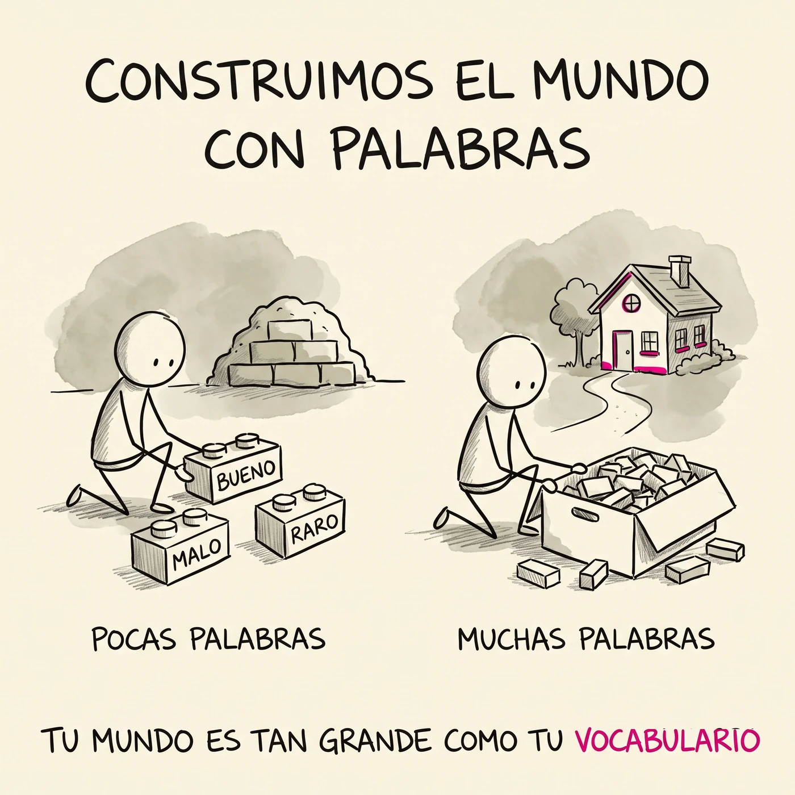
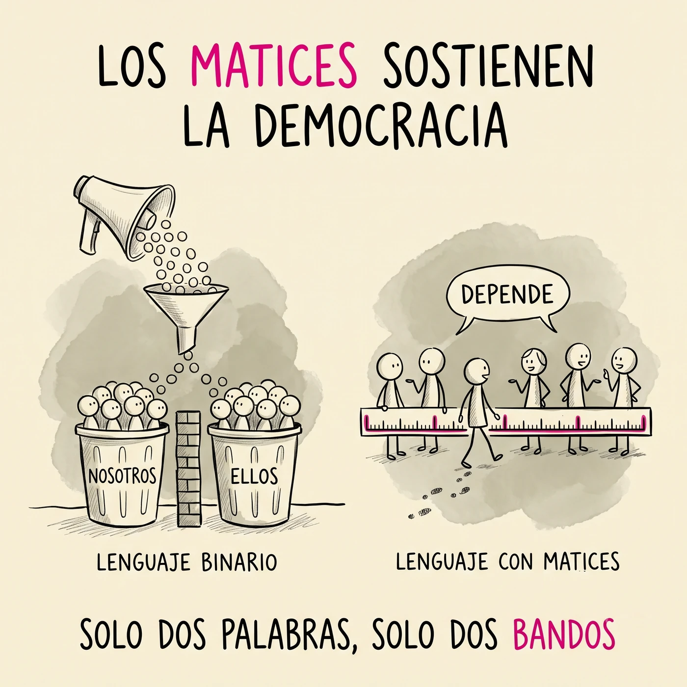

# Conocer las palabras por dentro

  a-<small>sin</small>
  mnem<small>memoria</small>
  -ia<small>cualidad</small>
  = amnesia

Toda palabra se puede abrir. Adentro hay piezas, viajes y gente. De eso va este curso.

Este sitio no es un libro de texto. Es nuestro **taller** (lo que usamos en clase) y nuestra **vitrina** (lo que el grupo va construyendo). Crece cada semana con trabajo de ustedes.

## ¿Y esto para qué me sirve?

Pregunta justa. Va la respuesta antes de empezar, para que sepas en qué te estás metiendo.

**Piensas con palabras.** No con imágenes ni con sensaciones: con palabras. Las que tienes son el material con el que puedes armar una idea, sostener un argumento, entender lo que te está pasando por dentro. Quien tiene doscientas palabras piensa cosas de doscientas palabras. No es un adorno para hablar bonito: es el tamaño del cuarto en el que vives.

<figure class="lamina">
  
  <figcaption>Tu mundo es tan grande como tu vocabulario.
  Lámina del curso, al estilo de las Sketchplanations de Jono Hey.</figcaption>
</figure>

**Una raíz te regala cincuenta palabras.** Aprender vocabulario de uno en uno es un mal negocio: son miles y se te olvidan. Aprender la pieza es otra cosa. Quien entiende *iatro-* (médico) lee sin ayuda *pediatra*, *geriatra*, *psiquiatra*, *iatrogenia*. Nadie se las enseñó. Se las regaló la raíz. Eso es lo que aquí se entrena: no memorizar palabras, sino conseguir la llave que abre familias enteras.

**Hay palabras que se usan para que no entiendas.** El contrato que vas a firmar, la receta que te dieron, el trámite que te rebotaron, el discurso que te quiere convencer. Buena parte del poder en este país se ejerce con vocabulario que da pena preguntar. Saber abrir una palabra es dejar de asentir sin entender. Es de las alfabetizaciones más políticas que existen y casi nadie la nombra así.

<figure class="lamina">
  
  <figcaption>Donde solo caben dos palabras, solo caben dos bandos.
  Lámina del curso, al estilo de las Sketchplanations de Jono Hey.</figcaption>
</figure>

**Tu manera de hablar tiene historia.** Lo que se dice en la Sierra no es "español mal hablado": es español con capas —latín debajo, náhuatl al lado, árabe más abajo, y palabras que solo viven aquí y que se van a morir si nadie las anota. Este curso te da las herramientas para documentar tu propia habla en lugar de avergonzarte de ella.

**Y porque es un gusto raro.** *Compañero* viene del latín *cum panis*: "el que comparte el pan". Contigo lo comparte, no con otro. Cuando lo sabes, ya no puedes volver a decir "compañero" sin oír lo que dice de verdad. Eso pasa como cien veces al semestre.

{: .ojo }
Y sí: la inteligencia artificial define cualquier palabra en un segundo. También un camión te lleva a la cima del cerro. Nadie que se subió al camión se puso más fuerte.

### El otro músculo: la atención

Este curso te va a pedir algo que casi ninguna otra cosa en tu día te pide: **quedarte con una sola cosa un rato largo**.

Vale la pena decirlo claro: si te cuesta concentrarte, no es que estés fallando. Cada aplicación de tu teléfono la diseñó gente muy inteligente y muy bien pagada para que no puedas soltarla. Tu atención es el producto que se vende. Contra eso, la fuerza de voluntad sola pierde siempre; lo que funciona es entrenar el músculo, y para eso hace falta un lugar y un rato en los que nada te jale.

Un ejemplo mínimo y escalofriante, que cuenta el escritor Juan Villoro: hay gente que reproduce las canciones en velocidad acelerada **para no perder tiempo con la canción**. Rompen el compás, deforman las voces, se comen los silencios —que en la música son la mitad del asunto— con tal de llegar antes a la siguiente. Ya no la escuchan: la consumen. Pregúntate con honestidad en qué partes de tu día estás haciendo exactamente eso.

De eso habla el movimiento del **slow living**: no se trata de hacer todo despacio, sino de dejar de vivir a un ritmo que tú no escogiste. Hacer menos cosas y estar de verdad en las que haces.

Hay una imagen que lo explica mejor que cualquier definición. Imagina que atraviesas la sala de un museo a paso veloz. Pasaste por todos los cuadros: podrías decir que "viste" la exposición completa. Pero no te detuviste en ninguno, no leíste una sola cédula, y a la salida no podrías describir ni uno. Estuviste ahí y no estuviste. Así se recorre buena parte de la vida cuando el ritmo lo pone otro: crees que experimentaste mucho, y en realidad rozaste muchas cosas sin poner atención en ninguna.

Por algo el proyecto de este semestre es un **museo**, y el trabajo consiste justamente en escribir las cédulas.

Y aquí las palabras nos dan la razón antes de empezar:

  skholé<small>tiempo libre, calma</small>
  = escuela

La escuela se llamó así por el lujo de **tener tiempo**. Alguien, en el camino, la convirtió en una carrera.

  ad-<small>hacia</small>
  tendere<small>estirarse</small>
  = atender

Atender es **estirarse hacia algo**. No es un estado que te cae encima: es un esfuerzo, y cansa, como cualquier músculo. También, como cualquier músculo, se entrena.

  nec-<small>no</small>
  otium<small>ocio, calma</small>
  = negocio

Durante siglos el trabajo se definió por lo que **le quita al descanso**, y no al revés. El ocio era el punto de partida; lo demás era su negación.

Nada de esto es una moda reciente. Marco Aurelio —emperador de Roma, el hombre más poderoso del mundo en su momento— se escribía esto a sí mismo hace mil novecientos años:

> Si buscas tranquilidad, haz menos. O, más exactamente, haz lo esencial. Casi todo lo que decimos y hacemos no es necesario: si logras eliminarlo, tendrás más tiempo y más calma. Pregúntate en cada momento: *¿esto hace falta?*
>
> — Marco Aurelio, *Meditaciones*

Por eso aquí se lee, y se lee sin trampa: dos libros en el semestre elegidos por ti, sin control de lectura, sin resumen y sin ficha. Y en algún momento de la semana, diez minutos de lectura en voz alta sin análisis y sin tarea, solo por el gusto de escuchar. No es relleno ni premio por portarse bien: es el gimnasio de la atención, y sin ese músculo lo demás no se sostiene.

Menos cosas, más hondo, y en presente. Ese es el paso de este curso.

## A dónde vamos juntos

Estamos por pasar cuatro meses abriendo palabras. Esto es lo que vas a poder hacer en diciembre, y que hoy —seamos honestos— todavía no puedes:

- **Desarmar cualquier palabra** que te encuentres y decir qué hace cada pieza: *hemo-globina*, *narco-lepsia*, *xeno-fobia*.
- **Leer el alfabeto griego** en voz alta y escribir tu nombre con él. Sí, el mismo de hace 2,800 años.
- **Descifrar una palabra que nunca has visto**, sin diccionario y sin teléfono, y acertar. Es el truco de magia del curso, y no es magia: es método.
- **Multiplicar tu vocabulario por raíces**: quien aprende *iatro-* no aprendió una palabra, desbloqueó cincuenta, incluidas las que todavía no ha leído.
- **Rastrear de dónde viene lo que hablas**: qué hay de latín, de náhuatl, de árabe y de aquí abajo de la Sierra en tu manera de decir las cosas.
- **Cazar etimologías falsas.** Suenan preciosas, circulan por WhatsApp y las inteligencias artificiales las inventan con toda seguridad. Vas a saber verificar en las fuentes de autoridad y no tragarte ninguna.
- **Entender la letra chiquita**: el griego de los médicos, el latín de los abogados y el inglés académico que vas a necesitar si sigues estudiando.
- **Leer dos libros que elegiste tú** y poder platicar de ellos con ganas, no por cumplir.
- **Sostener en voz alta lo que sabes.** Aquí lo que sabes se demuestra hablando, no entregando. Y eso lo vas a practicar tantas veces que dejará de darte miedo.

Al final, cada quien sale con su **Museo de Palabras**: una colección propia de palabras abiertas, documentadas y defendidas. El proyecto del semestre y lo que te llevas puesto.

## Las tres almas del curso

**Memorizar raíces** (el gimnasio). **Leer** (el placer). **Conocer las palabras por dentro** (el oficio).

Las tres se sostienen entre sí: sin mazo no tienes con qué pensar, sin lectura no hay atención que aguante, y sin oficio lo demás es juntar datos sueltos. De eso vive este curso.

## El semestre de un vistazo

| Semanas | Unidad | La pregunta | Qué sales sabiendo hacer |
|---|---|---|---|
| 0 | **[Semana 0 · Encendiendo motores](semanas/semana-00.html)** | ¿De qué vive este curso? | Armar tu gimnasio de palabras, firmar los pactos y elegir tu libro |
| 2 a 7 | **[U1 · La palabra por dentro](unidades/u1.html)** | ¿Cómo funciona una palabra? | Nombrar las piezas (raíz, prefijo, sufijo), leer el alfabeto griego y descifrar palabras nuevas |
| 8 a 12 | **[U2 · Las palabras viajan](unidades/u2.html)** | ¿De dónde vienen las palabras que hablo yo? | Reconocer las capas de tu habla y verificar cualquier etimología en fuentes de autoridad |
| 13 a 17 | **[U3 · Las palabras trabajan](unidades/u3.html)** | ¿Qué puertas me abren las palabras? | Leer lenguaje médico, jurídico y académico, en español y en inglés |

**U1 · La palabra por dentro (semanas 2 a 7).** Empezamos por la anatomía: toda palabra tiene raíz, prefijo y sufijo, y la raíz es la que carga el significado. Aprendes a abrir palabras con las manos, a leer el alfabeto griego y a usar un puñado de raíces que rinden muchísimo. Cierra con tu primera defensa oral —en parejas, nadie se estrena solo— y con la apertura de tu Museo.

**U2 · Las palabras viajan (semanas 8 a 12).** Tu habla es un sitio arqueológico. Debajo de lo que dices a diario hay latín, náhuatl, árabe y siglos de viajes. Además de leer esas capas, salimos a campo: entrevistas a tu gente y entre todos armamos el mapa léxico de nuestra región. Aquí se instala el reflejo que te va a servir toda la vida: **ninguna etimología sin fuente**.

**U3 · Las palabras trabajan (semanas 13 a 17).** La unidad más práctica: el griego de los médicos y los científicos, el latín de los tribunales y los contratos, el vocabulario del examen de ingreso y el pasaporte que tus raíces te dan para leer inglés. Cierra con la defensa de tu Museo de Palabras.

## Cómo es una semana aquí

Cuatro sesiones, cada una con su oficio. El ritmo se repite todo el semestre, así que no vas a andar adivinando qué toca.

| Día | Qué hacemos | Qué traes |
|---|---|---|
| **Martes** | Conversación: las palabras que trajimos de casa o de la calle salen a la luz y abrimos dos o tres en vivo | tu palabra de la semana |
| **Miércoles** | Taller: se trabaja con las manos —tarjetas, disecciones, matrices de raíces, juegos— | el mazo al día |
| **Jueves, centro de cómputo** | Duelo de práctica y trabajo con las fuentes: verificar, comparar, documentar | tu hipótesis del martes |
| **Viernes, 2 horas** | La sesión grande: seminario, quiz manuscrito, torneo o defensa | todo lo de la semana |

Y en algún momento de la semana, sin avisar qué día, **diez minutos de lectura en voz alta**: algo hermoso, sin análisis y sin tarea. Solo escuchar.

Cada semana tiene su propia página con el detalle día por día: [Semanas](semanas/).

## Lo que sí se hace en casa

Poco, diario y de verdad. Aquí no hay trabajos largos que una IA pueda hacer por ti; lo que pedimos en casa es lo único que nadie puede hacer en tu lugar:

1. **10 minutos diarios con tu mazo** (Anki o caja Leitner). Los duelos no perdonan, y lo que memorizaste es lo único con lo que puedes pensar.
2. **Tu libro, a tu ritmo.** Dos en el semestre, elegidos por ti. Sin control de lectura, sin resumen, sin fichas.
3. **Una encomienda corta a la semana**, casi siempre de campo: preguntarle a tu abuela por una palabra que ya nadie usa, cazar una locución latina en una noticia, traer una palabra rara del oficio de tu papá. Sin pantallas y sin llenar formatos.
4. **Tu bitácora**, cuando algo valga la pena guardarse: una palabra que te sacudió, una duda, una pieza para el Museo.

Todo lo demás pasa en el salón. Lo que sabes se demuestra aquí, hablando y escribiendo a mano.

## Y la calificación, ¿qué?

En este curso **ningún trabajo lleva número**. Las calificaciones que la universidad exige las propones tú, con tu evidencia enfrente y en una conversación con el profesor. No es un regalo: es más exigente que un examen, porque tienes que sostener lo que dices. Cómo funciona, con todo detalle: [Tu calificación](evaluacion.html).
