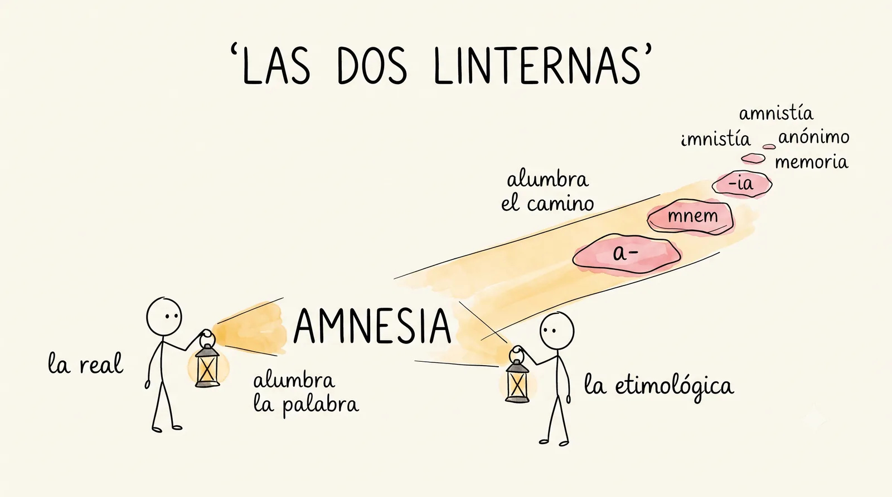
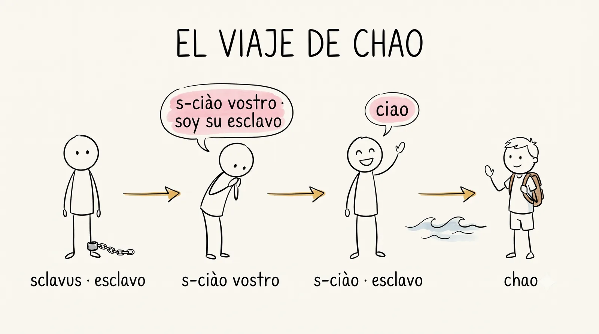
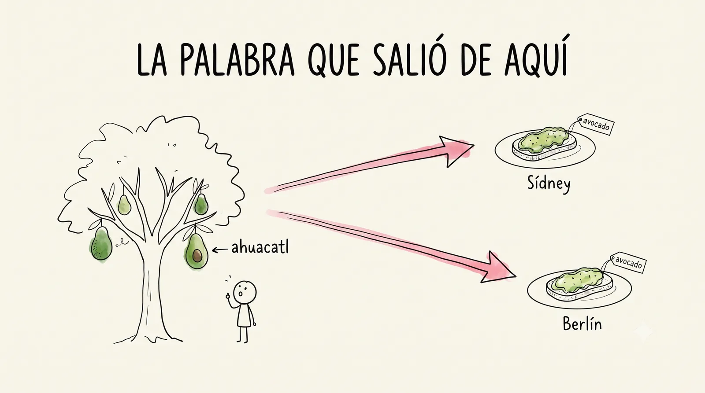

# Semana 2 · Las palabras tienen anatomía

> **La pregunta de la semana:** ¿qué hay dentro de una palabra?

**Esta semana podrás:**

- distinguir la definición real de la definición etimológica de una palabra
- nombrar sus piezas: prefijo, raíz, sufijo, étimo
- verificar una etimología en una fuente de autoridad, con captura y todo
- escribir tu primera biografía de una palabra, la semilla de tu Museo

Toda palabra se puede abrir. La IA define cualquier palabra en un segundo; lo que no puede es memorizar por ti, leer por ti, ni querer una palabra. De eso vive el curso.

---

## La semana de un vistazo

| Día | Qué haremos | Trae |
|---|---|---|
| [Martes 4](#martes) · 1 h | La cosecha: tus palabras heredadas salen a la luz | tu palabra que ya nadie usa, anotada |
| [Miércoles 5](#miercoles) · 1 h | Las dos linternas: definición real y etimológica | el mazo al día |
| [Jueves 6](#jueves) · 1 h, centro de cómputo | ¿Con qué linterna está escrita? | tu hipótesis del martes |
| [Viernes 7](#viernes) · 2 h | El seminario de la unidad, y abre el Museo | tu argumento y tu candidata a pieza |

Cada día es un mazo de láminas. En clase se proyectan una por una con el botón <strong>Presentar</strong>; aquí se quedan apiladas, en orden, para volver a ellas cuando quieras. Debajo de los mazos están los dos casos resueltos del Museo, completos.

<!-- ============================ MARTES ============================ -->
<section class="mazo" id="martes">

Martes 4 de agosto · 1 hora

<h3>La cosecha de palabras heredadas</h3>

Hoy el grupo estrena su primer tesoro.

<button class="btn-presentar" type="button">Presentar ▸</button>

<section class="lam lam--actividad">
<h4>1 La cosecha 20 min</h4>
Todo el grupo

Las palabras que trajeron de casa salen a la luz.

Algunas se presentan al grupo: la palabra, su historia y el nombre de quien la regaló. Todas quedan anotadas: son las primeras candidatas a pieza del Museo.

No alcanza el tiempo para todas y no hace falta: elige cuatro o cinco variadas (un objeto, un verbo, una que suene rarísimo) y garantiza en voz alta que las demás tendrán su turno. El escribano del kraft de la semana 0 puede repetir oficio. Agenda aquí el minuto del lector del martes.

</section>
<section class="lam">
<h4>2 La anatomía 15 min</h4>

Toda palabra se puede abrir. Hoy les ponemos nombre a las piezas.

a-<small>sin</small>
mnem<small>memoria</small>
-ia<small>cualidad</small>
= amnesia, "sin memoria"

Con <em>amnesia</em> en el pizarrón: <strong>prefijo</strong> al inicio, <strong>raíz</strong> al centro, <strong>sufijo</strong> al final. Y <strong>étimo</strong>: la palabra de origen de la que nace otra.

</section>
<section class="lam lam--oscura">
<h4>La regla que te llevas hoy</h4>

La raíz carga el significado; las demás piezas lo modifican.

</section>
<section class="lam lam--actividad">
<h4>3 Gimnasio: primeras disecciones 20 min</h4>
Actividad

No vas a abrir palabras que conoces: vas a adivinar palabras que nunca has visto.

<a href="../ejercicios/semana-02/ejercicio-2A-primeras-disecciones.html">Primeras disecciones</a>: con las piezas que ya traes en el mazo, sin diccionario y sin teléfono. Si faltaste hoy, hazlo en casa y llega el jueves con tu hipótesis anotada.

</section>
<section class="lam lam--actividad">
<h4>4 Tu hipótesis 5 min</h4>
A solas

Parte una palabra tuya, apuesta su significado y ponle número a tu seguridad.

Tu heredada es perfecta. Del 1 al 10: ¿qué tanto lo firmas? <strong>No la busques todavía.</strong> El jueves la juzgan las fuentes, y ahí comparas tu apuesta con el veredicto. Y no te vayas sin el mazo: las tarjetas de la semana ya están abajo y entran hoy. Los duelos van en serio.

Insiste en el número de seguridad: es la primera pieza del músculo de calibración que el jueves se mide en el quiz. Nadie sale sin hipótesis anotada; treinta segundos de silencio bastan.

</section>
</section>

<!-- ============================ MIÉRCOLES ============================ -->
<section class="mazo" id="miercoles">

Miércoles 5 de agosto · 1 hora

<h3>Las dos linternas</h3>

🔦 Una alumbra la palabra; la otra alumbra el camino.

<button class="btn-presentar" type="button">Presentar ▸</button>

<section class="lam lam--actividad">
<h4>1 Duelo de raíces 10 min</h4>
Actividad

El mazo sale a la cancha. Pieza contra pieza.

En parejas, con las tarjetas que ya traes: quien reciba una pieza tiene que usarla en una palabra que no esté en el reverso.

Corto y con energía: el duelo abre la sesión, no la ocupa. Registra en el pizarrón las palabras nuevas que salgan; alguna acabará en el kraft.

</section>
<section class="lam">
<h4>2 Qué es, con todas sus letras 20 min</h4>

etimología

La explicación de las palabras por la investigación de su historia y su estructura.

De dónde vienen y de qué están hechas. Para verlo en la práctica hay que separar dos maneras de definir una misma palabra.

</section>
<section class="lam">
<h4>🔦 Linterna 1 · La definición real</h4>

Dice qué significa la palabra hoy, tal como se usa.

Es la de la calle y la del diccionario. <em>Memoria:</em> imagen o conjunto de imágenes de hechos o situaciones pasados que quedan en la mente.

</section>
<section class="lam">
<h4>🔦 Linterna 2 · La definición etimológica</h4>

Dice de dónde viene la palabra y de qué piezas está hecha, y arma el significado con ellas.

Cuatro pasos: el origen, los étimos o raíces, los prefijos y sufijos, y el significado armado con todo eso. <em>Amnesia</em>, del griego ἀμνησία: <em>a-</em> (sin) + <em>mnem-</em> (memoria) + <em>-ia</em> (cualidad). Por lo tanto: <strong>"sin memoria"</strong>.

</section>
<section class="lam">
<h4>Fíjate en lo que acaba de pasar</h4>

La real te dice qué es la palabra. La etimológica, además, te regala piezas.

<em>a-</em>, <em>mnem-</em> y <em>-ia</em> van a reaparecer en decenas de palabras que todavía no has visto. Por eso las linternas no son rivales: son dos luces sobre el mismo objeto, y ver con las dos es distinto que ver con una.

</section>
<section class="lam">
<h4>¿Y la palabra "etimología"? También se abre</h4>

étymos<small>verdadero</small>
lógos<small>tratado, estudio</small>
= etimología

El estudio del significado <strong>auténtico, verdadero</strong> de las palabras. Esa es su definición etimológica; la real dice que es la ciencia que estudia las palabras por su origen, su estructura y sus transformaciones.

</section>
<section class="lam">
<h4>Las tres preguntas del semestre</h4>

Origen, estructura, transformaciones. Una pregunta para practicar cada una.

<table>
<tr><th>Investiga</th><th>La pregunta con la que se practica</th></tr>
<tr><td>su origen</td><td>¿De dónde viene la palabra <em>chamba</em>?</td></tr>
<tr><td>su estructura</td><td>¿Qué tienen en común <em>concordia</em>, <em>discordia</em> y <em>cardiólogo</em>?</td></tr>
<tr><td>sus transformaciones</td><td>¿Cómo hizo <em>esclavo</em> para convertirse en <em>chao</em>?</td></tr>
</table>

La de chamba trae trampa y hoy no se resuelve: la versión del Chamber of Commerce no aparece en ninguna fuente seria. Siémbrala, deja que alguien la cuente con seguridad, y cállate: el jueves, en el cierre con las fuentes, la comprueban ellos. La tercera se responde sola el viernes con el caso de chao.

</section>
<section class="lam lam--actividad">
<h4>3 El taller de las dos linternas 30 min</h4>
Actividad

Ahora enciende las dos linternas tú, sobre palabras de verdad.

<a href="../ejercicios/semana-02/ejercicio-2B-las-dos-linternas.html">El taller de las dos linternas</a>: dos palabras bajo ambas luces, diez palabras del español emparejadas con su étimo, y el descubrimiento de que el corazón y el amor están dos veces en nuestro idioma, uno por cada padre.

</section>
</section>

<!-- ============================ JUEVES ============================ -->
<section class="mazo" id="jueves">

Jueves 6 de agosto · 1 hora · Centro de cómputo

<h3>¿Con qué linterna está escrita?</h3>

Diez definiciones de diccionario. Tú dices cuál linterna las escribió.

<button class="btn-presentar" type="button">Presentar ▸</button>

<section class="lam lam--actividad">
<h4>1 Quiz relámpago 10 min</h4>
A solas · papel

Tres palabras, papel, tres minutos. Antes de voltear la hoja: ¿cuántas crees que tendrás bien?

El primero del semestre. Al calificar comparas tu apuesta con tu resultado. La brecha es información, no culpa.

Se califica en vivo y la brecha se anota en el expediente: la serie de calibración empieza hoy. Piezas sugeridas: dos del mazo cero y una de esta semana.

</section>
<section class="lam">
<h4>2 El taller: ¿E o R? 35 min</h4>

El taller del miércoles, llevado a la cancha.

🔦<b>R · la real</b>describe usos de hoy, sin origen ni piezas

🔦<b>E · la etimológica</b>nombra origen y piezas, y arma el significado

Diez definiciones tomadas de diccionarios de verdad. Tu trabajo: marcar <strong>E</strong> si la definición es etimológica y <strong>R</strong> si es real. La primera respuesta es la que cuenta.

</section>
<section class="lam lam--oscura">
<h4>La regla que salva las de trampa</h4>

La linterna no la decide la palabra: la decide la definición.

Y hay palabras que aparecen dos veces, una por linterna. No es error: ninguna de las dos definiciones está mal.

</section>
<section class="lam lam--actividad">
<h4>Manos al teclado</h4>
Actividad

Las diez definiciones te esperan, con tu cosecha al final.

<a href="../ejercicios/semana-02/ejercicio-2C-con-que-linterna.html">¿Con qué linterna está escrita?</a> Retroalimentación al instante, y el remate donde volteas la herramienta: eliges una palabra de tu mazo y le escribes tú las dos definiciones, una por linterna.

</section>
<section class="lam lam--actividad">
<h4>3 El cierre con las fuentes 15 min</h4>
Actividad

Apuesta primero, busca después, anota el veredicto con su fuente.

El método que desde hoy es costumbre de la casa. Pasa por el <a href="https://dle.rae.es" target="_blank" rel="noopener">DLE</a> y el <a href="http://etimologias.dechile.net" target="_blank" rel="noopener">DECEL</a> tu hipótesis del martes, tu palabra heredada y la <em>chamba</em> del miércoles. Captura: palabra, apuesta, veredicto, fuente.

Si una heredada no aparece en ningún diccionario, nómbralo como hallazgo y no como fracaso: es el primer límite de las fuentes descubierto a mano, y documentarla queda como trabajo del curso. Las mejores verificadas estrenan la vitrina de "Lo que produjimos", con permiso y nombre de pila.

</section>
</section>

<!-- ============================ VIERNES ============================ -->
<section class="mazo" id="viernes" data-ticket>

Viernes 7 de agosto · 2 horas

<h3>El seminario, y abre el Museo</h3>

Si la IA define cualquier palabra en un segundo, ¿para qué memorizar raíces?

<button class="btn-presentar" type="button">Presentar ▸</button>

<section class="lam lam--actividad">
<h4>1 El seminario de la unidad 40 min</h4>
Todo el grupo

Si la IA define cualquier palabra en un segundo, ¿para qué memorizar raíces?

Trae postura de verdad: el argumento lo construye el grupo, no el profesor.

Tu papel es de moderador incómodo: aboga por la IA cuando el grupo se acomode en contra, y al revés. No adelantes la pista de iatro-; guárdala para cuando la conversación la pida.

</section>
<section class="lam">
<h4>Una pista de hacia dónde vamos</h4>

Quien sabe <em>iatro-</em> ya lee <em>pediatra</em>, <em>geriatra</em>, <em>iatrogenia</em>.

Nadie le enseñó esas palabras. Se las regaló la raíz. La IA te da una definición; una raíz te da una familia completa.

</section>
<section class="lam lam--oscura">
<h4>2 Abre el Museo de Palabras 15 min</h4>

El proyecto del semestre: cada quien adopta palabras y les escribe su biografía.

Una pieza del Museo cuenta cuatro cosas: dónde nació la palabra, cómo viajó, cómo llegó a ti y qué se aprende de ella.

</section>
<section class="lam">
<h4>3 Caso 1 · chao, la que llegó de fuera 15 min</h4>

Cada vez que dices "chao" estás diciendo, sin saberlo: soy tu esclavo.

Del latín <em>sclavus</em> (esclavo, nacido del nombre del pueblo eslavo) al véneto <em>s-ciào vostro</em> ("soy su esclavo", vuelto fórmula de cortesía), al italiano <em>ciao</em>, al chao que cruzó el Atlántico. La historia completa está aquí abajo, en esta misma página.

</section>
<section class="lam">
<h4>Caso 2 · aguacate, la que salió de aquí</h4>

Esta palabra no vino de fuera. Salió de aquí.

Del náhuatl <em>ahuacatl</em> salieron <em>aguacate</em> y <em>guacamole</em>; el inglés <em>avocado</em> nació torcido por una etimología popular. Hoy está en menús de Sídney y de Berlín. La historia completa, con su detalle más famoso, está aquí abajo.

El detalle más famoso vive en el caso completo de abajo: ahuacatl también nombraba el testículo. Cuéntalo ahí, con la página abierta; despierta al grupo garantizado y sirve para decir algo serio: la etimología no es solemne, es honesta.

</section>
<section class="lam lam--oscura">
<h4>Lo que enseñan los dos casos</h4>

Las palabras de tu región no son palabras locales: son palabras que todavía no han viajado.

Tu heredada está hoy exactamente donde estuvo <em>ahuacatl</em> hace quinientos años. La diferencia es si alguien la anota o no.

</section>
<section class="lam lam--actividad">
<h4>4 Tu primera biografía 40 min</h4>
Actividad

Redacta la biografía de tu candidata a pieza. Hoy se siembra tu Museo.

<a href="../ejercicios/semana-02/ejercicio-2D-biografia-de-una-palabra.html">Biografía de una palabra</a>, con los cuatro apartados. La plantilla y dos biografías de muestra viven en <a href="../museo/plantilla-biografia.html">el Museo</a>.

</section>
<section class="lam">
<h4>5 Lectura en voz alta 10 min</h4>

Sin tarea y sin examen. Solo escuchar.

Diez minutos de un libro leído en voz alta, como se cierran las semanas buenas.

</section>
</section>

## Los dos casos del Museo, completos

Los dos casos resueltos del viernes, enteros, para consultarlos cuando escribas tu propia biografía. Van a propósito en direcciones contrarias.

### Caso resuelto 1 · *chao*, la palabra que llegó de fuera

**Dónde nació.** En el latín medieval **sclavus**, "esclavo". Y esa palabra, a su vez, nació del nombre de un pueblo: los **eslavos**, capturados y vendidos por miles durante siglos en el centro de Europa. El nombre de una gente se convirtió en el nombre de una condición. Ya solo con eso la palabra tiene una historia difícil de olvidar.

**Cómo viajó.**

| Etapa | Qué le pasó |
|---|---|
| latín **sclavus** | "esclavo" |
| véneto **s-ciào** | En Venecia la palabra se desgastó en la boca. Y ahí ocurrió lo raro: se volvió **fórmula de cortesía**. *S-ciào vostro* significaba "soy su esclavo", como quien dice hoy "para servirle" o "a sus órdenes". |
| italiano **ciao** | La fórmula se acortó y perdió por completo el sabor de sumisión. Dejó de decir nada sobre esclavos: ahora dice hola, y también dice adiós. |
| español **chao / chau** | Cruzó el Atlántico en el siglo XX con la migración italiana y aquí se escribió como suena. |

**Cómo llegó a ti.** Cada vez que te despides con un "chao", estás diciendo, sin saberlo y sin quererlo, *soy tu esclavo*. Cuatro letras cargando la historia de un pueblo entero.

**Qué enseña este caso.** Que las palabras no solo cambian de sonido: **cambian de oficio**. *Sclavus* nombraba lo más terrible que le puede pasar a una persona y terminó siendo lo que te dicen tus amigos en la puerta de la escuela.

### Caso resuelto 2 · *aguacate*, la palabra que salió de aquí

**Dónde nació.** En náhuatl, **ahuacatl**. Nombraba al fruto, y con la misma palabra se nombraba también al testículo: el parecido saltaba a la vista y a nadie de aquella época le pareció necesario inventar otra palabra.

**Cómo viajó.**

| Etapa | Qué le pasó |
|---|---|
| náhuatl **ahuacatl** | El fruto. Y también el testículo: la misma palabra para los dos, porque el parecido saltaba a la vista. |
| español **aguacate** | Los españoles oyeron *ahuacatl* y lo acomodaron a su propia boca. Lo mismo hicieron con *ahuacamolli* (*ahuacatl* + *molli*, salsa), que aquí se volvió **guacamole**. |
| inglés **avocado** | En inglés la palabra se torció por el parecido con una vieja voz española para "abogado". O sea: le pusieron un nombre equivocado por una etimología popular, exactamente el error que este curso te enseña a cazar. |
| el mundo | Hoy la palabra está en un menú de Sídney, en un supermercado de Berlín y en el desayuno de medio planeta. |

**Cómo llegó a ti.** Al revés que *chao*: esta no vino de fuera. **Salió de aquí.** Estaba en boca de gente que vivía en este territorio antes de que existiera esta escuela, este país y este idioma.

**Qué enseña este caso.** Que una palabra náhuatl esté hoy en la carta de un restaurante australiano quiere decir algo importante para lo que vas a hacer este semestre: las palabras de tu región no son "palabras locales". Son **palabras que todavía no han viajado**. La palabra que te regaló tu abuela, esa que nadie ha escrito nunca, está hoy exactamente en la misma situación en la que estuvo *ahuacatl* hace quinientos años. La diferencia es si alguien la anota o no.

## La lectura, esta semana

Tu libro avanza a tu ritmo, pero avanza. Esta semana la lectura vive en tres lugares: el **minuto del lector** (alguien cuenta qué está leyendo; se agenda el martes), la **lectura en voz alta** con la que cerramos alguna sesión, y tu **bitácora del lector**, que sigue viva con una línea por sesión de lectura. El primer círculo llega en la semana 7: ahí conversamos de verdad. Si todavía no tienes libro, pasa por [Leemos](../leemos.html).

---

## El gimnasio completo

Todos los ejercicios de la semana, para tu celular o el centro de cómputo. Sin nota y sin registro: puro entrenamiento.

- [Primeras disecciones](../ejercicios/semana-02/ejercicio-2A-primeras-disecciones.html) · martes
- [El taller de las dos linternas](../ejercicios/semana-02/ejercicio-2B-las-dos-linternas.html) · miércoles
- [¿Con qué linterna está escrita?](../ejercicios/semana-02/ejercicio-2C-con-que-linterna.html) · jueves, centro de cómputo
- [Biografía de una palabra](../ejercicios/semana-02/ejercicio-2D-biografia-de-una-palabra.html) · viernes
- [Quiz de gimnasio](../ejercicios/semana-02/quiz-gimnasio-semana-02.html) · para ensayar cuando quieras

## Hoja de consulta

Toca una palabra y ábrela. Cada pieza tiene su nombre y su significado.

  

  
Toca una palabra para diseccionarla.

  

    prefijo
    raíz
    sufijo
  

---

## Antes de irte

<a class="ticket" href="{{ site.ticket_url }}" target="_blank" rel="noopener">
  <b>Ticket de salida de esta semana</b>
  Noventa segundos, al cierre de la sesión larga: qué te llevas, qué quedó turbio y cómo estuvo el ritmo. Con nombre o sin él.
  <em>Lo que escribas aquí decide por dónde empezamos el martes.</em>
</a>
<a class="ticket-qr" href="{{ site.ticket_url }}" target="_blank" rel="noopener">
  
  escanéalo
</a>

---

## Las tarjetas de la semana

Catorce piezas nuevas. Cuatro son los nombres de las partes de una palabra; el resto son piezas de verdad, y todas aparecieron esta semana en algún ejercicio: ninguna te llega de la nada.

**Los nombres de las partes**

| Frente | Reverso (significado · ancla) |
|---|---|
| étimo | la palabra de origen de la que nace otra · el étimo de *amnesia* es *mnéme* |
| prefijo | pieza que va al inicio y modifica · *a-* en amnesia |
| raíz | pieza central, la que carga el significado · *mnem-* en amnesia |
| sufijo | pieza que va al final y modifica · *-ia* en amnesia |

**Las tres piezas de *amnesia***

| Frente | Reverso (significado · ancla) |
|---|---|
| a- / an- | sin, negación · amnesia, anónimo, abiótico |
| mnem- | memoria · amnesia, amnistía |
| -ia | cualidad · amnesia, alegría |

**El amor, uno por cada padre**

| Frente | Reverso (significado · ancla) |
|---|---|
| amor | amor, en latín · amigo, amoroso |
| éros | amor, en griego · erótico, Erasmo |

**Latín de todos los días**

| Frente | Reverso (significado · ancla) |
|---|---|
| oculus | ojo · oculista, binoculares, monóculo |
| oriri | nacer, surgir · Oriente, origen, oriundo |

**Alto rendimiento** (las que más te van a servir)

| Frente | Reverso (significado · ancla) |
|---|---|
| tele- | lejos · teléfono, telescopio, telegrafía |
| crono- | tiempo · cronómetro, cronología, crónica |
| -metro / -metría | medida · termómetro, geometría, telemetría |

### El mazo, para tu Anki

**[Descargar el mazo del curso (.apkg)](../recursos/anki/etimologias-uaq.apkg)**

Ábrelo con Anki ya instalado y se importa solo, con el mazo cero de la semana 0 y estas catorce dentro, cada una con su ancla y su familia de palabras. Cada pieza te la va a preguntar en las dos direcciones —de la pieza al significado y del significado a la pieza— porque así es como te la van a pedir en el quiz y en el duelo.

Es **el mismo archivo todo el semestre**: cada vez que se publiquen piezas nuevas lo vuelves a descargar y a importar, y Anki suma lo nuevo sin borrar tu avance en lo viejo. Si trabajas con caja Leitner, las tablas de arriba son tu lista para copiar a mano.

{: .ojo }
Hubo muchas más piezas esta semana en los ejercicios —*meso-*, *potamo-*, *demo-*, *-cracia*, *biblio-*, *neurona*, *capillus*, *dominus*, *sclavus*— y a propósito **no entran todavía al mazo**. Ya las usaste, ya te sirvieron; entran goteadas en las próximas semanas. Meter veintisiete tarjetas nuevas de un jalón es la manera más segura de abandonar Anki en marzo, y este gimnasio tiene que durar hasta diciembre.

## Lo que produjimos

*Las primeras palabras heredadas del grupo, ya verificadas. Se llena al cerrar la semana.*

## El postre 🍨

*amnistía* y *amnesia* son la misma raíz: *mnem*, memoria. Una amnistía es un olvido, pero jurídico: el Estado decide "no recordar" un delito. Perdonar, a veces, es solo memoria que se apaga a propósito.

