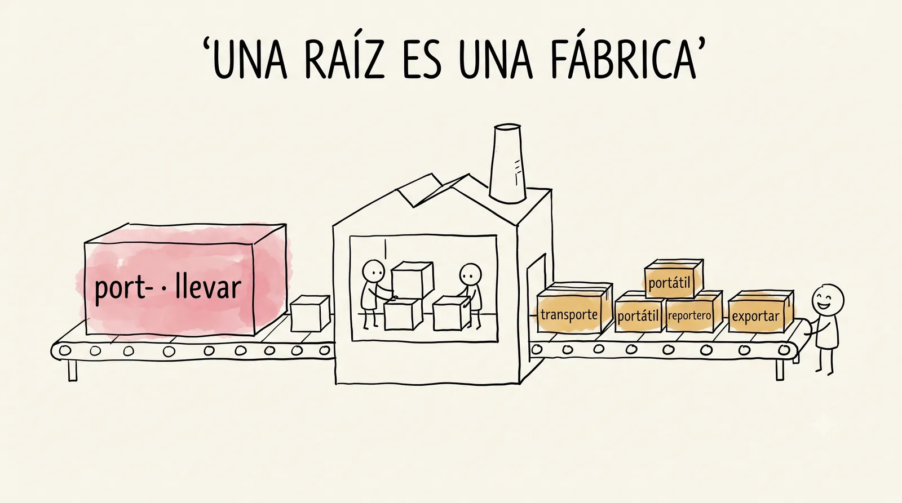

# Semana 3 · Sumas de palabras

> **La pregunta de la semana:** ¿cómo se arma y se desarma una palabra?

**Esta semana podrás:**

- escribir la suma de una palabra, y leerla de vuelta
- armar una matriz morfológica: una pieza fija, muchas combinaciones
- distinguir un corte real de un espejismo
- defender un corte con evidencia, no con corazonada

La regla de oro de la semana (apréndetela, se usa todo el semestre): un corte es real solo si la pieza reaparece en otras palabras con el mismo significado, y la fuente lo confirma.

---

## La semana de un vistazo

| Día | Qué haremos | Trae |
|---|---|---|
| [Martes 11](#martes) · 1 h | El juego de los cortes y el banco de dudosos | el mazo al día |
| [Miércoles 12](#miercoles) · 1 h | La fábrica de matrices | tu matriz a medio armar |
| [Jueves 13](#jueves) · 1 h, centro de cómputo | Dos espejismos y veinte palabras nuevas | el mazo al día |
| [Viernes 14](#viernes) · 2 h | El torneo de matrices por equipos | a tu equipo con las pilas puestas |

Cada día es un mazo de láminas. En clase se proyectan una por una con el botón <strong>Presentar</strong>; aquí se quedan apiladas, en orden, para volver a ellas cuando quieras.

<!-- ============================ MARTES ============================ -->
<section class="mazo" id="martes">

Martes 11 de agosto · 1 hora

<h3>El juego de los cortes</h3>

Desayunar es, literal, romper el ayuno.

<button class="btn-presentar" type="button">Presentar ▸</button>

<section class="lam">
<h4>1 La suma en el pizarrón 15 min</h4>

Toda palabra se puede escribir como una suma.

des<small>deshacer, quitar</small>
ayuno
= desayuno, "romper el ayuno"

Hoy aprendes a escribir la suma de una palabra y a leerla de vuelta: dada la suma, ¿qué palabra es? Directa e inversa, como en aritmética.

</section>
<section class="lam lam--oscura">
<h4>La regla de oro de la semana</h4>

Un corte es real solo si la pieza reaparece en otras palabras con el mismo significado, y la fuente lo confirma.

Apréndetela: se usa todo el semestre. Familia y fuente, las dos, siempre.

</section>
<section class="lam lam--actividad">
<h4>2 Sumas de palabras 30 min</h4>
En parejas

Suma y desarma, con las piezas de tu mazo.

<a href="../ejercicios/semana-03/ejercicio-3A-sumas-de-palabras.html">Sumas de palabras</a>, en parejas. Anota los cortes de los que dudaron: son materia prima del torneo del viernes.

</section>
<section class="lam lam--actividad">
<h4>3 El banco de dudosos 15 min</h4>
Todo el grupo

Cada pareja propone su corte más sospechoso. El grupo apuesta a mano alzada. Nadie resuelve nada.

Los veredictos caen el viernes, en el torneo, con el DECEL abierto. Y no te vayas sin el mazo: las tarjetas de la semana entran hoy.

Anota los cortes propuestos en el pizarrón o el kraft: son los retos listos del viernes. Si alguien propone re + loj, celébralo y congélalo: ese caso es tan bueno que tiene su propia semana, la 5. No lo resuelvas ni de broma.

</section>
</section>

<!-- ============================ MIÉRCOLES ============================ -->
<section class="mazo" id="miercoles">

Miércoles 12 de agosto · 1 hora

<h3>La fábrica de matrices</h3>

Cada pieza nueva no suma una palabra: multiplica.

<button class="btn-presentar" type="button">Presentar ▸</button>

<section class="lam lam--actividad">
<h4>1 Duelo de raíces 10 min</h4>
Actividad

El mazo a la cancha. Ya trae piezas de tres semanas.

Mete al duelo las piezas de la semana pasada (tele-, crono-, -metro) junto a las nuevas: el mazo viejo no se jubila, se recombina.

</section>
<section class="lam">
<h4>2 La matriz en acción 20 min</h4>

Una pieza fija, muchas móviles.

<table>
<tr><th>Fija</th><th>Móviles</th><th>Salen</th></tr>
<tr><td><strong>-logía</strong></td><td>bio, geo, psico, crono</td><td>biología, geología, psicología, cronología</td></tr>
<tr><td><strong>tele-</strong></td><td>fono, visión, scopio</td><td>teléfono, televisión, telescopio</td></tr>
</table>

Eso es una matriz morfológica: aprendes una pieza y te llevas la fila completa.

</section>
<section class="lam">
<h4>Una raíz no es una palabra: es una fábrica</h4>

La raíz <em>port-</em> (llevar) da exportar, importar, transporte, portátil, reportero, deportar.

¿Cuántas más? Ese es el reto del día. Y guarda el ojo crítico: no toda palabra con esas letras es de la familia. El viernes vas a ver caer una.

</section>
<section class="lam lam--actividad">
<h4>3 La fábrica de matrices 30 min</h4>
En equipos

Armen su matriz: lo respaldado como respaldado, lo dudoso como hipótesis.

<a href="../ejercicios/semana-03/ejercicio-3B-fabrica-de-matrices.html">La fábrica de matrices</a>. Si terminas, arma una matriz propia con piezas de tu mazo: las mejores se leen en voz alta. Las hipótesis dudosas son retos listos para el torneo del viernes.

</section>
</section>

<!-- ============================ JUEVES ============================ -->
<section class="mazo" id="jueves">

Jueves 13 de agosto · 1 hora · Centro de cómputo

<h3>Dos espejismos y veinte palabras</h3>

Los dos parecen obvios. Los dos engañan.

<button class="btn-presentar" type="button">Presentar ▸</button>

<section class="lam lam--actividad">
<h4>1 Quiz relámpago 10 min</h4>
A solas · papel

Una suma directa, una inversa, un corte a juicio. Tres minutos.

Con tu predicción antes de voltear la hoja, como siempre. Al calificar comparas: la brecha es información, no culpa.

El quiz proyectable, con respuestas y cronómetro, está en tus recursos docentes (carpeta local, quiz-relampago-semana-03.html).

</section>
<section class="lam">
<h4>2 Espejismo 1 · man + go 15 min</h4>

¿El mango de la sartén y el mango que te comes son la misma palabra?

El de la sartén viene de <em>manus</em> (mano): ese corte es real. Pero el fruto llegó del tamil, por el portugués, y no tiene ni una gota de <em>manus</em>. <strong>Dos palabras distintas disfrazadas de una.</strong> A veces el espejismo es verdad a medias, y solo la fuente lo distingue.

Pide la apuesta a mano alzada antes de revelar nada, y deja que alguien defienda la respuesta equivocada un momento: el golpe pedagógico está en haberse comprometido.

</section>
<section class="lam">
<h4>Espejismo 2 · in + vierno</h4>

El ojo ve el prefijo in- clarísimo. No está.

<em>Invierno</em> viene del latín <em>hibernum</em>, y ese "in" es pura casualidad de la forma. La pieza no reaparece en ninguna familia con ese significado, y la fuente lo confirma: la regla de oro trabajando.

</section>
<section class="lam lam--oscura">
<h4>La pregunta que te llevas</h4>

La pregunta buena no es cuál era la trampa: es por qué el ojo ve piezas donde no las hay.

Guárdala: se responde el viernes. Y el corte <em>re + loj</em> déjalo en paz: ese caso es tan bueno que tiene su propia semana.

</section>
<section class="lam lam--actividad">
<h4>3 Veinte palabras gratis 35 min</h4>
Actividad

Esta semana aprendiste que cada pieza multiplica. Hoy cobras la multiplicación.

<a href="../ejercicios/semana-03/ejercicio-3C-veinte-palabras-gratis.html">Veinte palabras gratis</a>: veinte palabras que nadie te ha enseñado, armadas casi por completo con piezas de tu mazo. Haz el corte de cabeza, apuesta el significado, y cada respuesta te regala la suma completa. Las que falles son tus mejores candidatas a tarjeta: anótalas con su suma y métele al mazo.

</section>
</section>

<!-- ============================ VIERNES ============================ -->
<section class="mazo" id="viernes" data-ticket>

Viernes 14 de agosto · 2 horas

<h3>El torneo de matrices</h3>

La matriz grande no gana por grande: gana por defendible.

<button class="btn-presentar" type="button">Presentar ▸</button>

<section class="lam">
<h4>1 Las reglas del torneo 20 min</h4>

Por equipos: construyan la matriz más grande que puedan defender.

Cada palabra propuesta debe sobrevivir la regla de oro si otro equipo la reta, y retar también da puntos. Los cortes dudosos del banco del martes entran como retos listos. El profesor es juez de última instancia, con el DECEL abierto. Las <a href="../ejercicios/semana-03/reglas-torneo-matrices.html">reglas completas, con ejemplos</a>, están publicadas: pásenlas por su matriz antes de salir a la cancha.

</section>
<section class="lam">
<h4>Así se ve una ronda</h4>

Fuego propone siete palabras con port-. Agua reta dos.

<table>
<tr><th>Jugada</th><th>Qué pasa</th><th>El punto</th></tr>
<tr><td>Agua reta <strong>deporte</strong>: "esa no lleva nada"</td><td>El DECEL responde: de <em>deportare</em>, llevarse lejos, a distraerse. El corte era real; el reto falla.</td><td>Se queda con Fuego</td></tr>
<tr><td>Agua reta <strong>portero</strong>: "trae las letras, pero ¿ahí port- significa llevar?"</td><td>La fuente responde: viene de <em>puerta</em> (<em>porta</em>), no de <em>portare</em>. La palabra cae.</td><td>Pasa a Agua</td></tr>
<tr><td>Nadie reta las otras cinco</td><td>Sobreviven sin pelea.</td><td>Cinco para Fuego</td></tr>
</table>
</section>
<section class="lam lam--oscura">
<h4>La pregunta que gana torneos</h4>

No es "¿esa palabra existe?". Es: "¿la pieza significa eso ahí?"

La misma que ayer desenmascaró a <em>mango</em>. Proponer sin fuente es regalar puntos; retar sin fuente es perder el turno.

</section>
<section class="lam lam--actividad">
<h4>2 El torneo 65 min</h4>
En equipos

Matriz al pizarrón, retos por turnos, el DECEL decide.

Cada equipo presenta su matriz; los demás retan por turnos. Palabra defendida, punto para el dueño; reto certero, punto para quien retó.

Equipos de tres o cuatro. Tiempo por ronda a la vista, tú cuidas el reloj. Reserva los dudosos del martes para los momentos en que el torneo se enfríe: son pólvora probada. Registra la mejor matriz y los veredictos sorprendentes: van a la vitrina de "Lo que produjimos".

</section>
<section class="lam">
<h4>3 La pregunta sembrada el jueves 15 min</h4>

¿Por qué el ojo ve piezas donde no las hay? Porque el cerebro ama los patrones, y los completa aunque no estén.

<em>Amigo</em> tampoco se corta en a + migo: viene de <em>amicus</em>. Por eso la regla de oro pide familia <strong>y</strong> fuente. Y por eso a nadie, ni a una IA, se le cree una etimología sin fuente.

</section>
<section class="lam">
<h4>4 El cierre de siempre 20 min</h4>

Las piezas nuevas al mazo, tu biografía avanza, y diez minutos de lectura.

Las tarjetas de la semana ya están abajo. Si vas al día con tu candidata del Museo, dale una vuelta a su biografía. Y cerramos con lectura en voz alta: sin tarea, sin examen, solo escuchar.

</section>
</section>

## La lectura, esta semana

El **minuto del lector** abre el martes (pasa una persona por semana), la voz alta cierra alguna de las sesiones y tu bitácora suma líneas. ¿El libro que elegiste no te está gustando? Cambiarlo no es fracaso, es tu derecho número 3: está completo en [Leemos](../leemos.html).

---

## El gimnasio completo

Todos los ejercicios de la semana, para tu celular o el centro de cómputo. Sin nota y sin registro: puro entrenamiento.

- [Sumas de palabras](../ejercicios/semana-03/ejercicio-3A-sumas-de-palabras.html) · martes
- [La fábrica de matrices](../ejercicios/semana-03/ejercicio-3B-fabrica-de-matrices.html) · miércoles
- [Veinte palabras gratis](../ejercicios/semana-03/ejercicio-3C-veinte-palabras-gratis.html) · jueves, centro de cómputo
- [Reglas del torneo de matrices](../ejercicios/semana-03/reglas-torneo-matrices.html) · viernes, con ejemplos de qué cuenta y qué no
- [Quiz de gimnasio](../ejercicios/semana-03/quiz-gimnasio-semana-03.html) · para ensayar cuando quieras
- [El quiz destapable](../ejercicios/semana-03/quiz-abierto-todo-lo-visto.html) · repaso general de las semanas 0 a 3, con puntaje

## Hoja de consulta

Antes de verificar, apuesta. ¿El corte es real o es un espejismo?

  
<strong>¿Corte real o espejismo?</strong>0 / 0

  

---

## Antes de irte

<a class="ticket" href="{{ site.ticket_url }}" target="_blank" rel="noopener">
  <b>Ticket de salida de esta semana</b>
  Noventa segundos, al cierre de la sesión larga: qué te llevas, qué quedó turbio y cómo estuvo el ritmo. Con nombre o sin él.
  <em>Lo que escribas aquí decide por dónde empezamos el martes.</em>
</a>
<a class="ticket-qr" href="{{ site.ticket_url }}" target="_blank" rel="noopener">
  
  escanéalo
</a>

---

## Las tarjetas de la semana

Quince piezas nuevas, todas aparecidas en los ejercicios de la semana: diez piezas de construcción y cinco palabras con historia. Nada de conceptos: esos viven en las sesiones, no en el mazo.

**Las piezas**

| Frente | Reverso (significado · ancla) |
|---|---|
| port- | llevar · transporte, portátil, reportero |
| des- | deshacer, quitar · desayuno, desarmar |
| -grama | escrito, registro · telegrama |
| -scopio | mirar · telescopio, microscopio |
| psico- | alma, mente · psicología |
| trans- | de un lado a otro · transporte, transformar |
| cali- | bello · caligrafía |
| -dromo | pista, carrera · hipódromo, autódromo |
| termo- | calor · termómetro, termo |
| -ónimo / ónoma | nombre · anónimo, sinónimo |

**Las palabras con historia**

| Frente | Reverso |
|---|---|
| desayuno | des + ayuno: romper el ayuno |
| deporte | de *deportare*, llevarse lejos a distraerse: el corte que parecía falso y era real |
| portero | de *puerta* (*porta*), no de *portare*: las letras engañan, la fuente no |
| invierno | de *hibernum*: ese in- no es prefijo |
| mango | dos palabras disfrazadas de una: *manus* para el de agarrar, del tamil el fruto |

## Lo que produjimos

*La mejor matriz del grupo y los veredictos más sorprendentes del torneo. Se llena al cerrar la semana.*

## El postre 🍨

*desayuno* es romper el ayuno, igual que el inglés *breakfast* (break + fast) y el francés *déjeuner*. Tres lenguas distintas tuvieron la misma idea: la primera comida del día es, literalmente, dejar de ayunar. Las lenguas piensan parecido más seguido de lo que creemos.

