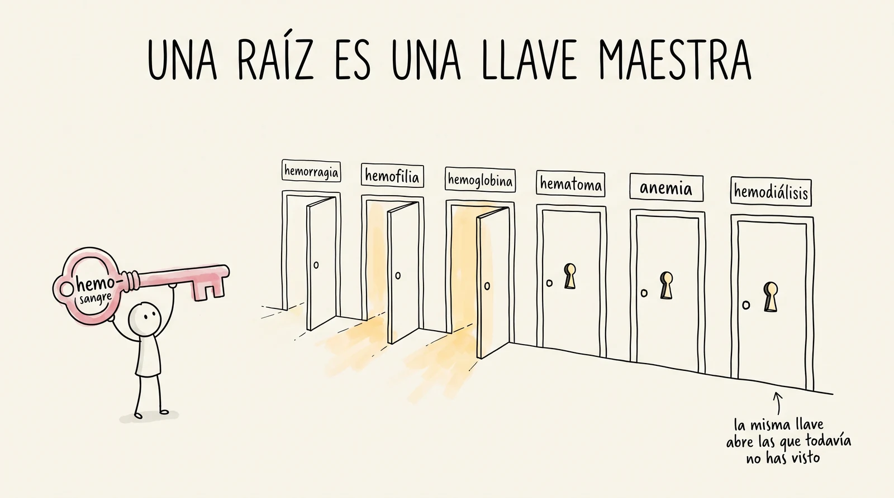
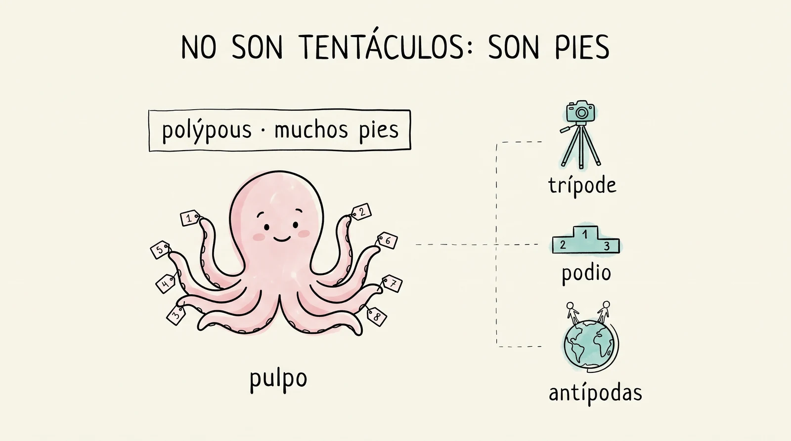
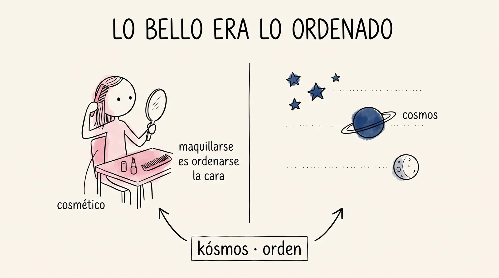
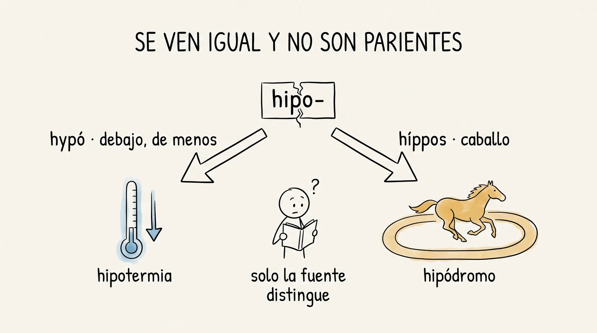

# Semana 5 · Una raíz, veinte palabras

> **La pregunta de la semana:** ¿cuántas palabras me regala una sola raíz?

**Esta semana podrás:**

- sacar en cadena la familia entera de una raíz, y contar cuántas palabras te regaló
- reconocer una pieza vieja escondida en una palabra que jamás relacionarías con ella
- desconfiar de dos piezas que se ven idénticas y no son parientes
- usar tu mazo como los que llevan años usándolo: buscar dentro de él, elegir bien el botón y rescatar tus tarjetas más falladas

Una raíz no es un dato: es una llave maestra. Quien sabe *hemo-* (sangre) ya lee hemorragia, hemofilia, hemoglobina, hematoma, hemodiálisis y cinco más, sin haberlas estudiado. Y de pilón entiende por qué *anemia* es sangre que falta.

---

| Día | Sesión | Trae |
|---|---|---|
| [Martes 25](#martes) · 1 h | La cadena de raíces | el mazo al día |
| [Miércoles 26](#miercoles) · 1 h | Las sorpresas del árbol | tu palabra más inesperada |
| [Jueves 27](#jueves) · 1 h, centro de cómputo | El gimnasio abierto | tu teléfono con Anki y el mazo al día |
| [Viernes 28](#viernes) · 2 h | El campeonato de árboles | tu hoja, tu mazo y ganas de escribir rápido |

Cada día es un mazo de láminas. En clase se proyectan una por una con el botón <strong>Presentar</strong>; aquí se quedan apiladas, en orden, para volver a ellas cuando quieras. Debajo de los mazos: el árbol interactivo con las diez raíces, las sorpresas, la trampa de la semana y las tarjetas.

<!-- ============================ MARTES ============================ -->
<section class="mazo" id="martes">

Martes 25 de agosto · 1 hora

<h3>La cadena de raíces</h3>

Hoy una sola pieza te va a regalar diez palabras.

<button class="btn-presentar" type="button">Presentar ▸</button>

<section class="lam lam--actividad">
<h4>1 El minuto del lector · estreno 30 min</h4>
Al aire · todo el grupo

Un minuto, una persona: qué estoy leyendo y por dónde voy.

Hoy se estrena el ritual y por eso es largo: todos escriben su ficha —título, página, una palabra— y pasan los que quieran. Sin resumen y sin recomendación forzada; se vale decir que no te está gustando. Después lee el profe un fragmento del libro que trae, y de ahí sale la raíz del día.

Del próximo martes en adelante son tres minutos: pasa una persona por semana, hasta que pase el grupo entero.

Reparte las fichas de papel ANTES de proyectar la lámina de la ficha, boca abajo, y repite dos veces que nadie las recoge. El cronómetro de la barra se pone solo: 45 s en la ficha, 60 s en cada minuto. Teclas: T arranca y pausa, R reinicia, N enseña estas notas, A oculta el apoyo.

</section>
<section class="lam lam--actividad">
<h4>Párense y ubíquense</h4>
Actividad · todo el grupo, sin hablar

Camina y párate donde estés de verdad.

<table>
<tr><th>Me lo estoy devorando</th><th>Ahí la llevo</th><th>Lo estoy arrastrando</th></tr>
<tr><td>voy volando, quiero seguir</td><td>avanzo, pero a mi ritmo</td><td>o lo abandoné, o no lo he abierto</td></tr>
</table>

Nadie tiene que decir nada todavía. Solo caminar y pararse en la pared que le toca.

Que se PAREN y caminen: si se quedan sentados señalando, se pierde el efecto. Tú no comentes dónde se paró nadie. Cuenta en silencio cuántos hay en la tercera pared: ese número te dice cómo va el programa lector, y no se dice en voz alta.

</section>
<section class="lam lam--oscura">
<h4>Miren alrededor</h4>

Nadie explica por qué está donde está. Solo véanse.

Abandonar un libro es una decisión lectora, no un fracaso. Aquí no hay una pared correcta.

Media lámina, treinta segundos. Vale oro si la tercera pared está llena: legitima el abandono antes de que nadie tenga que confesarlo. Si el grupo ya está cómodo, pásala de largo.

</section>
<section class="lam lam--actividad" data-crono="45">
<h4>Cuarenta y cinco segundos · nadie ve tu papel</h4>
Actividad · individual

Tres renglones y tres casillas.

<table>
<tr><th>Título y autor</th><th>Voy en la página</th><th>Una palabra</th></tr>
<tr><td>&nbsp;</td><td>&nbsp;</td><td>&nbsp;</td></tr>
</table>

☐ No lo he abierto. &nbsp;&nbsp; ☐ Lo abandoné. &nbsp;&nbsp; ☐ Prefiero no decir cuál. Las tres casillas valen lo mismo que los tres renglones.

Arranca el cronómetro con T; ya está en 45 s. Si alguien pregunta si cuenta para calificación: no, y dilo rápido.

</section>
<section class="lam lam--oscura" data-crono="60">
<h4>Un minuto cada quien</h4>

Lees tu papel en voz alta. Nada más. Sin resumen.

Después, el grupo puede hacer <strong>una</strong> pregunta. Dos están prohibidas: <em>¿de qué trata?</em> y <em>¿lo recomiendas?</em>

Hoy pasan los que quieran. Del próximo martes en adelante: uno por semana, hasta que pase el grupo entero.

Las dos preguntas prohibidas son el corazón de la regla: sin ellas esto se vuelve reseña. Dilas despacio.

</section>
<section class="lam">
<h4>Empiezo yo</h4>
<table>
<tr><th>Título y autor</th><th>Voy en la página</th><th>Una palabra</th></tr>
<tr><td><em>Orbital</em> · Samantha Harvey</td><td>16</td><td>lento</td></tr>
</table>

Y no me pregunten de qué trata, ni si lo recomiendo. Ese no es el trato aquí.

Modelas tú primero, con el cronómetro corriendo y dejando que te corte. Que te vean obedecer la regla del reloj: es lo único que hace creíble cortarles a ellos.

</section>
<section class="lam lam--oscura" data-crono="60">
<h4>Un minuto es un minuto</h4>

Cuando el cronómetro llega a cero, se acaba tu turno. Aunque estés a media frase.

No es rigor: es lo que impide que esto se vuelva una reseña.

Esta es la lámina que se queda puesta mientras pasan los lectores: T arranca cada minuto nuevo. Corta a los 60 s la primera vez aunque duela; la segunda ya nadie se pasa.

</section>
<section class="lam">
<h4>Y ahora déjenme leerles algo</h4>

Del libro que estoy leyendo.

Tres párrafos: un salón de clases, un cuadro y un muchacho de quince años al que la clase le pareció una pérdida de tiempo.

Cambio de aire: aquí guardan los papeles y se sientan a escuchar. No anuncies que hay etimología adelante; el remate se cae si lo ven venir.

</section>
<section class="lam">
<h4>El fragmento · <em>Las meninas</em></h4>

En la escuela les dieron una clase sobre <em>Las meninas</em>, cuando Shaun tenía quince años. Les contaron que el cuadro desorientaba al <strong>espectador</strong> y le dejaba con la sensación de no saber qué estaba <strong>mirando</strong>.

—Es un cuadro dentro de otro cuadro —les dijo el profesor—. Velázquez está en el cuadro, junto al caballete, y lo que pinta es el rey y la reina, pero ellos están fuera del cuadro, justo donde nos encontramos nosotros. El único detalle que nos dice que están ahí es que podemos <strong>verlos reflejados</strong> en un <strong>espejo</strong> que tenemos justo delante.<cite>Samantha Harvey, <em>Orbital</em>, pp. 15–16</cite>

Lee tú en voz alta, despacio, sin actuar. Si hay internet, ten <em>Las meninas</em> abierta para mostrarla veinte segundos al terminar; si no, descríbelo con la mano: el pintor aquí, el rey donde estamos nosotros.

</section>
<section class="lam lam--oscura">
<h4>Y entonces el profesor pregunta</h4>

Así pues, ¿cuál es el tema del cuadro?

O bien —dijo el profesor— ¿se trata de un cuadro sobre la nada, tan solo una sala con gente y un espejo?

Aquí sí haz la pausa. Deja la pregunta en el aire tres segundos antes de pasar.

</section>
<section class="lam">
<h4>Al muchacho le pareció una pérdida de tiempo</h4>

Para Shaun, que a los quince años no tenía ganas de ir a clase de Historia del Arte y ya sabía que quería ser piloto de combate, aquella lección fue el culmen de la frivolidad. El cuadro no le gustó especialmente y le daban igual los ingredientes de los que estuviera hecho.<cite>Samantha Harvey, <em>Orbital</em>, pp. 15–16</cite>

Seis astronautas dan dieciséis vueltas a la Tierra en un día, mirándola. Shaun es uno de ellos.

El chiste del fragmento: el que bosteza en la clase de arte es el mismo que hoy se pasa el día mirando la Tierra. Suéltalo y pasa, sin subrayarlo.

</section>
<section class="lam lam--oscura">
<h4>Un cuadro dentro de otro cuadro</h4>

Una palabra dentro de otra palabra.

Llevamos toda la semana haciendo lo mismo que ese profesor: señalar lo que está dentro de algo que parecía simple. Y el libro entero es eso: gente mirando la Tierra desde arriba.

La bisagra del día: aquí el ritual de lectura se convierte en clase de etimología. Es la única lámina donde conviene el silencio largo.

</section>
<section class="lam lam--actividad">
<h4>Cacería · toda palabra del fragmento que tenga que ver con mirar</h4>
Actividad · a mano alzada

espectador · mirando · verlos · reflejados · espejo

Cinco. Un fragmento sobre un cuadro y no habla de otra cosa.

PRIMERO pídelas a mano alzada con el fragmento a la vista; recién entonces destapa la lista. Las cinco están textualmente en lo que acabas de leer. Palabra que no salga en el fragmento se marca con "?" y se va al tribunal del jueves.

</section>
<section class="lam lam--oscura">
<h4>Tribunal · de esas cinco, ¿cuántas son parientes?</h4>

spec-<small>mirar</small>
= espectador · espejo

Dos. Solo dos. Las otras tres hablan de lo mismo y no se conocen entre ellas: <strong>significar parecido no prueba parentesco</strong>, la regla de oro de la semana 3.

Que voten antes de que destapes: casi todos apuestan que espejo y espectador no son parientes, y que reflejo sí lo es del espejo.

</section>
<section class="lam">
<h4>¿Y las otras de dónde salieron?</h4>
<table>
<tr><th>La palabra</th><th>Viene de</th><th>Y entonces</th></tr>
<tr><td>ver</td><td><em>videre</em></td><td>su propia raíz: visión, evidente, prever, revisar</td></tr>
<tr><td>observar</td><td><em>servare</em>, guardar</td><td>como conservar, preservar, reservar</td></tr>
<tr><td>contemplar</td><td><em>templum</em></td><td>el recinto que el augur trazaba en el cielo para leer los pájaros</td></tr>
<tr><td>percibir</td><td><em>capere</em>, agarrar</td><td>como capturar, recibir, concepto</td></tr>
</table>

Del fragmento, aquí se resuelve una: <em>verlos</em>. Las otras dos tienen lámina propia, y las dos son trampas.

</section>
<section class="lam lam--oscura">
<h4><em>reflejo</em> parece del espejo</h4>

re-<small>otra vez</small>
flectere<small>doblar</small>
= reflejo

Y no lo es. Reflejar es <strong>doblar hacia atrás</strong>: primo de flexible, inflexión y circunflejo.

Y de <em>reflexionar</em>, que es doblar el pensamiento hacia atrás. La misma palabra partida en dos.

</section>
<section class="lam">
<h4><em>mirar</em> tampoco viene de mirar</h4>

mirari<small>asombrarse</small>
→ milagro · maravilla · admirar · mirador

En latín, mirar se dice <em>spec-</em>. Nuestro <strong>mirar</strong> salió de otro lado: de quedarse asombrado.

Pregunta antes: ¿de dónde creen que viene MIRAR? Nadie dice asombrarse. Mirador y maravilla son las que hacen ruido.

</section>
<section class="lam">
<h4>La cosecha del día</h4>

spec-<small>specere: mirar</small>
= catorce puertas

espejo (<em>speculum</em>) · espejismo · espectador · espectáculo · espectro (lo que aparece) · perspectiva (mirar a través) · inspeccionar (mirar dentro) · sospechar (mirar por debajo) · especular (otear desde la torre) · expectativa · aspecto · espécimen · especie (lo que se ve) · prospecto.

skop- / skept-<small>su primo griego</small>
→ telescopio · microscopio · escéptico · horóscopo

Horóscopo es <em>hōra</em> + <em>skopein</em>: el que mira la hora. Guarda esa <em>hōra</em>: es la pieza que resuelve el enigma del <em>reloj</em>. La respuesta está más abajo, en la hoja de consulta, pero intenta armarla tú antes de abrirla.

Esta es la llave maestra de hoy: una pieza, catorce puertas. Léelas a buen ritmo, sin explicar cada una; el efecto es la cantidad.

</section>
<section class="lam lam--oscura">
<h4>Y la palabra sorpresa</h4>

re-<small>otra vez</small>
spec-<small>mirar</small>

respetar

Respetar es <strong>volver a mirar</strong>: mirar por segunda vez a alguien a quien ya habías visto de reojo. Piensen dónde apareció: en un cuadro donde el rey mira a la infanta, la infanta nos mira a nosotros, Velázquez nos mira a todos y el espejo lo devuelve.

Deja que compongan la suma ellos: re- más spec-, ¿qué palabra da? Suele salir en voz baja y desde el fondo. No la digas tú si alguien la está pensando.

</section>
<section class="lam lam--actividad">
<h4>2 Ritual: duelo de piezas 5 min</h4>
Actividad · en parejas

El mazo a la cancha. Ya trae cuatro semanas encima.

Se dice la pieza, el rival da el significado y una palabra donde viva. Quien usa Leitner juega con sus fichas. Esta semana no hay quiz el martes: cae el jueves, con las raíces nuevas ya puestas.

Mete piezas griegas de la semana 4 (-itis, -algia, iatro-, hiper-, hipo-) junto con las latinas viejas. Guarda hipo- para el final del duelo, sin decir nada: mañana esa pieza les va a explotar en la cara.

</section>
<section class="lam">
<h4>3 Una raíz es una llave maestra 5 min</h4>

Aprender una raíz no suma una palabra: abre una fila entera de puertas.

<em>spec-</em> acaba de darles catorce. Y no es la excepción: así funcionan todas.

hemo<small>sangre</small>
-rragia<small>brotar</small>
= hemorragia

Con esa sola pieza ya puedes leer hemofilia, hemoglobina, hematoma, hematología y hemodiálisis. Y una que no empieza con hemo pero es de la casa: <em>anemia</em>, sangre que falta, con el <em>an-</em> que traes desde la semana 2. Nadie te enseñó ninguna una por una.

Escribe hemo- en el pizarrón y pide palabras a mano alzada antes de dar la lista. Siempre sale hemorragia primero; anemia casi nunca, y es la que conviene celebrar.

</section>
<section class="lam lam--oscura">
<h4>La cuenta que importa</h4>

No es cuántas palabras sabes. Es cuántas te regala cada pieza que aprendes.

Diez piezas nuevas esta semana. Si cada una rinde ocho palabras, hoy sales con ochenta que no tenías el lunes. Esa multiplicación es todo el negocio de la etimología, y es la razón por la que este curso no te pide memorizar listas de palabras.

</section>
<section class="lam lam--actividad">
<h4>4 Gimnasio: la cadena de raíces 17 min</h4>
Actividad · en equipos

Elige una raíz y escribe todas las palabras de su familia que puedas, contra reloj.

<a href="../ejercicios/semana-05/ejercicio-5A-cadena-de-raices.html">La cadena de raíces</a>, con tres minutos por raíz. Cinco familias para escoger: hemo-, cosmo-, -polis, zoo- y -teca. Repetir te saca de la ronda, y las palabras dudosas no se borran: se marcan con "?" y se van al tribunal del jueves.

<a href="../ejercicios/semana-05/ejercicio-5A-cadena-de-raices.html" target="_blank" rel="noopener">La cadena de raíces</a>Una raíz, todas las palabras que te regala. El reto: pasar de diez en una sola familia.

Deja que jueguen por lo menos dos raíces distintas. La que casi siempre da más lejos es -teca, porque nadie espera que botica y bodega estén ahí. Anota los "?" del grupo en el pizarrón: son la pólvora del jueves.

</section>
<section class="lam lam--actividad">
<h4>5 Antes del miércoles 3 min</h4>
Para llevar a casa

Trae la palabra más inesperada que te salió hoy.

Una sola, con la raíz de la que salió y una línea de por qué te sorprendió. Y al mazo entran hoy las cinco raíces que jugaste: las tarjetas están abajo, con el estándar del curso —frente, solo la pieza; reverso, significado y palabra ancla—.

<strong>Y antes de salir: tu palabra, al pizarrón.</strong> La que escribiste en la ficha, hayas pasado o no. Solo la palabra: no se explica, no se comenta.

Si el grupo va rápido, fabrican tarjetas antes de salir. Si no, quedan de tarea. Insiste en una cosa: la tarjeta la fija quien la hace, no quien la baja. Y fotografía el pizarrón: esas palabras se publican en Leemos y son candidatas al Museo.

</section>
</section>

<!-- ============================ MIÉRCOLES ============================ -->
<section class="mazo" id="miercoles">

Miércoles 26 de agosto · 1 hora

<h3>Las sorpresas del árbol</h3>

El pulpo tiene muchos pies, el cosmos se maquilla y el mundo, en latín, quería decir limpio.

<button class="btn-presentar" type="button">Presentar ▸</button>

<section class="lam">
<h4>1 Ritual: la palabra más inesperada 6 min</h4>
Al aire

¿Cuál te sorprendió más, y por qué?

Ronda rápida. Las mejores se anotan: son candidatas al Museo y a la vitrina de la semana.

Si alguien trae una que no es de la familia, no la corrijas: mándala al tribunal de mañana. Que la duda se resuelva con fuente y no con la autoridad del profesor.

</section>
<section class="lam">
<h4>2 El pulpo no tiene tentáculos 8 min</h4>

poly<small>muchos</small>
pous<small>pie</small>
= pulpo

Del griego <em>polýpous</em>: muchos pies. Lo que tú llamas tentáculos, los griegos lo contaron como patas, y por eso el pulpo es pariente del <em>trípode</em>, del <em>podio</em>, del <em>podólogo</em> y de las <em>antípodas</em>, esa gente que tiene los pies exactamente del otro lado del planeta.

Pregunta primero: ¿de qué familia creen que viene "pulpo"? Nadie dice "pie". Ahí está el gancho del día.

</section>
<section class="lam">
<h4>Y otras cuatro que no te esperabas</h4>
<table>
<tr><th>La palabra</th><th>Viene de</th><th>Y entonces</th></tr>
<tr><td>náusea</td><td><em>naus</em>, nave</td><td>marearse era cosa de navegantes, antes de que hubiera coches</td></tr>
<tr><td>cosmético</td><td><em>kósmos</em>, orden</td><td>maquillarse es, literal, ordenarse la cara</td></tr>
<tr><td>zodiaco</td><td><em>zóidion</em>, animalito</td><td>es el círculo de los animalitos: por eso casi todos los signos son bichos</td></tr>
<tr><td>economía</td><td><em>oikos</em> + <em>nomos</em></td><td>son las reglas de la casa: la palabra más seria del noticiero nació administrando una cocina</td></tr>
</table>

Para los griegos lo bello era lo ordenado, y por eso el universo y un labial comparten raíz. Cuando alguien te diga que la etimología es cosa de museo, cuéntale que su crema facial se llama como el cosmos.

</section>
<section class="lam lam--oscura">
<h4>3 La trampa de la semana 10 min</h4>

hipotermia · hipódromo. ¿El <em>hipo-</em> es la misma pieza?

Pídeles el veredicto a mano alzada antes de leer lo que sigue.

Que se comprometan con una respuesta antes de la revelación: el golpe pedagógico está en haberse mojado. Casi todo el grupo va a decir que sí.

</section>
<section class="lam">
<h4>No son parientes</h4>

hypó<small>debajo, de menos</small>
→ hipotermia, hipoglucemia

híppos<small>caballo</small>
→ hipódromo, hipopótamo, hipocampo

Se escriben igual en español y no tienen absolutamente nada que ver. Es el mismo tipo de trampa que <em>mango</em> en la semana 3: dos piezas idénticas a la vista, con padres distintos. <strong>Solo la fuente distingue.</strong> Guárdate esta lección: vale para todo el semestre, y va a caer en el integrador.

De pilón: un hipopótamo es un caballo de río (<em>potamós</em>), y el <em>hipocampo</em> —el caballo de mar— le da nombre a la parte de tu cerebro donde vive la memoria, porque tiene esa forma.

</section>
<section class="lam lam--actividad">
<h4>4 Tu propio árbol 8 min</h4>
Actividad · individual

Ahora una raíz que no jugamos ayer, y hasta donde aguantes.

Vuelve a <a href="../ejercicios/semana-05/ejercicio-5A-cadena-de-raices.html">la cadena</a> con otra familia, o arma la tuya con una raíz de tu mazo viejo. La meta no es llegar a veinte: es llegar a una que nadie más tenga y poderla defender mañana.

<a href="../ejercicios/semana-05/ejercicio-5A-cadena-de-raices.html" target="_blank" rel="noopener">La cadena de raíces</a>Una raíz, todas las palabras que te regala. El reto: pasar de diez en una sola familia.

Hoy el árbol arranca en clase y se termina en casa: el bloque del pacto se lleva ocho minutos de este taller, y el viernes hay dos horas enteras de árboles. Si el grupo está enganchado y prefieres proteger el taller, lo que se recorta es la lámina de las tres palabras (basura, escoba, curador): se lee en treinta segundos o se guarda para el viernes.

</section>
<section class="lam lam--oscura">
<h4>5 Una sorpresa más, y esta es latina 10 min</h4>

Los romanos tuvieron que traducir <em>kósmos</em>. ¿Con qué palabra creen que lo hicieron?

Apuestas a mano alzada antes de pasar la lámina. Nadie la va a decir.

Regla de oro para los próximos diez minutos: <strong>no menciones ni una sola vez cómo está el salón hoy</strong>. Ni una indirecta, ni una mirada al piso. Se habla de una palabra latina, de Japón y de un experimento holandés; la comparación la hacen ellos solos, y ahí está toda la fuerza. Si la haces tú, esto se convierte en regaño y el pacto nace muerto.

</section>
<section class="lam">
<h4>mundus, o por qué el mundo se llama así</h4>

kósmos<small>orden, adorno</small>
se tradujo
mundus<small>limpio, aseado</small>
= mundo

En latín <em>mundus</em> era un adjetivo y quería decir <strong>limpio</strong>. También se llamaba <em>mundus</em> al estuche donde una señora guardaba sus cosas de arreglarse: otra vez la cosmética. Cuando los romanos tuvieron que traducir el <em>kósmos</em> de los griegos —ese universo que funciona porque está ordenado— echaron mano de la palabra que ya tenían para "limpio y arreglado". Por eso vives en un <em>mundo</em>: alguien decidió, hace dos mil años, que al universo se le iba a decir "lo limpio".

🍨 Y la negación sigue ahí, intacta, y la usas todos los días: <strong>in-mundo</strong> es lo que no está limpio. <em>Inmundicia</em>, igual. Cuando dices que algo es inmundo estás diciendo, literal, que <em>no es mundo</em>.

</section>
<section class="lam">
<h4>Tres palabras que hoy vas a necesitar</h4>
<table>
<tr><th>La palabra</th><th>Viene de</th><th>Y entonces</th></tr>
<tr><td>basura</td><td><em>versūra</em>, la acción de barrer, de <em>verrere</em>, barrer</td><td>basura no significa "lo sucio": significa <strong>lo que hay que barrer</strong>. La palabra ya trae la tarea adentro</td></tr>
<tr><td>escoba</td><td><em>scōpa</em>, ramita</td><td>la primera escoba fue un manojo de ramas amarradas, y el nombre nunca se actualizó</td></tr>
<tr><td>curador</td><td><em>cura</em>, cuidado</td><td>el que cuida. El del museo cuida las piezas; el de un salón cuida el lugar</td></tr>
</table>

🍨 Y la más rara de esa familia: <em>seguro</em> es <em>se-</em> (sin) + <em>cura</em> (cuidado). Estar seguro es estar sin preocupación. Misma raíz que <em>curar</em>, <em>procurar</em>, <em>curioso</em> y <em>curador</em>.

</section>
<section class="lam">
<h4>En Japón el salón lo limpian los que lo usan</h4>

Se llama <em>o-sōji</em>, y está en el horario, como el recreo.

De primaria a preparatoria, todos los días, entre quince y veinte minutos: los propios alumnos barren su salón, los pasillos, las escaleras y los baños de su escuela. No es castigo ni es servicio social; está en el plan de estudios, en la parte que llaman <em>tokkatsu</em>, las actividades donde se aprende lo que no se examina. Se reparte por equipos, rota cada semana, y el maestro limpia con ellos. La idea de fondo es sencilla: uno cuida de verdad lo que ha limpiado con sus propias manos.

🍨 De ahí viene algo que ya viste en la tele sin saber lo que estabas viendo: las aficiones japonesas que se quedan recogiendo la basura de las gradas cuando el partido ya acabó. En Rusia 2018 la selección perdió con Bélgica y quedó eliminada; antes de irse dejaron el vestidor impecable y una nota de agradecimiento, escrita en ruso, sobre la mesa.

Matiz que conviene decir en voz alta, porque alguien lo va a pensar: no es que los japoneses nazcan ordenados. Es que la limpieza tiene <strong>hora fija, reparto y compañía</strong>, y no se discute cada día si toca o no toca. Eso es justo lo que se les va a proponer, y es también la única parte que se puede copiar.

</section>
<section class="lam lam--oscura">
<h4>El refrán</h4>

El ave que alza el vuelo no enturbia el agua.<cite>立つ鳥跡を濁さず · tatsu tori ato o nigosazu</cite>

Las garzas y los patos levantan el vuelo sin dejar revuelto el estanque. Se dice de quien se va de un lugar —de un trabajo, de una casa, de un salón— sin dejarle el tiradero a otro. Todo lo anterior cabe en ese renglón.

</section>
<section class="lam">
<h4>Y no es solo cultura: está medido</h4>

Una pared con grafiti hace que la gente tire más basura. No es metáfora, son números.

<table>
<tr><th>Groninga, Holanda · 2008</th><th>Lugar en orden</th><th>Lugar en desorden</th></tr>
<tr><td>tiraron el volante al suelo (pared limpia / con grafiti)</td><td>33 %</td><td>69 %</td></tr>
<tr><td>se metieron por el hueco de la reja</td><td>27 %</td><td>82 %</td></tr>
<tr><td>se robaron un sobre con dinero a la vista</td><td>13 %</td><td>27 %</td></tr>
</table>

Seis experimentos de campo, con gente real que no sabía que la estaban observando. Cuando el lugar enseña que ahí una regla se rompe, la gente rompe también otras que no tienen nada que ver. El desorden se contagia. <strong>Y la buena noticia es la misma frase al revés:</strong> el orden también. Un salón nunca es neutral: todo el día le está diciendo algo al que está adentro.

Fuente: Keizer, Lindenberg y Steg, <em>The Spreading of Disorder</em>, revista <em>Science</em>, 2008. Si alguien pregunta si eso aplica aquí, la respuesta honesta es "no lo sé, eso fue en Holanda" — y de ahí sale sola la idea de averiguarlo nosotros.

</section>
<section class="lam lam--actividad">
<h4>6 La propuesta 5 min</h4>
Al aire · se decide hoy

Dos cosas: una chiquita que empieza hoy, y una grande que no depende de mí.

<strong>La chiquita.</strong> De hoy en adelante, los últimos <strong>tres minutos</strong> de esta clase son de este salón. Suena una alarma —no lo decide nadie, lo decide el reloj—, se acaba lo que se esté haciendo y nos ponemos todos: piso, bancas, pizarrón. Cuatro días a la semana. <strong>No hay lista, no hay castigo y no cuenta para la calificación:</strong> el día que cuente para la calificación deja de ser un pacto y se convierte en tarea.

<strong>La grande.</strong> Lo que acaban de ver de Japón no son tres minutos: son diez, al final del día, con el salón entero. Esa yo no se las puedo dar, porque mi clase no es la última del día. Si la quieren, la tienen que conseguir ustedes: hablar con su tutor y con los maestros que sí cierran el día, y pedirles esos diez minutos. El cartel de la pared ya está hecho para ese día.

Y como todos los pactos de este curso, trae fecha de corte: <strong>viernes 18 de septiembre</strong>. Ese día lo revisamos con lo que haya pasado y se decide si sigue igual, si cambia o si se cae. Y el que no quiera firmar no firma: un acuerdo que no se puede objetar no es un acuerdo, es un reglamento.

El giro está en la segunda mitad, y conviene decirlo sin adornos: <strong>no prometas lo que no controlas</strong>. Si vendes hoy los diez minutos del final del día, mañana a esa hora el último maestro se pasa de la hora, nadie se para y el pacto se muere el primer día — y resucitar uno muerto sale mucho más caro que arrancarlo. Al pasarles a ellos la gestión de la versión grande dejas de ser el que impone, y salir a conseguir un sí es la mejor parte del ejercicio. Lo que no se negocia sigue igual: <strong>tú barres también</strong>, no supervisas, y nadie recoge la basura de otro mientras el otro mira. Si se cae dos días seguidos, no se regaña a nadie: se vuelve a poner sobre la mesa en clase.

</section>
<section class="lam">
<h4>La de tres minutos, la que empieza hoy</h4>
<table>
<tr><th>Reloj</th><th>Qué pasa</th></tr>
<tr><td>0:00</td><td>suena la alarma en el celular del <strong>curador del día</strong>. Todos de pie. Se acabó la clase: nada de "acabo este renglón"</td></tr>
<tr><td>0:00 – 0:20</td><td>el curador reparte tres frentes: <strong>piso, bancas, pizarrón</strong>. Nadie escoge; la lista rota</td></tr>
<tr><td>0:20 – 2:20</td><td>manos. Cada quien en su frente, el profesor también</td></tr>
<tr><td>2:20 – 2:40</td><td>la línea: las bancas se alinean con una referencia física —una raya de gis, el tercer mosaico— para que "ordenado" sea verificable y no opinable</td></tr>
<tr><td>2:40 – 3:00</td><td>la vuelta del curador, la fórmula —<em>queda mundo</em>—, la foto del salón vacío y a la calle</td></tr>
</table>

Un solo cargo, el curador, y rota por lista. Un solo registro, la foto. Los sistemas con muchos papeles y muchas bitácoras se mueren a los quince días.

La alarma va en el celular de un alumno desde el primer día, nunca en el tuyo. Parece un detalle y es lo más importante de todo el diseño: es la única pieza capaz de viajar sola al final del día, cuando tú no estés ahí. Que tenga nombre —KÓSMOS— y que el curador se la pase al siguiente.

</section>
<section class="lam">
<h4>La de diez minutos, la que hay que ir a conseguir</h4>
<table>
<tr><th>Reloj</th><th>Qué pasa</th></tr>
<tr><td>0:00</td><td>suena la alarma. Todos de pie. Se acabó el día: nada de "acabo este renglón"</td></tr>
<tr><td>0:00 – 1:00</td><td>el <strong>curador del día</strong> reparte los cinco frentes: piso, bancas, pizarrón y escritorio, repisas y ventanas, puerta y pasillo</td></tr>
<tr><td>1:00 – 7:00</td><td>manos. Cada quien en su frente, y el maestro que esté también</td></tr>
<tr><td>7:00 – 8:00</td><td>la línea de las bancas</td></tr>
<tr><td>8:00 – 9:00</td><td>la vuelta del curador: camina el salón y dice "listo" o señala lo que falta. Diez segundos por frente</td></tr>
<tr><td>9:00 – 10:00</td><td>todos de pie junto a su banca. Se dice la fórmula —<em>queda mundo</em>—, se toma la foto del salón vacío y se sale</td></tr>
</table>

Esta es la del cartel: el salón entero al final del día, cinco frentes en vez de tres y tiempo para hacerlo bien. Y es la que hay que ir a pedir. Lo que se pide, dicho en una sola frase para que no se enrede: <strong>que los últimos diez minutos del último periodo no se ocupen</strong>.

Lleva el cartel impreso desde hoy: <a href="../recursos/plantillas/pacto-del-salon.html">el pacto del salón</a>, en tus plantillas. Ese cartel <strong>no se firma</strong>: es la hoja que dice qué están firmando, y va a la pared con la lista de curadores. Repártete la gestión con ellos: <strong>tú hablas con intendencia y con el tutor del grupo; a los demás maestros los convencen ellos</strong>. Con intendencia, ojo con el encuadre —el gesto se lee al revés con facilidad—: no la sustituimos, le devolvemos lo que nunca debió ser suyo. Y hay una pregunta que vale oro: qué le facilitaría más a ella que hiciéramos.

</section>
<section class="lam lam--actividad">
<h4>7 La firma: pasa al pizarrón 3 min</h4>
Actividad · uno por uno

Esto no se firma en una hoja. El que entra, se para y escribe su nombre en el pizarrón.

Ahí se quedan, en <strong>la esquina del pacto</strong>: el único pedazo del pizarrón que no se borra —ni en la limpieza de cada día— hasta que esto se revise el 18 de septiembre. Lo van a ver todos los días, que es justo de lo que hablamos hace rato: un salón siempre le está diciendo algo al que está adentro. El que no quiera firmar no firma y no pasa nada. Y el que se arrepienta, lo borra: para eso está a gis.

Dos reglas para que este minuto no se eche a perder. <strong>Uno:</strong> no cuentes, no leas la lista en voz alta y no mires quién no pasó — en el segundo en que se vuelve control de asistencia, deja de ser un pacto. Deja el pizarrón disponible y sigue con lo tuyo; el que quiera pasa. <strong>Dos:</strong> firma tú primero y siéntate. Que el primer nombre del pizarrón sea el del que va a barrer con ellos.

Antes de la clase: marca con cinta o con gis un recuadro en una esquina del pizarrón que no estorbe, y rotúlalo "el pacto". Sin recuadro, el frente 3 se lo lleva el jueves.

</section>
<section class="lam">
<h4>8 Cierre 2 min</h4>
Para llevar a casa

Al mazo las cinco raíces que faltan. Y mañana se paga una deuda de tres semanas.

Las diez tarjetas de la semana están abajo. Ojo con las dos que se parecen: <em>hipo-</em> lleva <strong>dos tarjetas distintas</strong>, y en el reverso de cada una escribe "no confundir con la otra". Y agrega una de pilón, la de hoy: <em>mundus</em>, limpio.

Y un encargo que no es de etimologías: el que hable con un maestro del último periodo, o con el tutor, que traiga el sí o el no. No hay fecha; hay pizarrón esperando.

Cierra recordándoles el re-loj congelado desde la semana 3. Que lleguen mañana con hambre; y si alguien ya lo googleó, pídele por favor que se aguante y no lo suelte.

</section>
<section class="lam lam--actividad" data-crono="240">
<h4>9 Suena la alarma: la primera vez 4 min</h4>
Actividad · todo el grupo

No lo vamos a discutir más: lo vamos a cronometrar.

Esto no es un ensayo: es el pacto, empezando. Y estamos midiendo una sola cosa, <strong>cuánto tarda de verdad</strong>, porque de ahí sale el argumento para pedir los diez. Si en tres minutos este salón queda, ya saben qué contestarle a quien les diga que es mucho tiempo.

Este es el remate del día y lo que convierte el discurso en dato: en un curso donde todo se verifica en la fuente y nada se cree por la autoridad del profesor, el pacto tampoco se cree — se mide. La lámina trae <code>data-crono="240"</code>: al llegar aquí el cronómetro del telón se pone solo en 4:00 y arranca con la tecla <strong>T</strong>, proyectado y a la vista de todos. Hoy son cuatro minutos porque incluye repartir los frentes por primera vez; de mañana en adelante son tres. El número final al pizarrón, y ese número se guarda para la revisión del 18 de septiembre. Y barre tú también, desde el primer día: es la lámina más importante de la semana y no tiene texto.

</section>
</section>

<!-- ============================ JUEVES ============================ -->
<section class="mazo" id="jueves">

Jueves 27 de agosto · 1 hora · centro de cómputo

<h3>El gimnasio abierto</h3>

Hoy no aprendes raíces nuevas: aprendes a usar el gimnasio.

<button class="btn-presentar" type="button">Presentar ▸</button>

<section class="lam lam--actividad">
<h4>1 El safari del mazo 10 min</h4>
Actividad · individual, con el mazo abierto

En tu mazo hay tesoros escondidos. Te voy a dar las pistas.

Cinco pistas, una por una. La primera mano arriba lee la tarjeta completa en voz alta: frente, reverso y la nota. Se vale usar el <strong>buscador</strong>, que es justo lo que hoy vienes a aprender.

<strong>Dónde está la lupa:</strong> en <em>AnkiDroid</em>, el ícono de lupa de arriba (o el menú ⋮ › <em>Explorar tarjetas</em>). En la <em>computadora</em>, el botón <strong>Explorar</strong> de la barra superior. En <em>AnkiWeb</em> (iPhone), la pestaña <strong>Search</strong>. El buscador recorre <strong>todo</strong> el mazo acumulado, no solo la semana en curso.

Truco que casi nadie conoce: el buscador también busca <strong>dentro del reverso</strong>. Si escribes <code>caballo</code> salen todas las tarjetas donde aparezca esa palabra, aunque el frente no la tenga. ¿No traes el mazo instalado? El <a href="../ejercicios/semana-05/ejercicio-5E-safari-del-mazo.html">safari del mazo</a> trae un buscador de práctica con las setenta tarjetas del curso.

<a href="../ejercicios/semana-05/ejercicio-5E-safari-del-mazo.html" target="_blank" rel="noopener">El safari del mazo</a>Tu mazo no es una lista de pendientes: es un archivo. Hoy aprendes a buscar dentro de él.

Sin preámbulo, al entrar: "saquen el teléfono y abran Anki, hoy toda la clase ocurre ahí adentro". Proyecta tu propio Anki y enseña la lupa antes de la primera pista. Mientras cazan, CIRCULA: quien no encuentra nada casi siempre no ha importado los mazos recientes; se repara ahí mismo, en voz baja y sin drama. Anota quiénes fueron para tu bitácora, no para regaño público.

</section>

<section class="lam">
<h4>Pista 1</h4>

Busquen la tarjeta donde el universo y un labial comparten raíz.

<strong>Es <em>cosmo-</em>.</strong> Se encuentra escribiendo <code>labial</code> o <code>cosm</code>. Para los griegos, <em>kósmos</em> era el orden: lo bello era lo ordenado. Por eso el universo y el maquillaje son la misma palabra.

En el telón, presiona A antes de proyectar la pista: eso oculta el apoyo, o sea la respuesta. Vuelve a presionar A cuando alguien la cante.

</section>

<section class="lam">
<h4>Pista 2</h4>

Hay un caballo escondido dentro de un nombre propio. Encuéntrenlo.

<strong>Es <em>hipo-</em> (híppos, caballo).</strong> Se encuentra con <code>Felipe</code> o <code>caballo</code>. Felipe es <em>Philippos</em>: "el amigo de los caballos". Alguien en el salón se llama así y no lo sabía.

</section>

<section class="lam">
<h4>Pista 3</h4>

La tarjeta del mareo de los navegantes.

<strong>Es <em>náusea</em>.</strong> Se encuentra con <code>mareo</code> o <code>nau</code>. De <em>nausía</em>, el mareo del barco: antes de que existiera el coche, marearse era cosa de navegantes.

</section>

<section class="lam">
<h4>Pista 4</h4>

El animal cuyo nombre significa, literalmente, "muchos pies".

<strong>Es <em>pulpo</em>.</strong> Se encuentra con <code>pies</code> o <code>pulpo</code>. <em>Polýpous</em>: pariente inesperado del podio y del trípode. Lo que tú llamas tentáculos, los griegos lo contaron como patas.

</section>

<section class="lam">
<h4>Pista 5</h4>

El círculo de los animalitos que, según algunos, decide tu destino el día que naces.

<strong>Es <em>zoo-</em>.</strong> Se encuentra con <code>zodiaco</code> o <code>animal</code>. <em>Zóidion</em> es "animalito": por eso casi todos los signos son bichos.

<strong>Pista de reserva</strong>, si el grupo va rápido o hay empate: "la raíz de quien perdió la memoria". Es <em>mnem-</em>, de la semana 2, y se encuentra con <code>memoria</code>. Sirve para demostrar que el buscador recorre el mazo entero y no solo lo de esta semana.

Cierra el bloque en treinta segundos: "esto que acaban de hacer se llama tener el mazo vivo. No es una lista de pendientes: es su archivo personal de palabras. Se busca, se consulta, se presume". Usuarios de caja Leitner cazan en su caja física y suelen ganar: dilo en voz alta, "el papel no tiene lupa, pero tiene manos rápidas".

</section>

<section class="lam lam--oscura">
<h4>2 Botonología: la pregunta trampa 12 min</h4>

¿Qué pasa exactamente cuando presionas "Bien"? ¿Y "Otra vez"?

Llevas cinco semanas presionando botones que nadie te explicó. Hoy se explican, porque son la habilidad más importante del semestre y son contraintuitivos.

Deja el silencio. Ese silencio es el gancho de todo el bloque: no lo rescates tú.

</section>

<section class="lam">
<h4>La mecánica al desnudo</h4>

Los cuatro botones no son calificaciones: son citas.

<table>
<tr><th>Botón</th><th>Qué le hace a la tarjeta</th><th>Qué le estás diciendo</th></tr>
<tr><td><strong>Otra vez</strong></td><td>vuelve en este mismo repaso, a los pocos minutos</td><td>"todavía no es mía, tráemela pronto"</td></tr>
<tr><td><strong>Bien</strong></td><td>el intervalo crece: de 1 día a 3, de 3 a una semana</td><td>"es mía, aléjala un poco"</td></tr>
<tr><td><strong>Fácil</strong></td><td>el intervalo pega un salto grande</td><td>"la respondí antes de terminar de leer"</td></tr>
<tr><td><strong>Difícil</strong></td><td>alarga poquito y ensucia el cálculo</td><td>la trampa de los perfeccionistas</td></tr>
</table>

<strong>La regla simplificada del curso: vivimos con dos botones, <em>Otra vez</em> y <em>Bien</em>.</strong> <em>Fácil</em>, solo para lo obvio. <em>Difícil</em>, casi nunca.

Mira los numeritos que están arriba de cada botón (1m, 3d, 7d): esa es tu próxima cita con esa palabra. Para mucha gente, hoy es la primera vez que los nota.

Demuestra con la tarjeta de -nomía proyectada. Haz que TODOS ubiquen los numeritos en su propia pantalla antes de seguir; si no los ubican, el resto del bloque no aterriza.

</section>

<section class="lam lam--actividad">
<h4>La demostración del mentiroso</h4>
Al aire · el profe se pone en evidencia

"Dudé tres segundos… pero le pongo Bien porque quiero acabar rápido."

Sale <em>-nomía</em>. Mmm… ¿era "nombre"? No… ah sí, "ley, regla". Dudé. Y aun así presiono <strong>Bien</strong>: la tarjeta se va <strong>una semana</strong>. Yo no me la sé. ¿Dónde me va a explotar? Mañana, en el quiz relámpago del viernes, que trae diez reactivos y ningún botón que apretar.

<strong>Mentirle al botón es mandarle la factura a tu yo del viernes.</strong>

La factura se puede ver completa, día por día: en <a href="../ejercicios/semana-05/ejercicio-5F-botonologia.html">Botonología</a> hay un simulador que corre dos semanas de un mazo honesto contra uno mentiroso.

<a href="../ejercicios/semana-05/ejercicio-5F-botonologia.html" target="_blank" rel="noopener">Botonología: los cuatro botones</a>La mini-clase que nadie te dio. Llevas cinco semanas presionando botones que no te explicaron.

Actúa la escena entera, con la duda incluida. Observa las caras: quien se ría con culpa se acaba de reconocer. Esos son tus conversos del día. Si el proyector falla, la escena funciona narrada, con un estudiante sosteniendo tu teléfono y cantando los intervalos en voz alta.

</section>

<section class="lam lam--oscura">
<h4>La regla de la casa</h4>

DUDASTE = OTRA VEZ

Y su corolario liberador: presionar <em>Otra vez</em> no es reprobar. Es pedir que la palabra vuelva pronto. <strong>El mazo no te califica: te administra.</strong>

Al pizarrón, con ceremonia, y que se quede escrito toda la sesión. Es la frase que quieres oír citada el viernes.

</section>

<section class="lam lam--actividad">
<h4>3 El duelo de los botones 18 min</h4>
Actividad · en parejas, teléfonos intercambiados

Tú no juzgas tu mazo. Lo juzga el de junto.

Intercambien teléfonos. <strong>A</strong> tiene el de <strong>B</strong>: lee en voz alta el frente de la tarjeta que Anki muestre y <strong>B responde de viva voz, sin ver la pantalla</strong>. A decide qué botón presionar y lo anuncia: "eso fue un Otra vez", "eso fue un Bien limpio". Siete tarjetas y cambio de rol.

Están presionando botones en el mazo del compañero: <strong>sean el juez que quisieran tener</strong>.

Parejas con quien tengan al lado; separa solo para emparejar un mazo enfermo (detectado en el safari) con uno sano. Si alguien se incomoda prestando su teléfono, modo espejo: cada quien sostiene el suyo, lee el frente al otro y presiona lo que el juez dicte. Número impar: trío con juez rotatorio. Pareja Anki+Leitner: el juez mueve la ficha de compartimento en vez de presionar botón, y esa equivalencia vale un comentario.

</section>

<section class="lam">
<h4>La tabla del juez</h4>

El estándar del curso: significado + una palabra ancla.

<table>
<tr><th>Lo que oíste</th><th>Botón</th><th>En voz del juez</th></tr>
<tr><td>Respondió al instante: significado <strong>y</strong> palabra ancla</td><td><strong>Bien</strong></td><td>"Bien limpio."</td></tr>
<tr><td>Respondió antes de que terminaras de leer</td><td><strong>Fácil</strong></td><td>"Fácil, presume."</td></tr>
<tr><td>Titubeó, dio solo la mitad, o dijo "espérame…"</td><td><strong>Otra vez</strong></td><td>"Casi. Otra vez: te vuelve en un rato."</td></tr>
<tr><td>Silencio o respuesta equivocada</td><td><strong>Otra vez</strong></td><td>"Otra vez, sin drama."</td></tr>
</table>

"<em>-podo</em>: pie, como trípode" es <strong>Bien</strong>. "<em>-podo</em>: este… ¿pie?" es <strong>Otra vez</strong>, aunque haya atinado. <strong>La duda es el dato.</strong>

¿Quieres entrenar el ojo de juez antes? En <a href="../ejercicios/semana-05/ejercicio-5F-botonologia.html">Botonología</a> hay diez casos para practicar el veredicto.

<a href="../ejercicios/semana-05/ejercicio-5F-botonologia.html" target="_blank" rel="noopener">Botonología: los cuatro botones</a>La mini-clase que nadie te dio. Llevas cinco semanas presionando botones que no te explicaron.

Proyéctala durante todo el bloque. Circula escuchando duelos: si oyes a un juez blandito ("bueno, te lo cuento como Bien"), intervén con humor: "juez comprado, tarjeta anulada".

</section>

<section class="lam lam--oscura">
<h4>Cierre del duelo</h4>

¿Cuál botón ganó en su duelo?

Si ganó <em>Otra vez</em>, hay que celebrarlo: significa <strong>jueces honestos</strong>, no estudiantes malos. Y una segunda pregunta al aire: <strong>¿alguien vio en el mazo ajeno una tarjeta que le dio envidia? ¿Qué tenía?</strong>

Las respuestas (una imagen, un meme, una nota chistosa) son publicidad gratuita del buen diseño de tarjetas, dicha por pares y no por ti. Aquí está el dato del semestre: quién responde de memoria y quién adivina. Anota tres nombres de cada lado; los mazos muertos reciben conversación individual en la semana 6, sin drama.

</section>

<section class="lam lam--actividad">
<h4>4 Rescate de sanguijuelas: la cacería 20 min</h4>
Actividad · individual

Todos tenemos una: la tarjeta que sale y da flojera.

Una <strong>sanguijuela</strong> es la tarjeta que te chupa tiempo en cada repaso y no avanza: la que fallas desde la semana 2. Encuéntrenla. Tres rutas, de la más técnica a la más honesta:

<ol>
<li>En AnkiDroid o en la computadora: <strong>Explorar</strong> y ordenar por <em>lapsos</em> (fallos).</li>
<li>En las <strong>estadísticas</strong> del mazo.</li>
<li>La ruta que nunca falla: <strong>la que te dio un vuelco en el estómago nada más de que la mencioné.</strong> Esa es.</li>
</ol>

La ruta 3 es legítima: la sanguijuela se conoce por el mal sabor, no por el reporte.

Cuatro minutos, no más. Anki marca solo las tarjetas que se fallaron ocho veces y les pone la etiqueta "leech": si a alguien le aparece, proyéctala, es oro.

</section>

<section class="lam">
<h4>El muro de sanguijuelas</h4>

Al pizarrón: cada quien anota la suya.

Con marcas de conteo se ve al instante cuáles se repiten. Y ahí llega el alivio: <strong>descubrir que media clase falla la misma tarjeta desculpabiliza a todos.</strong> Cuando una tarjeta no entra, no siempre es culpa de tu memoria: a veces la tarjeta está mal hecha. Y las tarjetas se arreglan.

Va más rápido si la dictan y tú anotas. FOTO DEL MURO antes de borrarlo: alimenta el quiz de la semana 6 y es el primer caso oficial de Camila la curadora. Si media clase falla la misma tarjeta, probablemente tiene dos ideas amontonadas o un frente ambiguo: es diagnóstico de diseño, no de estudiantes.

</section>

<section class="lam lam--actividad">
<h4>El rescate colectivo</h4>
Al aire · todo el grupo

Las tres más repetidas. ¿Quién le inventa una imagen tan absurda que ya no se pueda olvidar?

Mientras más ridícula, mejor: la memoria ama lo exagerado. Tres modelos, por si el grupo se traba:

<strong>-teca</strong>, si la confunden con "libro": <em>-teca</em> no es libro, es <strong>CAJA</strong>. Imagínate una caja de zapatos gigante: le metes libros y es biblioteca, películas y es filmoteca, cuadros y es pinacoteca, juguetes y es ludoteca. La caja es la misma; cambia lo que guardas.

<strong>hemo- contra hemi-</strong>, los gemelos falsos: <strong>hemO</strong> termina en O de… gota que cae. <strong>hemI</strong> termina en I de… mItad. <em>La O sangra, la I parte.</em>

<strong>-nomía</strong>: economía es <em>oikos</em> + <em>nomos</em>, las reglas de la casa. Imagínate a alguien administrando el gasto de tu casa: esa persona <strong>es</strong> la economía original. Toda <em>-nomía</em> es alguien poniendo reglas: la gastronomía las del comer, la astronomía las del cielo.

La mnemotecnia ganadora de cada tarjeta se elige a mano alzada, rápido. Si el muro sale disperso y no se repite ninguna, rescata las 3 que más risa o más quejas provoquen: el criterio emocional funciona igual.

</section>

<section class="lam lam--actividad">
<h4>La cirugía</h4>
Actividad · individual, dentro de Anki

Abre tu sanguijuela y edítala. Las tarjetas no son de piedra.

Agrega al reverso una línea nueva: <code>Mnemotecnia: …</code> con la del grupo o con una propia. <strong>La propia vale doble.</strong> El lápiz de edición está abajo mientras ves la tarjeta (en la computadora, la tecla <kbd>E</kbd>).

¿Tu sanguijuela no salió en el top 3? Fabrícale mnemotecnia propia con la misma receta —exagerar, dibujar, conectar con algo que ya amas— en el taller de <a href="../ejercicios/semana-05/ejercicio-5G-rescate-de-sanguijuelas.html">Rescate de sanguijuelas</a>.

<a href="../ejercicios/semana-05/ejercicio-5G-rescate-de-sanguijuelas.html" target="_blank" rel="noopener">Rescate de sanguijuelas</a>Cuando una tarjeta no entra, no siempre es culpa de tu memoria. A veces la tarjeta está mal hecha. Y las tarjetas se…

Muestra proyectado dónde está el lápiz. Observa quién edita con soltura y quién se pierde en los menús: los perdidos necesitan 2 minutos individuales la próxima semana, no más. Usuarios de Leitner escriben la mnemotecnia a mano en su ficha, que es incluso mejor.

</section>

<section class="lam lam--oscura">
<h4>Cierre y sincronización</h4>

Sincroniza con AnkiWeb antes de salir.

Hoy no aprendiste raíces nuevas: <strong>aprendiste a usar el gimnasio.</strong> Mañana, el quiz relámpago dice si funcionó: son diez reactivos, y es el más largo del semestre hasta ahora.

Un minuto, con las mochilas medio cerradas. Checa de reojo a quien use AnkiWeb desde Safari: es el sync que más se atora. Si el centro de cómputo falla, toda la sesión corre en celulares; solo la cirugía de tarjetas con imagen se pospone.

</section>
</section>

<!-- ============================ VIERNES ============================ -->
<section class="mazo" id="viernes" data-ticket>

Viernes 28 de agosto · 2 horas

<h3>El campeonato de árboles</h3>

Gana el que busca lejos, no el que grita rápido.

<button class="btn-presentar" type="button">Presentar ▸</button>

<section class="lam lam--actividad">
<h4>1 Ritual: quiz relámpago 15 min</h4>
Actividad · individual, sin ver el mazo

Diez reactivos. Hoy es largo a propósito.

Los quizzes de este curso son de tres reactivos. Este trae <strong>diez</strong>, porque le toca cubrir la semana entera: las diez raíces nuevas, la trampa de los dos <em>hipo-</em> y una pieza griega de la semana pasada. Tu apuesta primero, como siempre —del 0 al 10, antes de ver el primer reactivo—. Al calificar comparas, y los dos números van al renglón del <strong>quiz #4</strong> de tu expediente. La brecha es información, no culpa.

Y es el termómetro de lo de ayer: si le presionaste <em>Bien</em> a tarjetas que dudabas, aquí es donde llega la factura. Aquí no hay botones.

<a href="../ejercicios/semana-05/quiz-relampago-semana-05-viernes.html" target="_blank" rel="noopener">El quiz, lámina por lámina</a>Los diez reactivos como se proyectan, con cronómetro de cinco minutos y con las respuestas.

El quiz proyectable, con los diez reactivos uno por lámina, respuesta con la tecla R y cronómetro de 5 minutos, está aquí: <a href="../ejercicios/semana-05/quiz-relampago-semana-05-viernes.html">quiz relámpago del viernes, diez reactivos</a>. Reparte: 2 min de apuesta y encuadre, 6 de resolución, 5 de calificación comentada, 2 de cierre. Los reactivos 8 y 9 son los caros: la trampa de los dos hipo- y la sorpresa de cosmos/cosmético. Antes de calificar, pregunta a mano alzada quién apostó bajo por miedo: quien apostó bajo y salió bien tiene el medidor descalibrado hacia abajo, y eso se dice en voz alta.

</section>
<section class="lam lam--actividad">
<h4>2 Verificación exprés 10 min</h4>
Actividad · por equipos, en celulares

Los "?" de su árbol pasan por la fuente antes de subir al pizarrón.

Cada equipo toma sus palabras dudosas y las verifica: en el <a href="https://dle.rae.es">DLE</a> que existan, en el <a href="http://etimologias.dechile.net">DECEL</a> que la raíz sea la que creían. Lo que se cae aquí no llega al árbol. Si quieren la captura ordenada, la plantilla está en <a href="../ejercicios/semana-05/ejercicio-5C-tribunal-del-reloj.html">El tribunal del reloj</a>: palabra, raíz propuesta, veredicto, fuente.

Las que se caen no son fracaso: <strong>son el dato del día.</strong> Y la pregunta que gana campeonatos no es "¿esa palabra existe?", sino "¿la pieza significa eso ahí?".

<a href="../ejercicios/semana-05/ejercicio-5C-tribunal-del-reloj.html" target="_blank" rel="noopener">El tribunal del reloj</a>Hoy se paga una deuda de dos semanas y tus árboles enfrentan a las fuentes.

Diez minutos duros, con reloj. Es lo que antes ocupaba la sesión del jueves; ahora entra aquí, comprimido y justo antes de que sirva. Anota cuántos "?" del grupo sobrevivieron: ese número entra al marcador del semestre y se anuncia al abrir el campeonato.

</section>
<section class="lam">
<h4>3 Las reglas del campeonato 10 min</h4>

Tres raíces, dos minutos cada una. Cada quien su hoja.

Hoy juegas solo, contra el reloj y contra ti. Las raíces no se eligen: se destapan en pantalla, una por una, y nadie las ha visto antes. Al destaparse arrancan <strong>dos minutos</strong> para escribir todas las palabras de esa familia que se te ocurran. Cuando el reloj llega a cero se abre sola la familia completa, con la definición de cada palabra, y ahí te cuentas.

<table>
<tr><th>Lo que escribiste</th><th>Vale</th></tr>
<tr><td>Una palabra de las que salen solas</td><td>un punto</td></tr>
<tr><td>Una palabra de la orilla del árbol</td><td>dos puntos</td></tr>
<tr><td>Una que no está en la lista, existe en el DLE y trae la raíz de verdad</td><td>dos puntos</td></tr>
<tr><td>Una de las que parecen y no son</td><td>cero, y se tacha</td></tr>
<tr><td>Una repetida o inventada</td><td>cero</td></tr>
</table>

Dónde se gana: no en las obvias. <em>Cronómetro</em> y <em>monarquía</em> las escribe cualquiera. Se gana en la orilla, ahí donde están archivo, indígena y crónica —y donde también están las trampas—. Por eso la orilla paga doble y equivocarse ahí no cuesta puntos: el juego premia que te atrevas.

<a href="../ejercicios/semana-05/campeonato-de-arboles-tablero.html" target="_blank" rel="noopener">El tablero del campeonato</a>Ahí se destapan las tres raíces, corre el reloj de dos minutos y al llegar a cero se abre la familia completa con definiciones.

Se juega individual: cada quien su hoja, sin equipos. Proyecta el tablero y deja el DECEL en otra pestaña para las palabras que alguien quiera pelear. Las palabras del árbol que sobrevivieron a la verificación de la lámina 2 entran como puntos de salida en el primer renglón del marcador: tres días de trabajo arrancan el juego. Las tres marcas para medirse están en el tablero: menos de 8 en una ronda es quedarse en lo obvio, de 8 a 14 es buen árbol, más de 15 es estar jugando en la orilla.

</section>
<section class="lam lam--actividad">
<h4>4 El campeonato 35 min</h4>
Actividad · individual

Se destapa la raíz, corre el reloj, y a los dos minutos se abre la familia.

Tres rondas iguales. Escribes dos minutos, se abre la lista con todas las definiciones, te cuentas y anotas. Entre ronda y ronda, dos preguntas al aire: cuál fue la palabra más rara que alguien escribió y le sobrevivió a la lista, y cuál trampa se le coló a más gente. Las tres raíces suben de dificultad, y la última es la que decide.

La lista no es la última palabra. Si escribiste algo que no aparece, existe en el <a href="https://dle.rae.es">DLE</a> y trae la raíz de verdad, vale dos puntos: el <a href="http://etimologias.dechile.net">DECEL</a> decide en vivo. Esas son las que se anotan en la vitrina de la semana.

Ronda por ronda, unos diez minutos: destapar, dos de escritura, la familia abriéndose sola, tres o cuatro minutos de comentar la orilla y las trampas, y a la siguiente. Las raíces van de menor a mayor —<em>crono-</em>, <em>gen-</em>, <em>arqui-</em>— y ninguna está en el mazo de la semana: hoy no se examina el mazo, para eso fue el quiz de la primera lámina; se examina el músculo. Al final, el jefe final del tablero: tres palabras que mezclan una raíz de hoy con una del mazo. Registra el árbol más grande y las tres palabras más inesperadas del grupo: van a "Lo que produjimos".

</section>
<section class="lam">
<h4>5 La raíz que cambió de opinión 15 min</h4>

páthos<small>lo que se siente</small>
→ simpatía · patología

En griego, <em>páthos</em> era el sentimiento: todo lo que a uno le pasa por dentro. Con ese sentido nacieron <em>apatía</em> (sin sentimientos), <em>simpatía</em> (sentir con el otro) y <em>antipatía</em> (sentir en contra).

Después <em>páthos</em> pasó a significar la pasión. Y cuando los griegos decidieron que la pasión era una enfermedad del alma que nubla la razón, la raíz terminó significando enfermedad: de ahí <em>patología</em> y <em>patógeno</em>. Una sola raíz, tres épocas de significado, y todas siguen vivas en tu boca: cuando dices que alguien te cae simpático y que un virus es patógeno, usas la misma raíz en dos momentos distintos de su vida.

Esta lámina siembra la unidad 2: las palabras no solo viajan de lengua en lengua, también viajan de significado en significado. No lo anuncies; que quede la sensación.

</section>
<section class="lam lam--actividad">
<h4>6 Gimnasio: la familia numerosa 20 min</h4>
Actividad · individual

Tu pieza del Museo crece: ahora presenta también a su parentela.

<a href="../ejercicios/semana-05/ejercicio-5D-familia-numerosa.html">La palabra de familia numerosa</a>. Una biografía de esta semana no basta con contar de dónde viene la palabra: incluye a las otras que nacieron de la misma raíz. Presenta al personaje y a su familia.

<a href="../ejercicios/semana-05/ejercicio-5D-familia-numerosa.html" target="_blank" rel="noopener">La palabra de familia numerosa</a>Cuarta pieza del Museo: la biografía de una palabra que no vino sola al mundo.

Quien ya tenía su candidata del Museo desde la semana 2, la engorda hoy con la familia. Quien no, esta es su mejor oportunidad del semestre: los árboles del pizarrón están llenos de candidatas.

</section>
<section class="lam">
<h4>7 Fábrica de tarjetas y lectura 15 min</h4>

Diez piezas al mazo, y unos minutos de algo hermoso.

Revisa que las diez estén con el estándar del curso, y con los botones bien presionados: lo que aprendiste ayer se cobra aquí. Cerramos como siempre: lectura en voz alta, sin análisis y sin tarea. Una pregunta al salir: ¿qué palabra usaste esta semana sin saber que traía una raíz adentro?

</section>
</section>

## La lectura, esta semana

El **minuto del lector** se estrena este martes con el grupo entero —de la próxima semana en adelante pasa una persona por martes, hasta que pase todo el mundo—, la lectura en voz alta llega el mismo día y tu bitácora suma líneas. ¿El libro que elegiste no te está gustando? Cambiarlo no es fracaso, es tu derecho número 3: está completo en [Leemos](../leemos.html).

---

## El gimnasio completo

Los ejercicios de la semana, para tu celular o el centro de cómputo. Sin nota y sin registro: puro entrenamiento.

- [La cadena de raíces](../ejercicios/semana-05/ejercicio-5A-cadena-de-raices.html) · martes y miércoles
- [El safari del mazo](../ejercicios/semana-05/ejercicio-5E-safari-del-mazo.html) · jueves, centro de cómputo
- [Botonología: los cuatro botones](../ejercicios/semana-05/ejercicio-5F-botonologia.html) · jueves, centro de cómputo
- [Rescate de sanguijuelas](../ejercicios/semana-05/ejercicio-5G-rescate-de-sanguijuelas.html) · jueves, centro de cómputo
- [El tribunal del reloj](../ejercicios/semana-05/ejercicio-5C-tribunal-del-reloj.html) · viernes, para la verificación exprés
- [La palabra de familia numerosa](../ejercicios/semana-05/ejercicio-5D-familia-numerosa.html) · viernes
- [El campeonato de árboles](../ejercicios/semana-05/campeonato-de-arboles-tablero.html) · viernes, tablero para proyectar
- [Quiz de gimnasio](../ejercicios/semana-05/quiz-gimnasio-semana-05.html) · tres reactivos para calentar antes del quiz relámpago del viernes, que esta vez trae diez
- [El quiz relámpago del viernes, tal como se proyecta](../ejercicios/semana-05/quiz-relampago-semana-05-viernes.html) · los diez reactivos, con cronómetro y respuestas

### En el centro de cómputo (jueves)

El jueves no se abre el diccionario: se abre el mazo. Toda la hora ocurre dentro de Anki (o dentro de tu caja Leitner, que hace exactamente lo mismo).

1. **Antes de entrar:** abre Anki y sincroniza. Si te faltan mazos, bájalos de [Anki y caja Leitner](../recursos/anki.html) y hazlo ahí mismo: el safari no se puede cazar con el mazo vacío.
2. **Aprende la lupa.** Busca dentro de tu mazo —`caballo`, `memoria`, `zodiaco`— y comprueba que el buscador entra hasta el reverso de las tarjetas.
3. **Los cuatro botones.** Antes de presionar, mira el numerito de arriba: es tu próxima cita con esa palabra. Regla de la casa: **dudaste = Otra vez.**
4. **Tu sanguijuela.** Encuentra tu tarjeta más fallada, ponle una mnemotecnia y **edita la tarjeta** para dejarla escrita en el reverso.
5. **Antes de salir:** sincroniza otra vez.

---

## Hoja de consulta

Toca una raíz para ver a su familia. Cuenta cuántas palabras te regala cada una.

  

  
Toca una raíz.

  

    <button id="rt5-reveal">Resolver el enigma del reloj</button>
    

      
<strong>reloj</strong> no lleva el prefijo <em>re-</em>. Viene del latín <em>horologium</em>, y este del griego <em>hōrológion</em>: <strong>hōra</strong> (hora) + <strong>lógos</strong> (contar). El "re" es <em>horo-</em> gastado por los siglos. Un reloj es, literal, "el que cuenta las horas". Dos raíces griegas disfrazadas de palabra corta.

    

  

### Las seis sorpresas de estos árboles

Cada árbol esconde por lo menos una palabra que no esperabas ver ahí. Estas son las mejores:

- **pulpo** es de la familia del pie: del griego *polýpous*, "muchos pies". Lo que tú llamas tentáculos, los griegos lo contaron como patas.
- **náusea** es el mareo del barco: de *naus*, nave. Antes de existir el coche, marearse era cosa de navegantes.
- **cosmético** y **cosmos** son la misma palabra: *kósmos* era el orden. Maquillarse es, literalmente, ponerse en orden. El universo y tu cara, con la misma raíz.
- **zodiaco** es el círculo de los animalitos (*zóidion*). Por eso casi todos los signos son bichos.
- **economía** es *oikos* (casa) + *nomos* (regla): las reglas de la casa. La palabra más seria del noticiero nació administrando una cocina.
- **hipocampo** es "caballo de mar", y así se llama también la parte de tu cerebro donde vive la memoria, porque tiene esa forma.

Y una que sale del árbol de *-teca* y nadie cree: **botica** y **bodega** son la misma palabra griega, *apothḗkē*, el depósito. Una se fue por la farmacia y la otra por el vino.

### La trampa de la semana: dos hipo- distintos

En la semana 4 aprendiste *hipo-* = de menos (hipotermia, hipoglucemia). Esta semana aparece *hipo-* = caballo (hipódromo, hipopótamo). **No son la misma pieza:** una viene de *hypó* (debajo) y la otra de *híppos* (caballo). Se escriben igual en español y no tienen nada que ver.

Guárdate esta lección, porque vale para todo el semestre: dos piezas pueden verse idénticas y venir de padres distintos. Igual que *mango* y *mango* en la semana 3. Solo la fuente distingue.

{: .ojo }
¿Un hipopótamo es entonces un caballo de río? Exacto: *híppos* (caballo) + *potamós* (río). Los griegos lo vieron salir del agua y le pusieron el nombre más honesto posible.

### La raíz que cambió de opinión

Mira la familia de *pat-* con cuidado, porque esconde una historia. En griego, *páthos* era sentimiento, todo lo que a uno le pasa por dentro. Con ese sentido nacieron *apatía* (sin sentimientos), *simpatía* (sentir con el otro) y *antipatía* (sentir en contra).

Después *páthos* pasó a significar la pasión. Y cuando los griegos decidieron que la pasión era una enfermedad del alma que nubla la razón, la raíz terminó significando enfermedad: de ahí *patología* (estudio de las enfermedades) y *patógeno* (lo que las origina).

Una sola raíz, tres épocas de significado, y todas siguen vivas en tu boca. Cuando dices que alguien te cae simpático y que un virus es patógeno, usas la misma raíz en dos momentos distintos de su vida.

---

## Las tarjetas de la semana

Diez raíces nuevas, ninguna repetida de semanas pasadas. Todas salieron de los árboles de arriba.

📥 **[Baja el mazo de la semana 5](../recursos/anki/etimologias-semana-05.apkg)** · Las diez raíces más cinco palabras con historia: reloj, cosmético, náusea, pulpo e hipopótamo.

| Frente | Reverso (significado · palabra ancla) |
|---|---|
| hemo-, hemato- | sangre · hemorragia, hematoma |
| cosmo- | orden, mundo · cosmos, cosmético |
| -nauta | navegante · astronauta, náusea |
| -polis | ciudad · metrópoli, acrópolis |
| -podo, pod- | pie · trípode, pulpo |
| zoo- | animal · zoológico, zodiaco |
| -teca | depósito, caja · biblioteca, hemeroteca |
| -nomía | ley, regla · astronomía, economía |
| hipo- (híppos) | caballo · hipódromo, hipopótamo |
| pat- | sentir, sufrir · simpatía, patología |

{: .ojo }
Ojo con la última fila y con la penúltima: *hipo-* de caballo no es *hipo-* de menos (semana 4). En tu mazo van dos tarjetas distintas, y en el reverso de cada una escribe "no confundir con la otra".

## Por si hay tiempo: prefijos con historia

Los prefijos griegos también cuentan cuentos. Cinco para presumir:

**Antípoda** (*anti*, opuesto + *pous*, pie): los que tienen los pies exactamente del otro lado del planeta. Si perforaras la Tierra en línea recta desde Concá, saldrías cerca de las antípodas: en medio del océano Índico. Y sí: es de la familia del pulpo.

**Catástrofe** (*cata*, hacia abajo + *strophé*, voltear): voltear las cosas hacia abajo. Un giro para lo peor.

**Diáspora** (*dia*, a través + *sporá*, semilla): sembrar al voleo. Primero se dijo de los judíos expulsados de Israel; hoy, de cualquier pueblo disperso lejos de casa.

**Apogeo** (*apo*, lejos + *geo*, tierra): el punto donde un astro está más lejos de la Tierra. Por eso alguien "en su apogeo" está en lo más alto.

**Anfiteatro** (*amphi*, ambos lados + *théatron*, lugar para ver): teatro donde se ve desde los dos lados. Una plaza de toros es, literalmente, un anfiteatro.

## Lo que produjimos

*El árbol de raíz más grande del grupo, las tres palabras más inesperadas del campeonato y el muro de sanguijuelas rescatadas del jueves. Se llena al cerrar la semana.*

## El postre 🍨

*Filosofía* es *filo* (amor) + *sofía* (sabiduría): amor a la sabiduría. Ahora mira *filatelia* (amor a los sellos), *filantropía* (amor a la humanidad), *hemofilia* (afinidad con la sangre). La misma raíz que ama la sabiduría ama los timbres postales. Las raíces no tienen prejuicios.

---

## Antes de irte

<a class="ticket" href="{{ site.ticket_url }}" target="_blank" rel="noopener">
  <b>Ticket de salida de esta semana</b>
  Noventa segundos, al cierre de la sesión larga: qué te llevas, qué quedó turbio y cómo estuvo el ritmo. Con nombre o sin él.
  <em>Lo que escribas aquí decide por dónde empezamos el martes.</em>
</a>
<a class="ticket-qr" href="{{ site.ticket_url }}" target="_blank" rel="noopener">
  
  escanéalo
</a>

