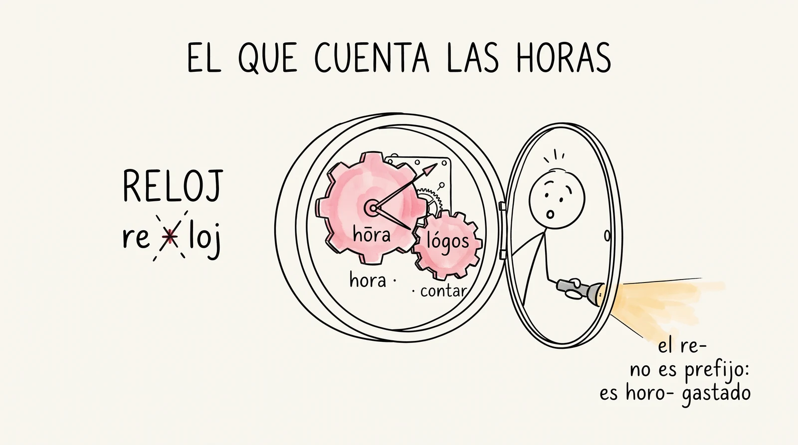

# Semana 5 · Una raíz, veinte palabras

> **La pregunta de la semana:** ¿cuántas palabras me regala una sola raíz?

**Esta semana podrás:**

- sacar en cadena la familia entera de una raíz, y contar cuántas palabras te regaló
- reconocer una pieza vieja escondida en una palabra que jamás relacionarías con ella
- desconfiar de dos piezas que se ven idénticas y no son parientes
- resolver, por fin, el enigma del *reloj*

Una raíz no es un dato: es una llave maestra. Quien sabe *hemo-* (sangre) ya lee hemorragia, hemofilia, hemoglobina, hematoma, hemodiálisis y cinco más, sin haberlas estudiado. Y de pilón entiende por qué *anemia* es sangre que falta.

---

| Día | Sesión | Trae |
|---|---|---|
| [Martes 25](#martes) · 1 h | La cadena de raíces | el mazo al día |
| [Miércoles 26](#miercoles) · 1 h | Las sorpresas del árbol | tu palabra más inesperada |
| [Jueves 27](#jueves) · 1 h, centro de cómputo | El tribunal del reloj | el mazo y ganas de cobrar la deuda |
| [Viernes 28](#viernes) · 2 h | El campeonato de árboles | a tu equipo con las pilas puestas |

Cada día es un mazo de láminas. En clase se proyectan una por una con el botón <strong>Presentar</strong>; aquí se quedan apiladas, en orden, para volver a ellas cuando quieras. Debajo de los mazos: el árbol interactivo con las diez raíces, las sorpresas, la trampa de la semana y las tarjetas.

<!-- ============================ MARTES ============================ -->
<section class="mazo" id="martes">

Martes 25 de agosto · 1 hora

<h3>La cadena de raíces</h3>

Hoy una sola pieza te va a regalar diez palabras.

<button class="btn-presentar" type="button">Presentar ▸</button>

<section class="lam lam--actividad">
<h4>1 Ritual: duelo de piezas 7 min</h4>
Actividad · en parejas

El mazo a la cancha. Ya trae cuatro semanas encima.

Se dice la pieza, el rival da el significado y una palabra donde viva. Quien usa Leitner juega con sus fichas. Esta semana no hay quiz el martes: cae el jueves, con las raíces nuevas ya puestas.

Mete piezas griegas de la semana 4 (-itis, -algia, iatro-, hiper-, hipo-) junto con las latinas viejas. Guarda hipo- para el final del duelo, sin decir nada: mañana esa pieza les va a explotar en la cara.

</section>
<section class="lam">
<h4>2 Una raíz es una llave maestra 8 min</h4>

Aprender una raíz no suma una palabra: abre una fila entera de puertas.

hemo<small>sangre</small>
-rragia<small>brotar</small>
= hemorragia

Con esa sola pieza ya puedes leer hemofilia, hemoglobina, hematoma, hematología y hemodiálisis. Y una que no empieza con hemo pero es de la casa: <em>anemia</em>, sangre que falta, con el <em>an-</em> que traes desde la semana 2. Nadie te enseñó ninguna una por una.

Escribe hemo- en el pizarrón y pide palabras a mano alzada antes de dar la lista. Siempre sale hemorragia primero; anemia casi nunca, y es la que conviene celebrar.

</section>
<section class="lam lam--oscura">
<h4>La cuenta que importa</h4>

No es cuántas palabras sabes. Es cuántas te regala cada pieza que aprendes.

Diez piezas nuevas esta semana. Si cada una rinde ocho palabras, hoy sales con ochenta que no tenías el lunes. Esa multiplicación es todo el negocio de la etimología, y es la razón por la que este curso no te pide memorizar listas de palabras.

</section>
<section class="lam lam--actividad">
<h4>3 Gimnasio: la cadena de raíces 30 min</h4>
Actividad · en equipos

Elige una raíz y escribe todas las palabras de su familia que puedas, contra reloj.

<a href="../ejercicios/semana-05/ejercicio-5A-cadena-de-raices.html">La cadena de raíces</a>, con tres minutos por raíz. Cinco familias para escoger: hemo-, cosmo-, -polis, zoo- y -teca. Repetir te saca de la ronda, y las palabras dudosas no se borran: se marcan con "?" y se van al tribunal del jueves.

Deja que jueguen por lo menos dos raíces distintas. La que casi siempre da más lejos es -teca, porque nadie espera que botica y bodega estén ahí. Anota los "?" del grupo en el pizarrón: son la pólvora del jueves.

</section>
<section class="lam lam--actividad">
<h4>4 Antes del miércoles 13 min</h4>
Para llevar a casa

Trae la palabra más inesperada que te salió hoy.

Una sola, con la raíz de la que salió y una línea de por qué te sorprendió. Y al mazo entran hoy las cinco raíces que jugaste: las tarjetas están abajo, con el estándar del curso —frente, solo la pieza; reverso, significado y palabra ancla—.

Si el grupo va rápido, fabrican tarjetas antes de salir. Si no, quedan de tarea. Insiste en una cosa: la tarjeta la fija quien la hace, no quien la baja.

</section>
</section>

<!-- ============================ MIÉRCOLES ============================ -->
<section class="mazo" id="miercoles">

Miércoles 26 de agosto · 1 hora

<h3>Las sorpresas del árbol</h3>

El pulpo tiene muchos pies y el cosmos se maquilla.

<button class="btn-presentar" type="button">Presentar ▸</button>

<section class="lam">
<h4>1 Ritual: la palabra más inesperada 7 min</h4>
Al aire

¿Cuál te sorprendió más, y por qué?

Ronda rápida. Las mejores se anotan: son candidatas al Museo y a la vitrina de la semana.

Si alguien trae una que no es de la familia, no la corrijas: mándala al tribunal de mañana. Que la duda se resuelva con fuente y no con la autoridad del profesor.

</section>
<section class="lam">
<h4>2 El pulpo no tiene tentáculos 10 min</h4>

poly<small>muchos</small>
pous<small>pie</small>
= pulpo

Del griego <em>polýpous</em>: muchos pies. Lo que tú llamas tentáculos, los griegos lo contaron como patas, y por eso el pulpo es pariente del <em>trípode</em>, del <em>podio</em>, del <em>podólogo</em> y de las <em>antípodas</em>, esa gente que tiene los pies exactamente del otro lado del planeta.

Pregunta primero: ¿de qué familia creen que viene "pulpo"? Nadie dice "pie". Ahí está el gancho del día.

</section>
<section class="lam">
<h4>Y otras cuatro que no te esperabas</h4>
<table>
<tr><th>La palabra</th><th>Viene de</th><th>Y entonces</th></tr>
<tr><td>náusea</td><td><em>naus</em>, nave</td><td>marearse era cosa de navegantes, antes de que hubiera coches</td></tr>
<tr><td>cosmético</td><td><em>kósmos</em>, orden</td><td>maquillarse es, literal, ordenarse la cara</td></tr>
<tr><td>zodiaco</td><td><em>zóidion</em>, animalito</td><td>es el círculo de los animalitos: por eso casi todos los signos son bichos</td></tr>
<tr><td>economía</td><td><em>oikos</em> + <em>nomos</em></td><td>son las reglas de la casa: la palabra más seria del noticiero nació administrando una cocina</td></tr>
</table>

Para los griegos lo bello era lo ordenado, y por eso el universo y un labial comparten raíz. Cuando alguien te diga que la etimología es cosa de museo, cuéntale que su crema facial se llama como el cosmos.

</section>
<section class="lam lam--oscura">
<h4>3 La trampa de la semana 12 min</h4>

hipotermia · hipódromo. ¿El <em>hipo-</em> es la misma pieza?

Pídeles el veredicto a mano alzada antes de leer lo que sigue.

Que se comprometan con una respuesta antes de la revelación: el golpe pedagógico está en haberse mojado. Casi todo el grupo va a decir que sí.

</section>
<section class="lam">
<h4>No son parientes</h4>

hypó<small>debajo, de menos</small>
→ hipotermia, hipoglucemia

híppos<small>caballo</small>
→ hipódromo, hipopótamo, hipocampo

Se escriben igual en español y no tienen absolutamente nada que ver. Es el mismo tipo de trampa que <em>mango</em> en la semana 3: dos piezas idénticas a la vista, con padres distintos. <strong>Solo la fuente distingue.</strong> Guárdate esta lección: vale para todo el semestre, y va a caer en el integrador.

De pilón: un hipopótamo es un caballo de río (<em>potamós</em>), y el <em>hipocampo</em> —el caballo de mar— le da nombre a la parte de tu cerebro donde vive la memoria, porque tiene esa forma.

</section>
<section class="lam lam--actividad">
<h4>4 Tu propio árbol 18 min</h4>
Actividad · individual

Ahora una raíz que no jugamos ayer, y hasta donde aguantes.

Vuelve a <a href="../ejercicios/semana-05/ejercicio-5A-cadena-de-raices.html">la cadena</a> con otra familia, o arma la tuya con una raíz de tu mazo viejo. La meta no es llegar a veinte: es llegar a una que nadie más tenga y poderla defender mañana.

</section>
<section class="lam">
<h4>5 Cierre 8 min</h4>
Para llevar a casa

Al mazo las cinco raíces que faltan. Y mañana se paga una deuda de tres semanas.

Las diez tarjetas de la semana están abajo. Ojo con las dos que se parecen: <em>hipo-</em> lleva <strong>dos tarjetas distintas</strong>, y en el reverso de cada una escribe "no confundir con la otra".

Cierra recordándoles el re-loj congelado desde la semana 3. Que lleguen mañana con hambre; y si alguien ya lo googleó, pídele por favor que se aguante y no lo suelte.

</section>
</section>

<!-- ============================ JUEVES ============================ -->
<section class="mazo" id="jueves">

Jueves 27 de agosto · 1 hora · centro de cómputo

<h3>El tribunal del reloj</h3>

Hoy cae el re-loj. Tres semanas colgado.

<button class="btn-presentar" type="button">Presentar ▸</button>

<section class="lam">
<h4>1 Ritual: quiz relámpago 10 min</h4>

Tres reactivos: las raíces nuevas y una pieza griega de la semana pasada.

Tu apuesta primero, como siempre: escribe cuántas vas a tener bien antes de ver el primer reactivo. Al calificar comparas, y los dos números van al renglón del quiz #4 de tu expediente. La brecha es información, no culpa.

El quiz proyectable, con respuestas y cronómetro de 3 minutos, está en tus recursos docentes (carpeta local, quiz-relampago-semana-05.html). El reactivo 2 es justo la trampa de ayer: sirve de termómetro de si cuajó.

</section>
<section class="lam lam--oscura">
<h4>2 La deuda de tres semanas 8 min</h4>

re + loj

En la semana 3 alguien propuso ese corte y lo congelamos. Hoy se descongela. Antes de abrir ninguna fuente: apuesten. ¿Es un corte real, un espejismo, u otra cosa?

No lo resuelvas tú. Deja que lo busquen ellos en el DECEL, en vivo, y que el hallazgo sea suyo. Este es el momento que la semana 3 estuvo comprando.

</section>
<section class="lam">
<h4>3 Lo que había adentro 8 min</h4>

hōra<small>hora</small>
lógos<small>contar</small>
= reloj

Del latín <em>horologium</em>, y este del griego <em>hōrológion</em>: "el que cuenta las horas". Ese <em>re-</em> no es prefijo de nada: es <em>horo-</em> gastado por los siglos hasta quedar irreconocible. Dos raíces griegas disfrazadas de palabra corta y cotidiana.

¿Y te acuerdas de la ὥρα que decodificaste el viernes pasado, la que se leía "hora"? Era esta. La semana 4 te dejó la pieza en la mano sin decirte para qué.

El callback a la ὥρα del viernes es el mejor momento del día: el curso cumple lo que promete. Si nadie lo conecta, pregúntales qué palabra griega decodificaron al cerrar la semana pasada.

</section>
<section class="lam lam--actividad">
<h4>4 Gimnasio: el tribunal 27 min</h4>
Actividad · individual

Los "?" del martes pasan por las fuentes, uno por uno.

<a href="../ejercicios/semana-05/ejercicio-5C-tribunal-del-reloj.html">El tribunal del reloj</a>. Toma las palabras dudosas de tu árbol: verifica en el <a href="https://dle.rae.es">DLE</a> que existan, y en el <a href="http://etimologias.dechile.net">DECEL</a> que la raíz sea la que creías. Captura: palabra, raíz propuesta, veredicto, fuente. Las que se caen no son fracaso: son el dato del día.

Recuérdales que la pregunta que gana torneos no es "¿esa palabra existe?" sino "¿la pieza significa eso ahí?". Es la misma del torneo de la semana 3.

</section>
<section class="lam">
<h4>5 El marcador 7 min</h4>
Al aire

¿Cuántos "?" del grupo sobrevivieron a las fuentes?

Ese número entra al marcador del semestre. Y mañana, con los árboles ya limpios, viene el campeonato: la matriz grande no gana por grande, gana por defendible.

</section>
</section>

<!-- ============================ VIERNES ============================ -->
<section class="mazo" id="viernes" data-ticket>

Viernes 28 de agosto · 2 horas

<h3>El campeonato de árboles</h3>

Gana el que busca lejos, no el que grita rápido.

<button class="btn-presentar" type="button">Presentar ▸</button>

<section class="lam lam--actividad">
<h4>1 Ritual: duelo relámpago 10 min</h4>
Actividad · en parejas

Las diez raíces de la semana, sin ver el mazo.

Uno dice la pieza, el otro da significado y palabra ancla. Dos vueltas y a jugar. Las dos tarjetas de <em>hipo-</em> valen doble: quien las distinga, gana el duelo.

</section>
<section class="lam">
<h4>2 Las reglas del campeonato 15 min</h4>

Por equipos: el árbol más grande que puedan defender.

<table>
<tr><th>Jugada</th><th>Vale</th></tr>
<tr><td>Una palabra de la familia, defendida con la regla de oro</td><td>un punto</td></tr>
<tr><td>Una palabra que ya tenía otro equipo</td><td>medio punto</td></tr>
<tr><td>Una palabra rara que sobrevive al reto, con fuente</td><td>dos puntos</td></tr>
<tr><td>Retar a otro equipo y tumbarle una palabra</td><td>un punto, y la palabra cae</td></tr>
<tr><td>Proponer o retar sin fuente</td><td>pierdes el turno</td></tr>
</table>

La regla del medio punto lo cambia todo: no conviene apuntarle a lo obvio. Conviene irse a la orilla del árbol, donde están botica, náusea y pulpo.

Equipos de tres o cuatro, una raíz por equipo, DECEL proyectado. Tú eres juez de última instancia. Reserva los "?" que se cayeron ayer para cuando el juego se enfríe.

</section>
<section class="lam lam--actividad">
<h4>3 El campeonato 35 min</h4>
Por equipos

Árbol al pizarrón, retos por turnos, la fuente decide.

Cada equipo presenta su árbol; los demás retan. Palabra defendida, punto para el dueño; reto certero, punto para quien retó. El árbol ganador se queda en la vitrina de la semana.

Marcador visible y tiempo por ronda a la vista. Registra el árbol más grande y las tres palabras más inesperadas del grupo: van a "Lo que produjimos".

</section>
<section class="lam">
<h4>4 La raíz que cambió de opinión 15 min</h4>

páthos<small>lo que se siente</small>
→ simpatía · patología

En griego, <em>páthos</em> era el sentimiento: todo lo que a uno le pasa por dentro. Con ese sentido nacieron <em>apatía</em> (sin sentimientos), <em>simpatía</em> (sentir con el otro) y <em>antipatía</em> (sentir en contra).

Después <em>páthos</em> pasó a significar la pasión. Y cuando los griegos decidieron que la pasión era una enfermedad del alma que nubla la razón, la raíz terminó significando enfermedad: de ahí <em>patología</em> y <em>patógeno</em>. Una sola raíz, tres épocas de significado, y todas siguen vivas en tu boca: cuando dices que alguien te cae simpático y que un virus es patógeno, usas la misma raíz en dos momentos distintos de su vida.

Esta lámina siembra la unidad 2: las palabras no solo viajan de lengua en lengua, también viajan de significado en significado. No lo anuncies; que quede la sensación.

</section>
<section class="lam lam--actividad">
<h4>5 Gimnasio: la familia numerosa 25 min</h4>
Actividad · individual

Tu pieza del Museo crece: ahora presenta también a su parentela.

<a href="../ejercicios/semana-05/ejercicio-5D-familia-numerosa.html">La palabra de familia numerosa</a>. Una biografía de esta semana no basta con contar de dónde viene la palabra: incluye a las otras que nacieron de la misma raíz. Presenta al personaje y a su familia.

Quien ya tenía su candidata del Museo desde la semana 2, la engorda hoy con la familia. Quien no, esta es su mejor oportunidad del semestre: los árboles del pizarrón están llenos de candidatas.

</section>
<section class="lam">
<h4>6 Fábrica de tarjetas y lectura 20 min</h4>

Diez piezas al mazo, y diez minutos de algo hermoso.

Revisa que las diez estén con el estándar del curso. Y cerramos como siempre: lectura en voz alta, sin análisis y sin tarea. Una pregunta al salir: ¿qué palabra usaste esta semana sin saber que traía una raíz adentro?

</section>
</section>

## La lectura, esta semana

El minuto del lector sigue, la voz alta cierra el viernes y tu bitácora suma líneas. ¿El libro que elegiste no te está gustando? Cambiarlo no es fracaso, es tu derecho número 3: está completo en [Leemos](../leemos.html).

---

## El gimnasio completo

Los ejercicios de la semana, para tu celular o el centro de cómputo. Sin nota y sin registro: puro entrenamiento.

- [La cadena de raíces](../ejercicios/semana-05/ejercicio-5A-cadena-de-raices.html) · martes y miércoles
- [El tribunal del reloj](../ejercicios/semana-05/ejercicio-5C-tribunal-del-reloj.html) · jueves, centro de cómputo
- [La palabra de familia numerosa](../ejercicios/semana-05/ejercicio-5D-familia-numerosa.html) · viernes
- [Quiz de gimnasio](../ejercicios/semana-05/quiz-gimnasio-semana-05.html) · para ensayar cuando quieras

### En el centro de cómputo (jueves)

1. Abre el [DECEL](http://etimologias.dechile.net) y busca **reloj**. Anota qué dos raíces griegas esconde (te va a sorprender).
2. Toma 3 palabras dudosas del árbol de tu equipo. Verifica en el [DLE](https://dle.rae.es) que existan y en el DECEL que la raíz sea la que creías.
3. Captura: palabra, raíz propuesta, veredicto, fuente.
4. Sube el mejor árbol de tu equipo a la vitrina.

---

## Hoja de consulta

Toca una raíz para ver a su familia. Cuenta cuántas palabras te regala cada una.

  

  
Toca una raíz.

  

    <button id="rt5-reveal">Resolver el enigma del reloj</button>
    

      
<strong>reloj</strong> no lleva el prefijo <em>re-</em>. Viene del latín <em>horologium</em>, y este del griego <em>hōrológion</em>: <strong>hōra</strong> (hora) + <strong>lógos</strong> (contar). El "re" es <em>horo-</em> gastado por los siglos. Un reloj es, literal, "el que cuenta las horas". Dos raíces griegas disfrazadas de palabra corta.

    

  

### Las seis sorpresas de estos árboles

Cada árbol esconde por lo menos una palabra que no esperabas ver ahí. Estas son las mejores:

- **pulpo** es de la familia del pie: del griego *polýpous*, "muchos pies". Lo que tú llamas tentáculos, los griegos lo contaron como patas.
- **náusea** es el mareo del barco: de *naus*, nave. Antes de existir el coche, marearse era cosa de navegantes.
- **cosmético** y **cosmos** son la misma palabra: *kósmos* era el orden. Maquillarse es, literalmente, ponerse en orden. El universo y tu cara, con la misma raíz.
- **zodiaco** es el círculo de los animalitos (*zóidion*). Por eso casi todos los signos son bichos.
- **economía** es *oikos* (casa) + *nomos* (regla): las reglas de la casa. La palabra más seria del noticiero nació administrando una cocina.
- **hipocampo** es "caballo de mar", y así se llama también la parte de tu cerebro donde vive la memoria, porque tiene esa forma.

Y una que sale del árbol de *-teca* y nadie cree: **botica** y **bodega** son la misma palabra griega, *apothḗkē*, el depósito. Una se fue por la farmacia y la otra por el vino.

### La trampa de la semana: dos hipo- distintos

En la semana 4 aprendiste *hipo-* = de menos (hipotermia, hipoglucemia). Esta semana aparece *hipo-* = caballo (hipódromo, hipopótamo). **No son la misma pieza:** una viene de *hypó* (debajo) y la otra de *híppos* (caballo). Se escriben igual en español y no tienen nada que ver.

Guárdate esta lección, porque vale para todo el semestre: dos piezas pueden verse idénticas y venir de padres distintos. Igual que *mango* y *mango* en la semana 3. Solo la fuente distingue.

{: .ojo }
¿Un hipopótamo es entonces un caballo de río? Exacto: *híppos* (caballo) + *potamós* (río). Los griegos lo vieron salir del agua y le pusieron el nombre más honesto posible.

### La raíz que cambió de opinión

Mira la familia de *pat-* con cuidado, porque esconde una historia. En griego, *páthos* era sentimiento, todo lo que a uno le pasa por dentro. Con ese sentido nacieron *apatía* (sin sentimientos), *simpatía* (sentir con el otro) y *antipatía* (sentir en contra).

Después *páthos* pasó a significar la pasión. Y cuando los griegos decidieron que la pasión era una enfermedad del alma que nubla la razón, la raíz terminó significando enfermedad: de ahí *patología* (estudio de las enfermedades) y *patógeno* (lo que las origina).

Una sola raíz, tres épocas de significado, y todas siguen vivas en tu boca. Cuando dices que alguien te cae simpático y que un virus es patógeno, usas la misma raíz en dos momentos distintos de su vida.

---

## Las tarjetas de la semana

Diez raíces nuevas, ninguna repetida de semanas pasadas. Todas salieron de los árboles de arriba.

📥 **[Baja el mazo de la semana 5](../recursos/anki/etimologias-semana-05.apkg)** · Las diez raíces más cinco palabras con historia: reloj, cosmético, náusea, pulpo e hipopótamo.

| Frente | Reverso (significado · palabra ancla) |
|---|---|
| hemo-, hemato- | sangre · hemorragia, hematoma |
| cosmo- | orden, mundo · cosmos, cosmético |
| -nauta | navegante · astronauta, náusea |
| -polis | ciudad · metrópoli, acrópolis |
| -podo, pod- | pie · trípode, pulpo |
| zoo- | animal · zoológico, zodiaco |
| -teca | depósito, caja · biblioteca, hemeroteca |
| -nomía | ley, regla · astronomía, economía |
| hipo- (híppos) | caballo · hipódromo, hipopótamo |
| pat- | sentir, sufrir · simpatía, patología |

{: .ojo }
Ojo con la última fila y con la penúltima: *hipo-* de caballo no es *hipo-* de menos (semana 4). En tu mazo van dos tarjetas distintas, y en el reverso de cada una escribe "no confundir con la otra".

## Por si hay tiempo: prefijos con historia

Los prefijos griegos también cuentan cuentos. Cinco para presumir:

**Antípoda** (*anti*, opuesto + *pous*, pie): los que tienen los pies exactamente del otro lado del planeta. Si perforaras la Tierra en línea recta desde Concá, saldrías cerca de las antípodas: en medio del océano Índico. Y sí: es de la familia del pulpo.

**Catástrofe** (*cata*, hacia abajo + *strophé*, voltear): voltear las cosas hacia abajo. Un giro para lo peor.

**Diáspora** (*dia*, a través + *sporá*, semilla): sembrar al voleo. Primero se dijo de los judíos expulsados de Israel; hoy, de cualquier pueblo disperso lejos de casa.

**Apogeo** (*apo*, lejos + *geo*, tierra): el punto donde un astro está más lejos de la Tierra. Por eso alguien "en su apogeo" está en lo más alto.

**Anfiteatro** (*amphi*, ambos lados + *théatron*, lugar para ver): teatro donde se ve desde los dos lados. Una plaza de toros es, literalmente, un anfiteatro.

## Lo que produjimos

*El árbol de raíz más grande del grupo, las tres palabras más inesperadas del campeonato y la resolución del reloj. Se llena al cerrar la semana.*

## El postre 🍨

*Filosofía* es *filo* (amor) + *sofía* (sabiduría): amor a la sabiduría. Ahora mira *filatelia* (amor a los sellos), *filantropía* (amor a la humanidad), *hemofilia* (afinidad con la sangre). La misma raíz que ama la sabiduría ama los timbres postales. Las raíces no tienen prejuicios.

---

## Antes de irte

<a class="ticket" href="{{ site.ticket_url }}" target="_blank" rel="noopener">
  <b>Ticket de salida de esta semana</b>
  Noventa segundos, al cierre de la sesión larga: qué te llevas, qué quedó turbio y cómo estuvo el ritmo. Con nombre o sin él.
  <em>Lo que escribas aquí decide por dónde empezamos el martes.</em>
</a>
<a class="ticket-qr" href="{{ site.ticket_url }}" target="_blank" rel="noopener">
  
  escanéalo
</a>

