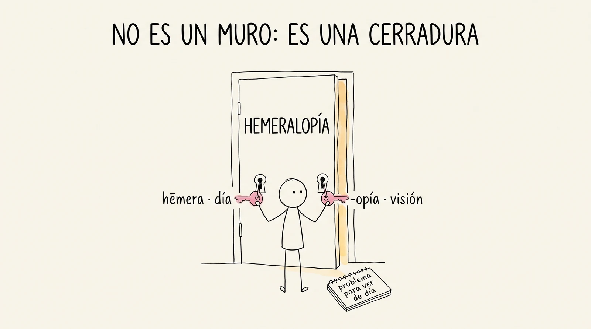
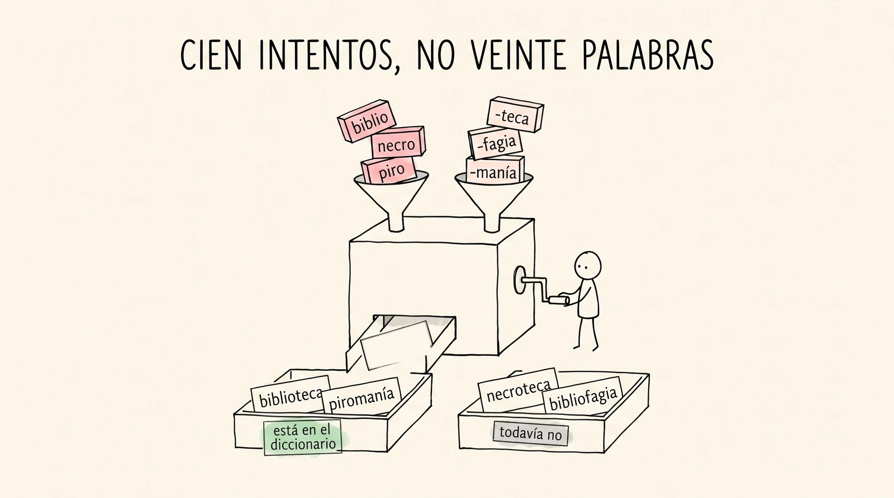
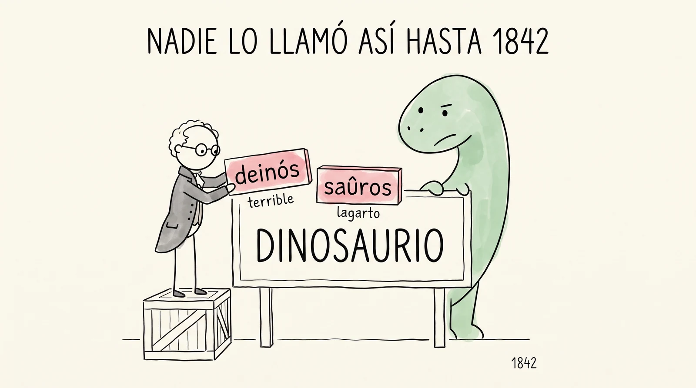

# Semana 6 · Descifrar a ciegas

> **La pregunta de la semana:** ¿puedo descifrar una palabra que nunca he visto?

**Esta semana podrás:**

- leer una palabra desconocida solo con las piezas que ya traes
- armar palabras nuevas que se entiendan, aunque no estén en el diccionario
- distinguir cuándo inventaste algo y cuándo lo redescubriste
- explicar por qué una palabra "no existe" y aun así se entiende perfecto

*hēmera* (día) + *opía* (visión) = *hemeralopía*: problema para ver de día. Nunca la habías visto y ya la lees. Eso es el curso funcionando.

---

| Día | Sesión | Trae |
|---|---|---|
| [Martes 1](#martes) · 1 h | La prueba de fuego | el mazo al día |
| [Miércoles 2](#miercoles) · 1 h | Ahora al revés | tu palabra descifrada en casa |
| [Jueves 3](#jueves) · 1 h, centro de cómputo | ¿Existían de verdad? | tus monstruos inventados |
| [Viernes 4](#viernes) · 2 h | La fábrica de monstruos | a tu equipo con las pilas puestas |

Cada día es un mazo de láminas. En clase se proyectan una por una con el botón <strong>Presentar</strong>; aquí se quedan apiladas, en orden, para volver a ellas cuando quieras. Debajo de los mazos: el tablero combinatorio, la tanda del cuaderno y las tarjetas de la semana.

<!-- ============================ MARTES ============================ -->
<section class="mazo" id="martes">

Martes 1 de septiembre · 1 hora

<h3>La prueba de fuego</h3>

Hoy lees palabras que nadie te enseñó.

<button class="btn-presentar" type="button">Presentar ▸</button>

<section class="lam">
<h4>1 El minuto del lector 3 min</h4>
Al aire

Una persona, un minuto: qué estoy leyendo y por dónde voy.

Sin resumen y sin recomendación forzada. Solo el título, por dónde vas y si te está gustando o no. Se vale decir que no.

Lleva la lista y ve tachando: uno por martes, hasta que pase todo el grupo. A estas alturas ya hay quien cambió de libro dos veces: eso también se cuenta y también se aplaude.

</section>
<section class="lam lam--actividad">
<h4>2 Ritual: duelo de piezas 7 min</h4>
Actividad · en parejas

El mazo completo: cinco semanas de piezas en la cancha.

Se dice la pieza, el rival da significado y ancla. Hoy el duelo no es de calentamiento: las piezas que traigas afiladas son exactamente las que te van a servir en veinte minutos.

Prioriza los sufijos griegos (-logía, -fobia, -cracia, -itis, -algia, -teca): son las piezas que más rinden al descifrar a ciegas. El quiz de esta semana cae el jueves.

</section>
<section class="lam lam--oscura">
<h4>3 La palabra imposible 10 min</h4>

hemeralopía

Nadie en este salón la ha visto en su vida. Nadie la ha estudiado. Y en treinta segundos todo el grupo va a saber qué significa. Apuesten primero, en voz alta.

Escríbela sola en el pizarrón, sin contexto, y deja que el silencio incomode tantito. Pide apuestas antes de dar cualquier pista: el punto de la semana es que se atrevan.

</section>
<section class="lam">
<h4>Se rindió</h4>

hēmera<small>día</small>
-opía<small>visión</small>
= hemeralopía

Problema para ver con luz de día. La segunda pieza ya la conocías por <em>miopía</em>; la primera vuelve más adelante en la semana, en un lugar donde no la esperas. Y su gemela exacta es <em>nictalopía</em>: lo mismo, pero de noche.

</section>
<section class="lam">
<h4>4 El método, en tres pasos 8 min</h4>

Cortar · apostar · verificar. En ese orden, siempre.

<table>
<tr><th>Paso</th><th>Qué haces</th><th>Qué no haces</th></tr>
<tr><td><strong>1 · Cortar</strong></td><td>partes la palabra donde reconozcas una pieza</td><td>no buscas todavía</td></tr>
<tr><td><strong>2 · Apostar</strong></td><td>sumas los significados y dices qué crees que es</td><td>no te esperas a estar seguro</td></tr>
<tr><td><strong>3 · Verificar</strong></td><td>vas al DLE y al DECEL</td><td>no aceptas nada sin fuente</td></tr>
</table>

Es el mismo protocolo del tribunal de la semana 4, pero con la dificultad subida: allá apostabas sobre palabras que habías oído; aquí, sobre palabras que no existen para ti hasta este momento.

</section>
<section class="lam lam--actividad">
<h4>5 Gimnasio: la prueba de fuego 25 min</h4>
Actividad · en parejas

Cinco palabras que nunca has visto. Una por una.

<a href="../ejercicios/semana-06/ejercicio-6A-la-prueba-de-fuego.html">La prueba de fuego</a>. Cada palabra trae cuatro piezas en el banco y solo dos son las suyas: primero cortas, luego apuestas. Al final del ejercicio hay un banco libre para armar tu propio monstruo. Anótalo bien, porque el jueves lo llevamos a juicio.

Las cinco son reales y están documentadas: hemeralopía, nictalopía, batracofagia, heliolatría y glosolalia. Si alguien duda de que existan, perfecto: eso es el jueves.

</section>
<section class="lam lam--actividad">
<h4>6 Antes del miércoles 7 min</h4>
Para llevar a casa

Caza una palabra larga y descífrala antes de buscarla.

En un libro de texto, en una etiqueta, en las noticias. La regla es una sola: <strong>apuesta antes de buscar</strong>. Trae la palabra, tu corte, tu apuesta y, si la buscaste, el veredicto.

</section>
</section>

<!-- ============================ MIÉRCOLES ============================ -->
<section class="mazo" id="miercoles">

Miércoles 2 de septiembre · 1 hora

<h3>Ahora al revés</h3>

Leer una palabra es un nivel. Armarla es el siguiente.

<button class="btn-presentar" type="button">Presentar ▸</button>

<section class="lam">
<h4>1 Ritual: la cacería 6 min</h4>
Al aire

¿Qué palabra cazaste, y le atinaste?

Ronda rápida. Interesa tanto la que atinaron como la que no: las que fallaron dicen qué pieza faltaba.

Celebra en voz alta a quien apostó y falló habiendo apostado. Es literalmente el comportamiento que el curso quiere producir.

</section>
<section class="lam">
<h4>2 Diez piezas nuevas, y todas tenebrosas 12 min</h4>
<table>
<tr><th>Pieza</th><th>Dice</th><th>Vive en</th></tr>
<tr><td>necro-</td><td>muerte, muerto</td><td>necrópolis, necrología</td></tr>
<tr><td>cripto-</td><td>oculto, escondido</td><td>criptografía, cripta</td></tr>
<tr><td>piro-</td><td>fuego</td><td>piromanía, pirotecnia</td></tr>
<tr><td>xeno-</td><td>extraño, extranjero</td><td>xenofobia</td></tr>
<tr><td>teo-</td><td>dios</td><td>teología, ateo</td></tr>
<tr><td>-mancia</td><td>adivinación</td><td>quiromancia, cartomancia</td></tr>
<tr><td>-fagia</td><td>comer</td><td>antropofagia, sarcófago</td></tr>
<tr><td>-latría</td><td>adoración</td><td>idolatría, egolatría</td></tr>
<tr><td>-filia</td><td>amor, afinidad</td><td>bibliofilia, hemofilia</td></tr>
<tr><td>-opía</td><td>visión</td><td>miopía, hemeralopía</td></tr>
</table>

Fíjate en <em>sarcófago</em>: <em>sarx</em> (carne) + <em>-fagia</em>. La caja donde se guarda un muerto se llama, literalmente, "la que come carne". Que duerman bien.

No dictes la tabla: tapa la tercera columna y que la llenen ellos. Ya traen la mitad. Y el <em>a-</em> de ateo es el mismo de amnesia, desde la semana 2: si nadie lo dice, dilo tú.

</section>
<section class="lam lam--oscura">
<h4>3 El juego se invierte 10 min</h4>

Yo digo el significado. Ustedes arman la palabra.

"adivinación por medio del fuego" =
piro
-mancia

Existe, y está registrada: leer el futuro en las llamas. Ahora ustedes: "miedo a los libros", "adoración al sol", "comer carroña", "gobierno de los dioses". Vale aproximar la ortografía: se premia la lógica de las piezas, no la escritura perfecta.

Respuestas: bibliofobia, heliolatría, necrofagia, teocracia. Las cuatro existen. Si alguien arma una que no existe pero está bien construida, celébrala en grande: es el material del viernes.

</section>
<section class="lam lam--actividad">
<h4>4 Gimnasio: taller de descifrado 26 min</h4>
Actividad · individual

Las dos direcciones, en el mismo ejercicio.

<a href="../ejercicios/semana-06/ejercicio-6B-taller-de-descifrado.html">Taller de descifrado</a>: primero descifras palabras que no conoces, después te dan el encargo y tú armas la palabra. Guarda las que inventes: mañana se van al juicio, y la sorpresa frecuente es que ya existían.

</section>
<section class="lam">
<h4>5 Cierre 6 min</h4>
Para llevar a casa

Al mazo las diez piezas. Y trae dos monstruos inventados.

Dos palabras que hayas armado tú y que <em>creas</em> que no existen. Escríbelas con sus piezas y con lo que significarían. Mañana las buscamos, y ahí viene lo bueno.

</section>
</section>

<!-- ============================ JUEVES ============================ -->
<section class="mazo" id="jueves">

Jueves 3 de septiembre · 1 hora · centro de cómputo

<h3>¿Existían de verdad?</h3>

La mitad de tus inventos ya los inventó alguien.

<button class="btn-presentar" type="button">Presentar ▸</button>

<section class="lam">
<h4>1 Ritual: quiz relámpago 10 min</h4>

Tres reactivos, y uno es una palabra que nunca has visto.

Es a propósito. Tu apuesta primero, del 0 al 3, y fíjate en algo mientras la escribes: ¿le bajaste por saber que venía una desconocida? Anota también eso. Los dos números van al renglón del quiz #5 de tu expediente, el último antes del integrador.

El quiz proyectable está en tus recursos docentes (carpeta local, quiz-relampago-semana-06.html). La lámina de cierre del quiz les dice algo importante: si bajaron la apuesta por miedo y aun así salieron, su medidor está mal calibrado hacia abajo.

</section>
<section class="lam lam--oscura">
<h4>2 La pregunta del día 8 min</h4>

¿Inventaste una palabra, o la redescubriste?

Cuando armas una palabra con piezas griegas y resulta que ya existía, no es que hayas copiado: es que llegaste a la misma solución que llegó alguien más, por el mismo camino. Las piezas funcionan igual para ti que para el que la registró hace ciento cincuenta años.

Este es el corazón conceptual de la semana. Si el grupo se queda con una sola idea, que sea esta: el método no es un truco escolar, es el mismo que usan los que nombran cosas nuevas.

</section>
<section class="lam lam--actividad">
<h4>3 Gimnasio: el juicio de los monstruos 32 min</h4>
Actividad · individual

Tus inventos y tus descifrados, a las fuentes.

<a href="../ejercicios/semana-06/ejercicio-6C-existian-de-verdad.html">¿Existían de verdad?</a>. Primero las palabras del martes: ¿existían? ¿acertaste el significado? Después tus dos monstruos: búscalos en el <a href="https://dle.rae.es">DLE</a> y en el <a href="http://etimologias.dechile.net">DECEL</a>. Captura: palabra, significado que dedujiste, veredicto, fuente.

Ten a la mano el buscador con comillas: muchos monstruos "inventados" aparecen en textos médicos o en griego antiguo. Cuando le pase a alguien, proyéctalo: es el mejor momento de la semana.

</section>
<section class="lam">
<h4>4 El marcador 10 min</h4>
Al aire

¿Cuántas del grupo existían? ¿Cuántos significados atinamos?

Dos números al pizarrón, y los dos se presumen. Y mañana, el juego largo: cien combinaciones posibles con veinte piezas.

</section>
</section>

<!-- ============================ VIERNES ============================ -->
<section class="mazo" id="viernes" data-ticket>

Viernes 4 de septiembre · 2 horas

<h3>La fábrica de monstruos</h3>

Veinte piezas no dan veinte palabras: dan cien intentos.

<button class="btn-presentar" type="button">Presentar ▸</button>

<section class="lam lam--actividad">
<h4>1 Ritual: duelo relámpago 10 min</h4>
Actividad · en parejas

Las diez piezas de la semana, sin ver el mazo.

Dos vueltas. Quien falle una, la escribe tres veces y sigue jugando: el mazo no se castiga, se afina.

</section>
<section class="lam">
<h4>2 El tablero 15 min</h4>

Diez raíces a la izquierda, diez finales a la derecha. Cien casillas.

El <a href="#hoja-de-consulta">tablero combinatorio</a> de esta página, proyectado. Cada combinación que toquen les dice una de dos cosas: <em>está en el diccionario</em> o <em>no está, pero se entiende</em>. Las dos respuestas valen. La segunda es la interesante.

Proyéctalo y deja que ellos elijan las combinaciones, no tú. La primera que salga real produce un "aaah" colectivo que vale toda la sesión.

</section>
<section class="lam lam--actividad">
<h4>3 Reto 1: encuentra al campeón 20 min</h4>
Por equipos

Hay una raíz que da seis palabras reales. ¿Cuál es?

Y no está sola: otra le pisa los talones con otras seis, y una de esas seis les va a dar risa nerviosa. Equipos contra reloj, con el tablero enfrente. Gana el que encuentre primero las dos raíces campeonas y sus doce palabras.

Son <em>biblio-</em> (biblioteca, bibliofilia, bibliomanía, bibliografía, bibliolatría, bibliofobia) y <em>necro-</em> (necrofilia, necrofobia, necrología, necrofagia, necromancia, necrolatría). La que da risa nerviosa siempre es la misma, y no hace falta que la nombres tú.

</section>
<section class="lam lam--actividad">
<h4>4 Reto 2: la fábrica de monstruos 30 min</h4>
Por equipos · concurso

Ahora inventen una palabra que el idioma necesite y todavía no tenga.

Reglas: piezas griegas de verdad, significado defendible en una frase, y un caso de uso real ("esto sirve para nombrar…"). Cada equipo presenta dos. El grupo vota, y las mejores se guardan para el concurso de la semana 16.

Pide que la palabra nombre algo que de verdad les pase y no tenga nombre. Ahí salen las buenas. Reta a los equipos que solo peguen piezas bonitas: sin caso de uso, la palabra no se sostiene. Registra las ganadoras: van a la vitrina y al concurso de la 16.

</section>
<section class="lam">
<h4>5 ¿Y quién decide si existe? 12 min</h4>
Al aire

Si todos la entienden, ¿ya existe? ¿O hace falta que alguien la apunte?

Una palabra que no está en el diccionario y aun así se entiende es un <strong>neologismo</strong>. Todas las palabras del diccionario fueron eso alguna vez, incluida <em>dinosaurio</em>, que se le ocurrió a un señor en 1842. La pregunta de quién decide se queda abierta: tiene su propia semana, la 16.

No la resuelvas. Es la pregunta que sostiene la unidad 3. Si alguien dice "la RAE", pregúntale de dónde saca la RAE las palabras. Ahí se les cae el veinte.

</section>
<section class="lam lam--actividad">
<h4>6 Fábrica de tarjetas 13 min</h4>
Actividad · individual

Diez piezas al mazo. Y ojo: dos de las de esta semana ya las tenías.

<em>-cracia</em> y <em>-fobia</em> entraron en la semana 4 y no se duplican. Quien va al día, avanza su biografía del Museo: los monstruos de hoy son candidatos preciosos, y su historia se cuenta sola.

</section>
<section class="lam">
<h4>7 Lectura compartida 20 min</h4>

Diez minutos de algo hermoso, sin análisis y sin tarea.

El cierre de siempre. Y una pregunta al salir: ¿qué palabra de tu libro te gustaría desarmar la semana que entra? La 7 cierra la unidad, y ahí se ve todo lo que ya sabes.

</section>
</section>

## La lectura, esta semana

El **minuto del lector** abre el martes (pasa una persona por semana, hasta que pasa todo el grupo), la voz alta cierra el viernes y tu bitácora suma líneas. La semana que entra estrenas el círculo de lectura: si tu obra ya está terminada, ve preparando su ficha para el tendedero de [Leemos](../leemos.html).

---

## El gimnasio completo

Los ejercicios de la semana, para tu celular o el centro de cómputo. Sin nota y sin registro: puro entrenamiento.

- [La prueba de fuego](../ejercicios/semana-06/ejercicio-6A-la-prueba-de-fuego.html) · martes
- [Taller de descifrado](../ejercicios/semana-06/ejercicio-6B-taller-de-descifrado.html) · miércoles
- [¿Existían de verdad?](../ejercicios/semana-06/ejercicio-6C-existian-de-verdad.html) · jueves, centro de cómputo
- [Quiz de gimnasio](../ejercicios/semana-06/quiz-gimnasio-semana-06.html) · para ensayar cuando quieras

### En el centro de cómputo (jueves)

1. Toma las palabras desconocidas que descifraste el martes. Búscalas en el [DLE](https://dle.rae.es): ¿existían? ¿acertaste el significado?
2. Busca tus dos "monstruos" inventados. Sorpresa frecuente: a veces ya existen.
3. Captura: palabra, significado que dedujiste, veredicto, fuente.
4. Suma tu acierto al marcador del grupo.

---

## Hoja de consulta

Combina una raíz de la izquierda con una de la derecha. Descubre qué palabra forman y qué significa.

  

    

    

  

  
Elige una pieza de cada lado.

{: .ojo }
Cuando una combinación no está en el diccionario pero se entiende, acabas de inventar un neologismo. Guárdalo: en la semana 16 hacemos concurso.

**Dos retos con este tablero.** El primero: *biblio-* es el campeón de la casa, con seis combinaciones reales. Encuéntralas todas. El segundo: *necro-* le pisa los talones con otras seis, y una de ellas te va a dar risa nerviosa. Y una advertencia: si una combinación tuya no aparece como real, no significa que esté mal armada. Significa que nadie la ha necesitado todavía.

---

## Las tarjetas de la semana

*-cracia* y *-fobia* ya viven en tu mazo desde la semana 4: no se duplican. Estas son las nuevas.

📥 **[Baja el mazo de la semana 6](../recursos/anki/etimologias-semana-06.apkg)** · Las diez piezas más cinco palabras con historia: hemeralopía, hemeroteca, dinosaurio, gerontocracia y burocracia.

| Frente | Reverso (significado · palabra ancla) |
|---|---|
| -opía | visión · miopía, hemeralopía |
| -fagia | comer · antropofagia, necrofagia |
| -latría | adoración · idolatría, heliolatría |
| -filia | amor, afinidad · bibliofilia, hemofilia |
| -mancia | adivinación · quiromancia, piromancia |
| necro- | muerte, muerto · necrópolis, necrología |
| cripto- | oculto, escondido · criptografía |
| teo- | dios · teología, teocracia |
| piro- | fuego · piromanía, pirotecnia |
| xeno- | extraño, extranjero · xenofobia, xenofilia |

## Por si hay tiempo: la tanda del cuaderno

Ocho palabras que probablemente nunca has visto. Deduce el significado con las pistas y luego toca para comprobar.

<strong>hemeroteca</strong> · si <em>hēmera</em> = día y <em>teca</em> = depósito...
El lugar donde se guardan los diarios: los papeles del día. Es la misma <em>hēmera</em> de hemeralopía, la palabra con la que abrió la semana. Dos palabras lejanísimas, la misma pieza.

<strong>gerontocracia</strong> · si <em>géron</em> = anciano y <em>cracia</em> = poder...
Gobierno de los viejos. Pregunta para discutir: ¿vivimos en una?

<strong>burocracia</strong> · si <em>bureau</em> = oficina (francés) y <em>cracia</em> = poder...
El poder de las oficinas. Palabra híbrida: mitad francesa, mitad griega. Las raíces no piden pasaporte.

<strong>iatrofobia</strong> · si <em>iatrós</em> = médico y <em>fobia</em> = miedo...
Miedo al médico. La raíz <em>iatro</em> es vieja conocida tuya: pediatra, geriatra.

<strong>egolatría</strong> · si <em>ego</em> = yo y <em>latría</em> = adoración...
Adoración de uno mismo. Conoces a alguien, no lo niegues.

<strong>quiromancia</strong> · si <em>quiro</em> = mano y <em>mancia</em> = adivinación...
Leer la suerte en las manos. La misma <em>mancia</em> de cartomancia y nigromancia.

<strong>hemorragia</strong> · si <em>hemo</em> = sangre y <em>rragia</em> = brotar...
Sangre que brota. La conocías de oído; ahora la conoces por dentro.

<strong>criptozoología</strong> · si <em>cripto</em> = oculto, <em>zoo</em> = animal y <em>logía</em> = estudio...
El estudio de los animales ocultos: los que nadie ha podido demostrar que existan. El chupacabras tiene su disciplina, y la disciplina tiene nombre griego de tres piezas.

<strong>necrópolis</strong> · si <em>nekrós</em> = muerto y <em>polis</em> = ciudad...
La ciudad de los muertos: así se le llama a un cementerio antiguo y grande. Los griegos no pusieron tumbas: pusieron una ciudad, con sus calles.

## Lo que produjimos

*El marcador de acierto del grupo descifrando palabras nunca vistas, y las palabras inventadas que ganaron la fábrica de monstruos. Se llena al cerrar la semana.*

## El postre 🍨

*Dinosaurio* es *deinós* (terrible) + *saûros* (lagarto): "lagarto terrible". La inventó el paleontólogo Richard Owen en 1842, armándola con piezas griegas, igual que tú esta semana. Los científicos llevan siglos jugando este juego.

---

## Antes de irte

<a class="ticket" href="{{ site.ticket_url }}" target="_blank" rel="noopener">
  <b>Ticket de salida de esta semana</b>
  Noventa segundos, al cierre de la sesión larga: qué te llevas, qué quedó turbio y cómo estuvo el ritmo. Con nombre o sin él.
  <em>Lo que escribas aquí decide por dónde empezamos el martes.</em>
</a>
<a class="ticket-qr" href="{{ site.ticket_url }}" target="_blank" rel="noopener">
  
  escanéalo
</a>

