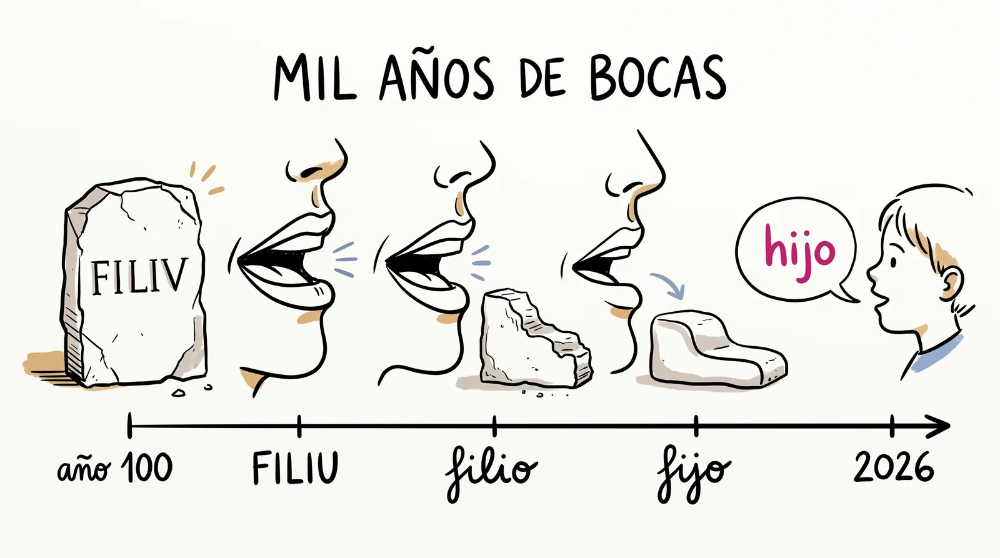
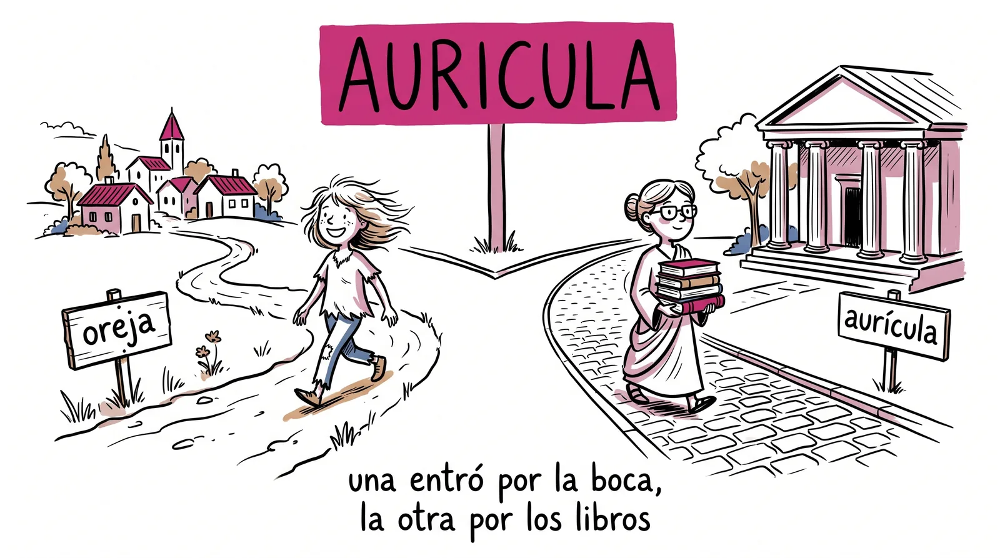
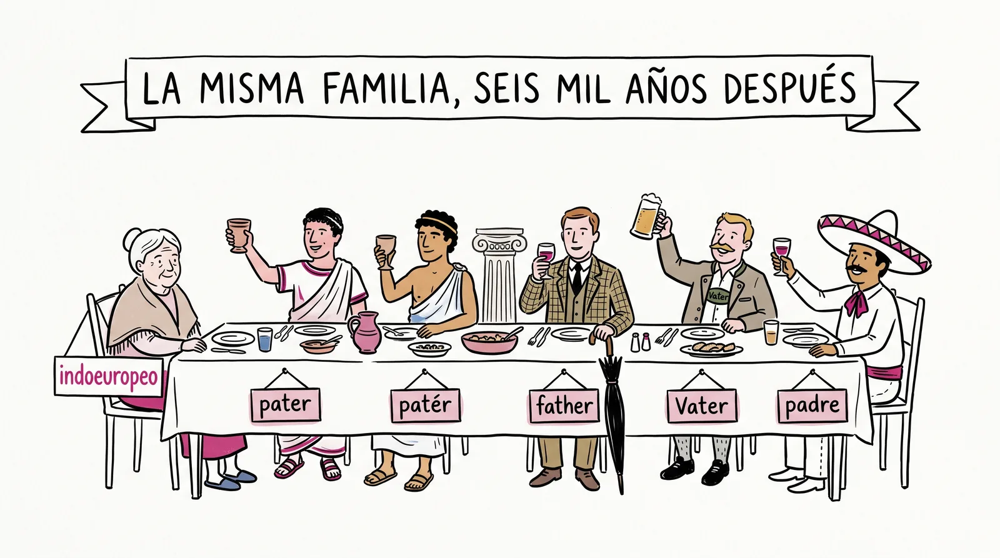

# Semana 8 · La máquina del tiempo fonética

> **La pregunta de la semana:** ¿cómo se convirtió el latín en esto que hablo?

**Esta semana podrás:**

- predecir cómo una palabra latina se volvió española, ley por ley
- hacer el viaje al revés: del español de hoy reconstruir el latín de hace mil años
- cazar un doblete: la hija popular y la hija culta de un mismo latín
- escribir la biografía completa de una palabra que viajó diez siglos

El español no se inventó: es latín gastado durante mil años en la boca de la gente. Y ese desgaste tuvo reglas.

---

| Día | Sesión | Trae |
|---|---|---|
| [Martes 15](#martes) · 1 h | La máquina del tiempo | el mazo al día |
| Miércoles 16 | No hay clase: fiestas patrias | |
| [Jueves 17](#jueves) · 1 h, centro de cómputo | El taller y el tribunal | tu equipo armado |
| [Viernes 18](#viernes) · 2 h | El viaje de mil años | tu étimo verificado del jueves |

Cada día es un mazo de láminas. En clase se proyectan una por una con el botón <strong>Presentar</strong>; aquí se quedan apiladas, en orden, para volver a ellas cuando quieras. Debajo de los mazos: la máquina del tiempo interactiva, las tarjetas de la semana y la familia completa.

<!-- ============================ MARTES ============================ -->
<section class="mazo" id="martes">

Martes 15 de septiembre · 1 hora

<h3>La máquina del tiempo</h3>

El español no se inventó: es latín gastado por un millón de bocas.

<button class="btn-presentar" type="button">Presentar ▸</button>

<section class="lam">
<h4>1 El minuto del lector 3 min</h4>
Al aire

Una persona, un minuto: qué estoy leyendo y por dónde voy.

Sin resumen y sin recomendación forzada. Solo el título, por dónde vas y si te está gustando o no. Se vale decir que no. Si estrenas segundo libro después del círculo, cuéntanos de dónde salió la recomendación.

Primera semana de la unidad 2 y primer martes después del círculo: lo más probable es que a quien le toque el minuto traiga libro nuevo, elegido oyendo al círculo. Nómbralo: la recomendación que funcionó es la prueba de que el círculo sirve.

</section>
<section class="lam lam--bitacora">
<h4>La bitácora del lector 1 min</h4>

Libro nuevo, misma bitácora: el registro no se corta entre libros.

<a href="../recursos/plantillas/bitacora-lector.html" target="_blank" rel="noopener">Bitácora del lector</a>Registra tu segundo libro y sigue sumando líneas. El círculo 2 es el viernes de la semana 12.

Lámina fija de todos los martes: pasa el QR, manda el enlace al grupo en este momento y sigue. Recuérdales cada tanto que la bitácora vive solo en su teléfono: desde el menú se copia un código de respaldo (empieza con ETIMB·) que se mandan a sí mismos por WhatsApp. Hoy toca registrar el segundo libro: quien no lo eligió el viernes, que anote el que se llevó apuntado en la ronda relámpago.

</section>
<section class="lam lam--oscura">
<h4>2 La deuda de la semana 2 6 min</h4>

almohada

Seis semanas colgada y aquí está la respuesta: no es griega ni latina. Viene del árabe <em>al-mihadda</em>, "la que se pone bajo la mejilla". Ese <em>al-</em> no es un prefijo: es un artículo entero, el "la" del árabe, pegado a la palabra. Una lengua que vivió aquí ochocientos años dejó cientos de palabras así, y tiene su propia semana: la que entra. Hoy toca una pregunta más grande: si casi todo lo demás sí es latín, ¿por qué no hablamos latín?

Paga la deuda rápido y no te quedes en los arabismos: son el plato fuerte de la semana 9 y la caza se echa a perder si la adelantas. El movimiento de hoy es el pivote: de dónde vino una palabra ya lo saben preguntar; cómo se fue transformando en el camino es lo que no han visto nunca.

</section>
<section class="lam">
<h4>3 La máquina del tiempo 10 min</h4>

Nadie decidió cambiar el latín. Se gastó, como se gasta un escalón.

<em>FILIU</em> pasó por un millón de bocas durante mil años: <em>filio</em>, <em>fijo</em>, <em>hijo</em>. Nadie lo notó mientras pasaba, igual que nadie ve gastarse un escalón. Pero el desgaste no fue al azar: la misma boca que gastó una palabra gastó todas las parecidas igual. A esas rutas fijas del desgaste les llamamos leyes, y conocerlas te vuelve adivino: puedes predecir el español desde el latín, y el latín desde el español.

La analogía del escalón es la que mejor aterriza: nadie lo desgasta a propósito y aun así la huella queda siempre en el mismo lugar. Si alguien pregunta por qué cambió el sonido, la respuesta honesta es la buena: hablar rápido y parecido a tu gente es más fácil que pronunciar como romano.

</section>
<section class="lam">
<h4>4 Las leyes de la ida 13 min</h4>
<table>
<tr><th>La ley</th><th>Latín</th><th>Español</th></tr>
<tr><td>F inicial se volvió h muda</td><td>FARINA</td><td>harina</td></tr>
<tr><td>El grupo CT se volvió ch</td><td>NOCTE</td><td>noche</td></tr>
<tr><td>PL, CL y FL iniciales se volvieron ll</td><td>PLUVIA, CLAMARE, FLAMMA</td><td>lluvia, llamar, llama</td></tr>
<tr><td>Las vocales breves diptongaron</td><td>PORTA, TERRA</td><td>puerta, tierra</td></tr>
<tr><td>Las consonantes entre vocales se suavizaron</td><td>VITA</td><td>vida</td></tr>
</table>

Cinco leyes bastan para leer la mayoría de los viajes. Y son leyes de verdad: no fallan casi nunca, y cuando parecen fallar es porque la palabra tiene otra historia. Eso también lo vas a aprender a detectar esta semana.

No dictes la tabla: da la ley con su primer ejemplo, tapa la columna del español y que el grupo la llene apostando. FACERE, LACTE, OCTO, FOCU y CLAVE son buenos tiros extra para pedir en voz alta. La tabla completa vive abajo en la máquina del tiempo interactiva de esta página, que es la misma que van a usar en el gimnasio.

</section>
<section class="lam lam--actividad">
<h4>5 Gimnasio: predice en las dos direcciones 22 min</h4>
Actividad · individual

La ida: del latín al español. La vuelta: del español al latín.

<a href="../ejercicios/semana-08/ejercicio-8A-predice-en-dos-direcciones.html">Predice en las dos direcciones</a>. Primero te doy el latín y apuestas el español; luego te doy el español y reconstruyes el latín. Apuesta siempre antes de revelar: el músculo que entrena este ejercicio es el de predecir, no el de reconocer.

<a href="../ejercicios/semana-08/ejercicio-8A-predice-en-dos-direcciones.html" target="_blank" rel="noopener">Predice en las dos direcciones</a>Las cinco leyes trabajando en los dos sentidos del viaje.

Circula y escucha las apuestas de la vuelta: reconstruir el latín es el nivel difícil y es normal que truene. El error productivo típico es aplicar una ley de más ("si hijo viene de FILIU, ojo vendrá de OLIU"): celebra el método aunque falle el dato, igual que en el reactivo del mango.

</section>
<section class="lam">
<h4>6 Antes del jueves 5 min</h4>
Para llevar a casa

El miércoles es 16: no nos vemos. El jueves, centro de cómputo con tu equipo armado.

Equipos de tres o cuatro, decididos hoy y anotados antes de salir. El jueves cada equipo recibe una ley y la exprime en el taller. Y un pendiente chiquito para las fiestas: fíjate cómo dices los números del uno al diez. Ocho de ellos son latín gastado, y ya puedes decir qué ley los gastó.

Deja la lista de equipos escrita, no de palabra: el jueves en el centro de cómputo no hay tiempo de armarlos. Cinco leyes, así que con más de cinco equipos se repite ley y se comparan tablas; funciona igual de bien.

</section>
</section>

<!-- ============================ JUEVES ============================ -->
<section class="mazo" id="jueves">

Jueves 17 de septiembre · 1 hora · centro de cómputo

<h3>El taller y el tribunal</h3>

Cada equipo exprime una ley; el diccionario dicta sentencia.

<button class="btn-presentar" type="button">Presentar ▸</button>

<section class="lam">
<h4>1 Ritual: el reparto de leyes 5 min</h4>
Al aire

Cinco leyes sobre la mesa. Cada equipo toma una.

Y antes de tocar el teclado, dos minutos de memoria: digan en voz alta dos palabras donde su ley ya trabajó. Si el equipo no las saca de memoria, la tabla de abajo se las presta.

Reparte por sorteo, no por elección: la ley de la F y la del CT son las codiciadas y las vocales breves se quedan huérfanas. Si hay más de cinco equipos, duplica leyes y anúncialo como duelo: al final se comparan las dos tablas de la misma ley.

</section>
<section class="lam lam--actividad">
<h4>2 Gimnasio: taller de transformaciones 25 min</h4>
Actividad · en equipos

Su ley, seis pares latín y español, y qué cambió exactamente en cada uno.

<a href="../ejercicios/semana-08/ejercicio-8B-taller-de-transformaciones.html">Taller de transformaciones</a>. La tabla del equipo: mínimo seis pares donde su ley trabajó, y en cada par la transformación exacta. Anoten también su par más dudoso: ese va al tribunal de hoy mismo, en el siguiente ejercicio. La tabla terminada va a la vitrina de la semana.

<a href="../ejercicios/semana-08/ejercicio-8B-taller-de-transformaciones.html" target="_blank" rel="noopener">Taller de transformaciones</a>Una ley por equipo, exprimida hasta el sexto par.

El par dudoso es el oro de la sesión: ahí están los cultismos y los préstamos tardíos sin saberlo. No los corrijas tú: déjalos llegar al tribunal del siguiente bloque, que para eso está. A los equipos rápidos, pídeles el séptimo par con una palabra que no venga en ningún ejemplo del curso.

</section>
<section class="lam lam--actividad">
<h4>3 Gimnasio: el árbol genealógico 25 min</h4>
Actividad · en equipos

Sus dudosos, a juicio en el DECEL. Y de premio, la caza del doblete.

<a href="../ejercicios/semana-08/ejercicio-8C-el-arbol-genealogico.html">El árbol genealógico</a>. Primero el juicio: verifiquen en el <a href="http://etimologias.dechile.net">DECEL</a> que el español venga del latín que apostaron y qué ley operó. Después la caza: un <strong>doblete</strong>, una palabra latina que dio dos españolas, una popular y una culta, como <em>AURICULA</em> que dio <em>oreja</em> y <em>aurícula</em>. Capturen: palabra, étimo, ley, fuente.

<a href="../ejercicios/semana-08/ejercicio-8C-el-arbol-genealogico.html" target="_blank" rel="noopener">El árbol genealógico</a>El diccionario etimológico dicta sentencia y el doblete es el trofeo.

La regla de oro sigue mandando: sin fuente no hay etimología, ni siquiera cuando la ley cuadra perfecto. Si un étimo apostado resulta falso pero la ley estaba bien aplicada, sepáralo en el pizarrón: es un espejismo nuevo, primo de los de la semana 3, y mañana el doblete lo explica.

</section>
<section class="lam">
<h4>4 El marcador 5 min</h4>
Al aire

¿Cuántos pares sobrevivieron al juicio? ¿Qué dobletes cayeron?

Los dobletes cazados se anotan y mañana abren la sesión: son la pieza que explica por qué las leyes a veces "fallan". Y mañana también escribes tu primera biografía completa: una palabra, mil años, tu firma.

Guarda tú la lista de dobletes del grupo: es la primera lámina de mañana y el mejor material de la semana. Con tres dobletes ya se arma la sesión; con seis, sobra.

</section>
</section>

<!-- ============================ VIERNES ============================ -->
<section class="mazo" id="viernes" data-ticket>

Viernes 18 de septiembre · 2 horas

<h3>El viaje de mil años</h3>

Hoy escribes la biografía de una palabra que viajó diez siglos.

<button class="btn-presentar" type="button">Presentar ▸</button>

<section class="lam lam--actividad">
<h4>1 Ritual: duelo de leyes 8 min</h4>
Actividad · en parejas

Se dice el latín; el rival da el español y nombra la ley.

FOCU, NOCTE, CLAMARE, TERRA, FARINA, OCULU y las que el mazo reparta. Quien falle una, la escribe con su ley y sigue jugando: el mazo no se castiga, se afina.

</section>
<section class="lam lam--oscura">
<h4>2 La vuelta 12 min</h4>

hecho. ¿Cuál era el latín?

Dos leyes trabajaron aquí, y las dos al revés: la h muda delata una F, y la ch delata un CT. El latín era <em>FACTU</em>. Ahora ustedes, en voz alta: <em>leche</em>, <em>ojo</em>, <em>llama</em>. Reconstruir una palabra que nadie escribió y atinarle es exactamente el oficio de los filólogos: así se recuperan lenguas de las que no quedó ni una piedra.

Respuestas: LACTE, OCULU, FLAMMA. Escribe las reconstrucciones con asterisco cuando el grupo las proponga sin verificar: es la notación real de los filólogos para las formas reconstruidas, y les encanta saber que existe. La verificación en fuente llegó ayer; hoy se juega la predicción.

</section>
<section class="lam">
<h4>3 El doblete: hermanas separadas 12 min</h4>

AURICULA<small>latín</small>
= oreja y aurícula

Una palabra latina, dos hijas: una se crió en el pueblo y la otra estudió en la capital.

La hija popular entró por la boca y las leyes la gastaron completa: <em>oreja</em>. La hija culta entró siglos después por los libros, directo del latín escrito, y llegó casi intacta: <em>aurícula</em>. Por eso las leyes a veces parecen fallar: <em>frío</em> y <em>frígido</em> salen los dos de <em>FRIGIDU</em>, <em>estrecho</em> y <em>estricto</em> de <em>STRICTU</em>. No falló la ley: la palabra culta nunca pasó por la máquina.

Abre con los dobletes que el grupo cazó ayer, no con los del curso: el efecto de "esto lo encontré yo" vale más que el ejemplo perfecto. Este es además el cierre de las fugitivas del callout de abajo: febrero y fiebre conservaron su F por la misma razón, entraron o se rehicieron por la vía culta.

</section>
<section class="lam lam--actividad">
<h4>4 Gimnasio: la palabra que viajó mil años 30 min</h4>
Actividad · individual

Una palabra con étimo verificado, su viaje completo y tu firma de biógrafo.

<a href="../ejercicios/semana-08/ejercicio-8D-la-palabra-que-viajo-mil-anos.html">La palabra que viajó mil años</a>. Sirve la que confirmaste ayer en el tribunal. La ficha del viaje primero: de qué latín salió, qué leyes la gastaron, cómo se dice hoy. Luego la biografía, con el viaje como historia. Las mejores son candidatas directas al Museo: una biografía de palabra con leyes fonéticas adentro es pieza mayor.

<a href="../ejercicios/semana-08/ejercicio-8D-la-palabra-que-viajo-mil-anos.html" target="_blank" rel="noopener">La palabra que viajó mil años</a>La ficha del viaje y la biografía: tu primera pieza de la unidad 2.

Insiste en el foco: la biografía cuenta el viaje, no solo el origen. "Viene del latín FILIU" es la mitad; "y el grupo LI se volvió j en el camino" es la otra mitad, la que esta semana enseñó. Guarda dos o tres biografías buenas para la vitrina y para modelar la semana 10.

</section>
<section class="lam">
<h4>5 La familia completa 15 min</h4>

El latín tampoco nació solo: tenía primas, y todas la misma abuela.

Compara <em>padre</em>, <em>pater</em>, <em>patḗr</em>, <em>father</em> y <em>Vater</em> en la tabla de abajo. No es coincidencia ni copia: son primas que heredaron de la misma abuela, el indoeuropeo, una lengua de hace más de seis mil años que nadie escribió nunca. ¿Y cómo sabemos que existió, si no dejó ni una piedra? Con el truco que acabas de aprender hoy: reconstruyendo hacia atrás, con leyes y asterisco.

Proyecta la tabla de la familia que está abajo en esta página y pide que lean las filas en voz alta: el parecido se oye más de lo que se ve, sobre todo en noche, night y Nacht. El remate importa: el método de la vuelta que jugaron hoy es el mismo con el que se reconstruyó el indoeuropeo entero. Y planta la semilla: en la semana 15 este cuadro vuelve para explicar por qué el inglés se les va a hacer menos extranjero.

</section>
<section class="lam lam--actividad">
<h4>6 Fábrica de tarjetas 10 min</h4>
Actividad · individual

Esta semana el mazo no crece de piezas: crece de leyes.

Seis tarjetas: las cinco leyes con su par ancla y el doblete con <em>AURICULA</em>. Están en la tabla de abajo. Con estas seis, cualquier palabra latina que te encuentres ya te dice algo antes de buscarla.

</section>
<section class="lam">
<h4>7 Lectura compartida 18 min</h4>

Diez minutos de algo hermoso, sin análisis y sin tarea.

El cierre de siempre, ahora con los segundos libros estrenándose. Y una pregunta para irte pensando: ¿cuántas lenguas crees que hablas al día sin saberlo? La semana que entra las vamos a desenterrar, y te va a tocar entrevistar a tu gente.

La pregunta siembra la semana 9 y su trabajo de campo: la palabra de la casa que cada quien trae para el mapa léxico. No la desarrolles hoy: déjala picando, que para eso es el cierre.

</section>
</section>

## La lectura, esta semana

El **minuto del lector** abre el martes, la voz alta cierra el viernes y tu [bitácora](../recursos/plantillas/bitacora-lector.html) estrena segundo libro: regístralo esta semana, aunque lo elijas de la lista que hiciste oyendo el círculo. Si tu obra terminada dejó ficha, ya cuelga en el tendedero de [Leemos](../leemos.html); y si prestaste o pediste libro en el préstamelo, la bitácora también guarda eso.

---

## El gimnasio completo

Los ejercicios de la semana, para tu celular o el centro de cómputo. Sin nota y sin registro: puro entrenamiento.

- [Predice en las dos direcciones](../ejercicios/semana-08/ejercicio-8A-predice-en-dos-direcciones.html) · martes
- [Taller de transformaciones](../ejercicios/semana-08/ejercicio-8B-taller-de-transformaciones.html) · jueves, en equipos
- [El árbol genealógico](../ejercicios/semana-08/ejercicio-8C-el-arbol-genealogico.html) · jueves, centro de cómputo
- [La palabra que viajó mil años](../ejercicios/semana-08/ejercicio-8D-la-palabra-que-viajo-mil-anos.html) · viernes
- [Quiz de gimnasio](../ejercicios/semana-08/quiz-gimnasio-semana-08.html) · para ensayar cuando quieras

### En el centro de cómputo (jueves)

1. Toma 3 pares dudosos de tu equipo. Verifica en el [DECEL](http://etimologias.dechile.net) que el español venga de ese latín y qué ley operó.
2. Busca un **doblete**: una palabra latina que dio dos españolas, una popular y una culta (*AURICULA* → oreja y aurícula).
3. Captura: palabra, étimo latino, ley, fuente.

---

## Hoja de consulta

Toca una palabra latina y viaja mil años hasta el español. Fíjate en la ley que la transformó.

  

  
Toca una palabra latina.

{: .reto }
Al revés es más difícil: si hoy dices *hecho*, ¿cuál era el latín? (Pista: CT y F. Respuesta: *FACTU*.)

{: .ojo }
Toda ley tiene fugitivas: *febrero, fiebre, fiesta, filo* y *fin* conservaron su F. Son cultismos o palabras que entraron tarde, cuando la ley ya no operaba. Si encuentras una excepción, no rompiste la regla: encontraste una palabra con otra historia. Y esa otra historia tiene nombre desde el viernes: la vía culta, la misma del doblete.

### Las palabras también cambian de adentro

El sonido no es lo único que se gasta con los siglos: el significado también viaja. *Pedagogo* era en Grecia el esclavo que llevaba a los niños a la escuela (*paidós*, niño + *agogós*, el que conduce). Hoy es el profesor. La palabra ascendió de puesto.

Y *hablar*, ya lo verás en el postre, viene de contar fábulas. A este viaje del significado se le llama cambio semántico, y en la semana 11 vamos a cazar los casos donde la gente lo inventa al revés.

---

## Las tarjetas de la semana

Esta semana el mazo no crece de piezas: crece de leyes. Seis tarjetas, y con esas seis cualquier palabra latina que te encuentres ya te dice algo antes de buscarla.

**[Baja el mazo de la semana 8](../recursos/anki/etimologias-semana-08.apkg)** · Las cinco leyes del desgaste con su par ancla, más el doblete. En [Recursos · Anki](../recursos/anki.html) están todos, sueltos por semana o el semestre completo.

| Frente | Reverso (significado · palabra ancla) |
|---|---|
| F inicial → h | FARINA → harina |
| CT → ch | NOCTE → noche |
| PL / CL / FL → ll | PLUVIA → lluvia |
| vocal breve → diptongo | PORTA → puerta |
| consonante suave | VITA → vida |
| doblete | AURICULA → oreja / aurícula |

## Por si hay tiempo: la familia completa

El latín no estaba solo: era parte de una familia gigante, el indoeuropeo, una lengua madre hablada hace más de 6,000 años que hoy vive en los idiomas de más de la mitad del planeta. Compara:

| Español | Latín | Griego | Inglés | Alemán |
|---|---|---|---|---|
| padre | pater | patḗr | father | Vater |
| madre | mater | mḗtēr | mother | Mutter |
| tres | tres | treîs | three | drei |
| noche | nox | nýx | night | Nacht |
| estrella | stella | astḗr | star | Stern |

No es coincidencia ni copia: son primas. Todas heredaron de la misma abuela. Guarda esta tabla en la memoria, porque en la semana 15 va a explicar por qué el inglés se te va a hacer menos extranjero de lo que crees.

## Lo que produjimos

*Las tablas de leyes de cada equipo, los dobletes cazados y las mejores biografías del viaje. Se llena al cerrar la semana.*

## El postre 🍨

*hablar* viene de *FABULARI* (contar fábulas). Hablar era, literalmente, andar contando historias. La F se volvió h, y de contar mentiras hermosas nos quedó la palabra para todo lo que decimos. No está tan mal como origen.

---

## Antes de irte

<a class="ticket" href="{{ site.ticket_url }}" target="_blank" rel="noopener">
  <b>Ticket de salida de esta semana</b>
  Noventa segundos, al cierre de la sesión larga: qué te llevas, qué quedó turbio y cómo estuvo el ritmo. Con nombre o sin él.
  <em>Lo que escribas aquí decide por dónde empezamos el martes.</em>
</a>
<a class="ticket-qr" href="{{ site.ticket_url }}" target="_blank" rel="noopener">
  
  escanéalo
</a>

