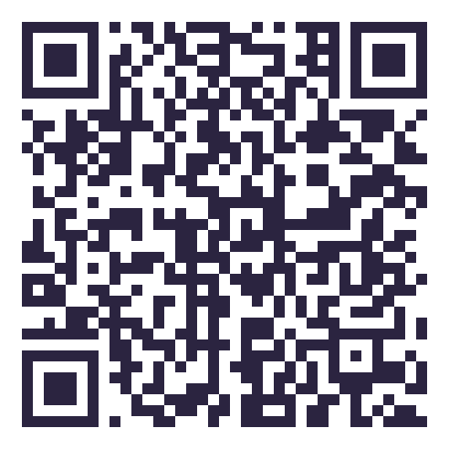
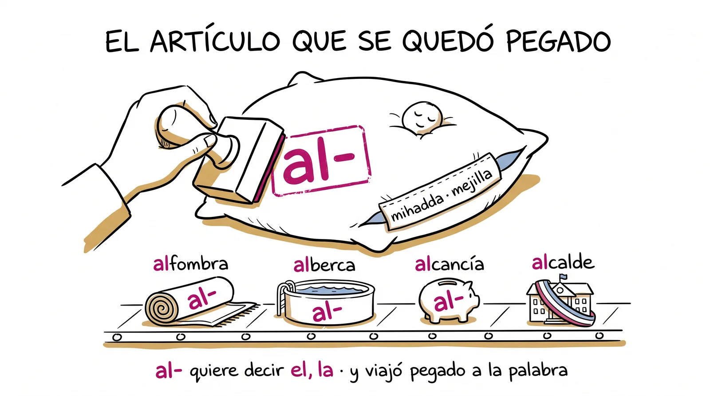
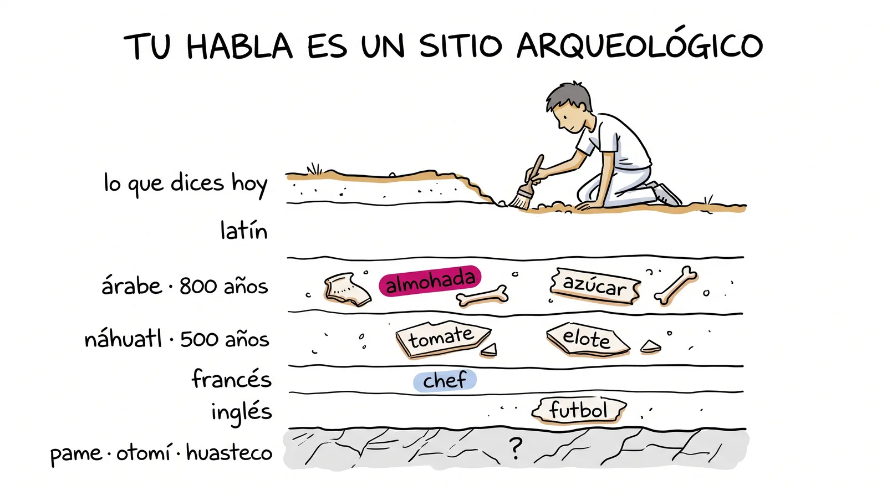
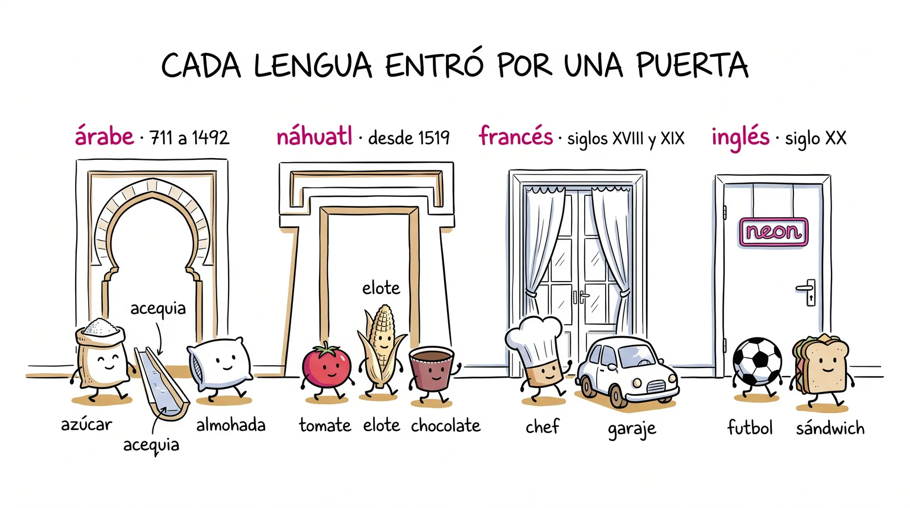
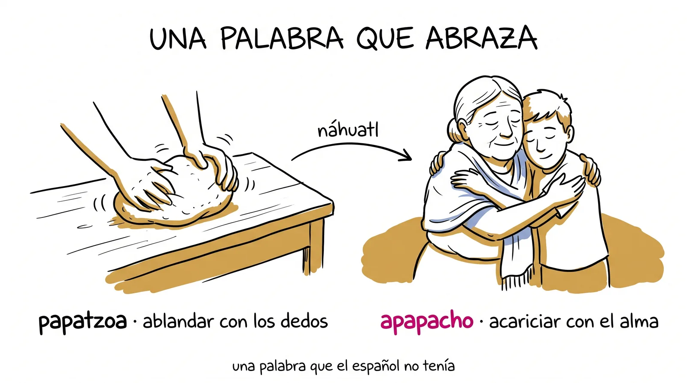

# Semana 9 · Las lenguas escondidas

> **La pregunta de la semana:** ¿qué lenguas viven escondidas en mi habla?

**Esta semana podrás:**

- reconocer el árabe, el náhuatl, el francés y el inglés que dices todos los días sin saberlo
- leer las marcas que delatan a cada lengua antes de abrir el diccionario
- verificar el origen de una palabra en la fuente, y leer el paréntesis del DLE como quien lee una cédula
- escribir la biografía de una palabra viajera y grabar tu primer booktuber

Tu habla es un sitio arqueológico. Debajo de lo que dices hay latín, y debajo del latín hay ocho siglos de árabe, cinco de náhuatl y un puñado de modas francesas e inglesas. Esta semana se excava, empezando por la lengua que asomó la semana pasada en *almohada* y que dejó unas cuatro mil palabras más.

---

| Día | Sesión | Trae |
|---|---|---|
| [Martes 22](#martes) · 1 h | Cacería en tu propia habla | tu mazo al día y a alguien para hacer pareja |
| [Miércoles 23](#miercoles) · 1 h | La lista de tu lengua | tres palabras cazadas en casa |
| [Jueves 24](#jueves) · 1 h, centro de cómputo | El origen a juicio | las dudosas de tu equipo |
| [Viernes 25](#viernes) · 2 h | La palabra viajera y el primer booktuber | tu libro terminado y una frase marcada |

Cada día es un mazo de láminas. En clase se proyectan una por una con el botón <strong>Presentar</strong>; aquí se quedan apiladas, en orden, para volver a ellas cuando quieras. Debajo de los mazos: el mapa de lenguas para tocar, el caso de gis y tiza, las tarjetas de la semana y la bolsa grande de nahuatlismos.

<!-- ============================ MARTES ============================ -->
<section class="mazo" id="martes">

Martes 22 de septiembre · 1 hora

<h3>Cacería en tu propia habla</h3>

La semana pasada cayó almohada. Hoy caen las otras cuatro mil.

<button class="btn-presentar" type="button">Presentar ▸</button>

<section class="lam">
<h4>1 El minuto del lector 3 min</h4>
Al aire

Una persona, un minuto: qué estoy leyendo y por dónde voy.

Segundo libro para casi todos. Solo el título, por dónde vas y si te está gustando o no. Se vale decir que no, y se vale decir que todavía no lo abres.

Antes del minuto, un minuto tuyo: lee en voz alta dos o tres cosas del ticket de la semana pasada ("tres dijeron que las leyes fonéticas quedaron turbias; empezamos por ahí"). Si el ticket no cambia la clase a la vista de todos, deja de contestarse. El minuto del lector sigue con la lista de siempre: uno por martes.

</section>
<section class="lam lam--bitacora">
<h4>La bitácora del lector 1 min</h4>

Libro nuevo, rastro nuevo. Que la primera sesión quede anotada esta semana.

<a href="../recursos/plantillas/bitacora-lector.html" target="_blank" rel="noopener">Bitácora del lector</a>En la pestaña de libros, da de alta tu segunda obra. El viernes grabas el booktuber de la primera, y la pestaña <em>Mi rastro</em> te dice cuánto le diste.

Lámina fija de todos los martes: pasa el QR, manda el enlace al grupo en este momento y sigue. Recuérdales cada tanto que la bitácora vive solo en su teléfono: desde el menú se copia un código de respaldo (empieza con ETIMB·) que se mandan a sí mismos por WhatsApp. Hoy el dato útil es el viernes: el booktuber habla de la primera obra, y la bitácora tiene sus fechas y su cosecha de palabras. Que la abran ahí.

</section>
<section class="lam lam--actividad">
<h4>2 Ritual: duelo de leyes 5 min</h4>
Actividad · en parejas

Uno dice el latín, el otro lo vuelve español. Y dice la ley.

FILIU, NOCTE, PLUVIA, PORTA, VITA. Las cinco leyes de la semana pasada, sin ver el mazo. Quien falle, la escribe y sigue: esto es calentamiento, no examen.

Corto y de pie. Las leyes de la 8 vuelven en el integrador de la 12, así que no dejes que se enfríen. Si alguien pregunta por la palabra que no obedece la ley (fiesta, febrero), recuérdales la lámina de las fugitivas: cultismos y palabras que entraron tarde.

</section>
<section class="lam lam--oscura">
<h4>3 almohada, segunda vuelta 10 min</h4>

almohada

La semana pasada supieron de dónde viene. Hoy, qué trajo consigo.

Ya saben que es árabe y que ese <em>al-</em> es un artículo pegado. Lo que no saben: cuántas palabras entraron por la misma puerta, y cómo reconocerlas. Apuesten un número antes de seguir: ¿cuántas palabras árabes creen que dicen en un día normal?

El martes 15 pagaste la deuda en seis minutos y dejaste los arabismos para hoy. Retoma desde ahí: que ellos cuenten la historia de almohada, no tú, y que digan qué era ese al-. Las apuestas del número van al pizarrón; la lámina de los ocho siglos las corrige.

</section>
<section class="lam">
<h4>Lo que trae adentro</h4>

al-<small>el, la (artículo)</small>
mihadda<small>de hadd, mejilla</small>
= almohada, "la que va bajo la mejilla"

Es árabe. <em>Al-</em> es el artículo ("el", "la") y se quedó pegado a la palabra cuando pasó al español: por eso <em>almohada</em>, <em>alfombra</em>, <em>alcalde</em> y <em>alberca</em> traen la misma firma. La <em>mihadda</em> es literalmente "la cosa de la mejilla". Cada noche pones la cabeza sobre una palabra que lleva mil doscientos años viajando.

Así lo dice la fuente: <strong>DLE, entrada <em>almohada</em>: "Del ár. hisp. almuḫádda, y este del ár. clás. miḫaddah, de ḫadd 'mejilla'"</strong>. El jueves aprendes a leer ese paréntesis completo.

</section>
<section class="lam lam--oscura">
<h4>Ocho siglos</h4>

El árabe se habló en España de 711 a 1492. Dejó unas cuatro mil palabras en el español.

Ochocientos años son más de los que lleva el español en América. En ese tiempo entraron las palabras del riego (<em>acequia</em>, <em>alberca</em>, <em>aljibe</em>), de la cocina (<em>aceite</em>, <em>azúcar</em>, <em>alcachofa</em>, <em>jarabe</em>), de la ciencia (<em>álgebra</em>, <em>cifra</em>, <em>algoritmo</em>), de la casa (<em>almohada</em>, <em>alfombra</em>, <em>almacén</em>) y una que dices cuando deseas algo: <em>ojalá</em>. Todas cruzaron el mar en 1492 y llegaron aquí con los barcos.

El dato de "cuatro mil" es el que suele citarse; si preguntan, es la cifra habitual de los manuales, no un conteo exacto. Lo importante es el orden de magnitud: la segunda fuente del español después del latín.

</section>
<section class="lam">
<h4>4 Tu habla es un sitio arqueológico 5 min</h4>

Capas. Y cada capa dejó una marca que se puede aprender a ver.

<table>
<tr><th>Capa</th><th>Cuándo entró</th><th>La marca que la delata</th><th>Ejemplos</th></tr>
<tr><td><strong>árabe</strong></td><td>711 a 1492, en España</td><td>empieza con <em>al-</em> (y a veces <em>a-</em>)</td><td>almohada, alberca, azúcar, aceite</td></tr>
<tr><td><strong>náhuatl</strong></td><td>desde 1519, aquí</td><td>termina en <em>-te</em>, <em>-ate</em>, <em>-ote</em> (era <em>-tl</em>)</td><td>tomate, aguacate, elote, papalote</td></tr>
<tr><td><strong>francés</strong></td><td>siglos XVIII y XIX, por moda</td><td>suena a cocina o a salón: <em>-é</em>, <em>-aje</em></td><td>chef, chofer, puré, garaje</td></tr>
<tr><td><strong>inglés</strong></td><td>siglo XX, por deporte y tecnología</td><td>consonantes finales raras para el español</td><td>futbol, clóset, sándwich, clip</td></tr>
</table>

Las marcas no son pruebas: son sospechas bien fundadas. <em>Tiza</em> no termina en <em>-te</em> y es náhuatl; <em>naranja</em> no empieza con <em>al-</em> y es árabe. La marca te dice dónde buscar; la fuente decide.

Aquí no cabe una quinta fila, pero dila: debajo de todas esas capas, en la Sierra, están el pame, el otomí y el huasteco, y casi nada de eso está en los diccionarios. Es la siembra de la semana 10 y del mapa léxico. No la desarrolles hoy.

</section>
<section class="lam lam--actividad">
<h4>5 Gimnasio: cacería en tu propia habla 25 min</h4>
Actividad · en parejas

Diez palabras que dices como si fueran "de siempre". Apuesta de dónde viene cada una.

<a href="../ejercicios/semana-09/ejercicio-9A-caceria-de-lenguas.html">Cacería en tu propia habla</a>: para cada palabra dicen su apuesta en voz alta, tocan la lengua y revisan. Si fallan, el ejercicio da una pista antes que la respuesta. Las que se les resistan, anótenlas como dudosas: el jueves las verificamos en fuentes.

<a href="../ejercicios/semana-09/ejercicio-9A-caceria-de-lenguas.html" target="_blank" rel="noopener">Cacería en tu propia habla</a>Diez palabras, cinco lenguas posibles, y una pista antes de cada respuesta.

Un teléfono por pareja. La que más se cae es <em>quiosco</em> (persa, con escalas en turco y francés) y la que más sorprende es <em>tiza</em>: la palabra más escolar del salón resultó mexicana. Cuando alguien lo descubra, proyéctalo: esa es la semilla del caso de gis y tiza del jueves.

</section>
<section class="lam">
<h4>6 Ronda de síntesis 6 min</h4>
Al aire

¿Cuál te sorprendió más no ser "de aquí de siempre"?

Una línea por pareja. Y una pregunta para cerrar: si <em>tiza</em> es náhuatl y <em>almohada</em> es árabe, ¿qué queda de "puro español"? Guarden la respuesta: es la pregunta con la que cierra la unidad en la semana 12.

</section>
<section class="lam lam--actividad">
<h4>7 Antes del miércoles 5 min</h4>
Para llevar a casa

Caza tres palabras en tu casa que sospeches que no son latinas.

En la cocina, en el patio, en lo que dice tu abuela. Tráelas con tu apuesta de lengua, sin buscarlas todavía: <strong>apuesta antes de buscar</strong>, como siempre. Y decide con tu equipo qué lengua van a adoptar mañana: náhuatl, árabe, francés o inglés.

Una cosa más: el Museo abrió su <a href="../museo/galeria.html">Sala 2, Palabras heredadas</a>. Las piezas de esta unidad se cuelgan ahí, y la primera puede ser tuya.

</section>
</section>

<!-- ============================ MIÉRCOLES ============================ -->
<section class="mazo" id="miercoles">

Miércoles 23 de septiembre · 1 hora

<h3>La lista de tu lengua</h3>

Cuatro lenguas, cuatro equipos, y cada una entró por una puerta distinta.

<button class="btn-presentar" type="button">Presentar ▸</button>

<section class="lam">
<h4>1 Ritual: la cacería de casa 6 min</h4>
Al aire

¿Qué cazaste, y de qué lengua apuestas que viene?

Ronda rápida: palabra y apuesta, nada más. Al pizarrón, en cuatro columnas, una por lengua. Las que no sepan dónde poner van a una quinta columna que se llama <em>dudosas</em>, y esa columna es la más valiosa del día.

No corrijas nada todavía. Si alguien trae una que es latina de toda la vida (pasa seguido con <em>cocina</em> o <em>mesa</em>), va a dudosas sin comentario: el jueves la fuente lo dirá mejor que tú.

</section>
<section class="lam">
<h4>2 Cuatro lenguas, cuatro puertas 14 min</h4>

Ninguna palabra entra al idioma por casualidad. Entra por una puerta, y la puerta explica qué palabras son.

<table>
<tr><th>Lengua</th><th>La puerta</th><th>Por eso trae palabras de</th></tr>
<tr><td><strong>árabe</strong></td><td>ocho siglos de convivencia en Al-Ándalus</td><td>el riego, el campo, la ciencia, la casa</td></tr>
<tr><td><strong>náhuatl</strong></td><td>1519: los españoles llegan a un mundo sin nombres en su lengua</td><td>lo que aquí había y allá no: comida, plantas, animales, objetos</td></tr>
<tr><td><strong>francés</strong></td><td>siglos XVIII y XIX: Francia manda en la moda y la cocina</td><td>la mesa, el vestido, el salón, la calle</td></tr>
<tr><td><strong>inglés</strong></td><td>siglo XX: el deporte y la tecnología hablan inglés</td><td>la cancha, la oficina, la pantalla</td></tr>
</table>

Regla que sale de la tabla: <strong>una lengua presta las palabras de lo que sabe hacer</strong>. Nadie le pidió al náhuatl la palabra para "caballo" (no había) ni al inglés la palabra para "tortilla".

Detente en la puerta del náhuatl: es la única lengua de la tabla que prestó palabras porque el español no las tenía, no por moda ni por dominio. Es una diferencia de fondo y la van a necesitar en la semana 12, en la disputa sobre quién es dueño del español.

</section>
<section class="lam">
<h4>La misma palabra, dos viajes</h4>

caput<small>cabeza (latín)</small>
→ chef (francés) → jefe · chef

jefe y chef son la misma palabra francesa. Entró dos veces, con tres siglos de diferencia.

El francés <em>chef</em> ("cabeza", "el que manda") entró al español en el siglo XVII y el idioma lo masticó hasta dejarlo en <em>jefe</em>. En el siglo XX volvió a entrar, ahora con gorro blanco, y como llegó tarde se quedó tal cual: <em>chef</em>. Es un doblete como los de la semana 8 (<em>oreja</em> y <em>aurícula</em>), pero de préstamo: la primera entrada se gasta, la segunda se conserva.

</section>
<section class="lam lam--oscura">
<h4>Palabras mexicanas que conquistaron el mundo</h4>

chocolate · tomate · aguacate · chile · chicle · coyote

El préstamo no va en una sola dirección. Estas seis salieron del náhuatl, pasaron por el español y hoy viven en inglés, francés, alemán, japonés. <em>Chocolate</em> se dice casi igual en cien lenguas: es probablemente la palabra mexicana más viajada de la historia.

Buen momento para el mapa mental: el náhuatl no solo recibió, también exportó. Si alguien pregunta por <em>tiza</em>, guárdala: es el caso del jueves.

</section>
<section class="lam lam--actividad">
<h4>3 Gimnasio: la lista de tu lengua 25 min</h4>
Actividad · por equipos

Cada equipo adopta una lengua y junta sus préstamos vivos en el habla de todos los días.

<a href="../ejercicios/semana-09/ejercicio-9B-la-lista-de-tu-lengua.html">La lista de tu lengua</a>: mínimo ocho palabras con significado y, si la tiene, su pista de origen (el <em>al-</em>, el <em>-te</em>). Al final entregan sus dos más dudosas: esas van al tribunal del jueves. La captura del equipo alimenta el mapa léxico que arranca la semana que viene.

<a href="../ejercicios/semana-09/ejercicio-9B-la-lista-de-tu-lengua.html" target="_blank" rel="noopener">La lista de tu lengua</a>Ocho palabras, dos dudosas y una captura por equipo.

Cuatro equipos, una lengua cada uno; si hay más de cuatro, dos equipos de náhuatl, que es la bolsa más grande. El equipo de inglés tiende a listar palabras que no usan ("software"): pídeles palabras que de verdad se dicen en su casa (clóset, suéter, sándwich, bistec). Las capturas se pegan en la plantilla del tablero y de ahí sale "Lo que produjimos".

</section>
<section class="lam lam--actividad">
<h4>4 Fábrica de tarjetas 7 min</h4>
Actividad · individual

Al mazo: las dos marcas y siete palabras viajeras.

Frente, la palabra (<em>ojalá</em>); reverso, lengua y significado literal (<em>árabe · "si Dios quiere"</em>). Las dos marcas se tarjetean como piezas: <em>al-</em> y <em>-tl → -te</em>. La lista completa está abajo, en las tarjetas de la semana, y el mazo de Anki ya trae las catorce.

</section>
<section class="lam">
<h4>5 Cierre 3 min</h4>
Para llevar a casa

Mañana, centro de cómputo: las dudosas de tu equipo van a juicio.

Trae a la mano tus dudosas del martes y las dos de tu equipo. Y ve pensando en <strong>una palabra de tu casa o tu región</strong> que no esté en ningún diccionario: mañana la eliges y la investigas con tu familia el fin de semana.

</section>
</section>

<!-- ============================ JUEVES ============================ -->
<section class="mazo" id="jueves">

Jueves 24 de septiembre · 1 hora · centro de cómputo

<h3>El origen a juicio</h3>

El martes apostaste lenguas. Hoy tus apuestas enfrentan a las fuentes.

<button class="btn-presentar" type="button">Presentar ▸</button>

<section class="lam">
<h4>1 Cómo se lee el paréntesis 8 min</h4>

En el DLE, el origen está al principio de la entrada, entre paréntesis. Casi nadie lo lee. Tú sí.

<table>
<tr><th>Lo que dice el DLE</th><th>Cómo se lee</th></tr>
<tr><td>Del ár. hisp. <em>almuḫádda</em>, y este del ár. clás. <em>miḫaddah</em></td><td>del árabe hispánico (el de Al-Ándalus), que a su vez lo tomó del árabe clásico</td></tr>
<tr><td>Del nahua <em>tizatl</em></td><td>del náhuatl; "nahua" es como lo abrevia el DLE</td></tr>
<tr><td>Del fr. <em>chef</em>, y este del lat. <em>caput</em></td><td>entró por el francés, pero el abuelo es latino</td></tr>
<tr><td>Del ingl. <em>football</em></td><td>préstamo del inglés</td></tr>
<tr><td>Quizá del nahua <em>tocaitl</em></td><td>la fuente duda, y lo dice: ese "quizá" también es dato</td></tr>
</table>

Después confirmas en el <a href="http://etimologias.dechile.net">DECEL</a>: ahí está la historia completa, con las escalas del viaje. Dos fuentes, un veredicto.

Proyecta la entrada de <em>almohada</em> en el DLE y lee el paréntesis en voz alta, abreviatura por abreviatura. Es el reflejo que la unidad quiere instalar: mirar primero el paréntesis. La fila de "quizá" es importante: la fuente honesta también dice cuando no sabe, y eso vuelve en la semana 11 contra la IA, que nunca lo dice.

</section>
<section class="lam lam--oscura">
<h4>2 Tres cosas pueden pasar hoy 4 min</h4>

Atinaste. Fallaste. O la fuente cuenta algo más raro de lo que nadie apostó.

Las tres valen. La primera confirma que ya ves las marcas. La segunda te enseña una marca nueva. La tercera es la mejor: <em>quiosco</em> no es árabe ni francés ni náhuatl, es persa, y pasó por el turco y el francés antes de llegar aquí. Cuando te pase, apúntala: son las palabras con mejor biografía.

</section>
<section class="lam lam--figura">
<h4>3 El caso de gis y tiza 8 min</h4>

En España dicen <em>tiza</em>, una palabra mexicana. En México decimos <em>gis</em>, una palabra griega. Cada quien usa la del otro.

<svg viewBox="0 0 720 300" xmlns="http://www.w3.org/2000/svg" role="img" aria-label="Dos viajes cruzados: gis sale de Grecia, pasa por Roma y España y llega a México; tiza sale de México y llega a España. Cada palabra terminó en el país del otro." style="width:100%;max-width:44rem;height:auto;margin:.6rem auto 0;display:block">
<defs>
<marker id="fl9r" viewBox="0 0 10 10" refX="8" refY="5" markerWidth="7" markerHeight="7" orient="auto"><path d="M0,0 L10,5 L0,10 z" fill="#C4006A"/></marker>
<marker id="fl9j" viewBox="0 0 10 10" refX="8" refY="5" markerWidth="7" markerHeight="7" orient="auto"><path d="M0,0 L10,5 L0,10 z" fill="#0B5F52"/></marker>
</defs>
<rect x="0" y="0" width="720" height="300" rx="14" fill="#FBF7E9"/>
<g font-family="Inter, system-ui, sans-serif" font-size="15" fill="#221A3A">
<rect x="560" y="40" width="130" height="54" rx="10" fill="#fff" stroke="#E6DFF0"/><text x="625" y="62" text-anchor="middle" font-weight="700">Grecia</text><text x="625" y="82" text-anchor="middle" font-size="13" fill="#6B6485">gypsos</text>
<rect x="400" y="40" width="130" height="54" rx="10" fill="#fff" stroke="#E6DFF0"/><text x="465" y="62" text-anchor="middle" font-weight="700">Roma</text><text x="465" y="82" text-anchor="middle" font-size="13" fill="#6B6485">gypsum</text>
<rect x="400" y="200" width="150" height="62" rx="10" fill="#fff" stroke="#E6DFF0"/><text x="475" y="224" text-anchor="middle" font-weight="700">España</text><text x="475" y="246" text-anchor="middle" font-size="13" fill="#6B6485">yeso · gis · hoy: tiza</text>
<rect x="40" y="200" width="150" height="62" rx="10" fill="#fff" stroke="#E6DFF0"/><text x="115" y="224" text-anchor="middle" font-weight="700">México</text><text x="115" y="246" text-anchor="middle" font-size="13" fill="#6B6485">tizatl · hoy: gis</text>
<path d="M560,67 L530,67" stroke="#C4006A" stroke-width="3" fill="none" marker-end="url(#fl9r)"/>
<path d="M465,94 C465,150 475,160 475,200" stroke="#C4006A" stroke-width="3" fill="none" marker-end="url(#fl9r)"/>
<path d="M400,215 C300,150 250,150 190,212" stroke="#C4006A" stroke-width="3" fill="none" marker-end="url(#fl9r)"/>
<path d="M190,246 C260,300 340,300 400,250" stroke="#0B5F52" stroke-width="3" fill="none" stroke-dasharray="7 5" marker-end="url(#fl9j)"/>
<text x="300" y="160" text-anchor="middle" font-weight="700" fill="#C4006A">gis: griego, con escala en Roma</text>
<text x="300" y="292" text-anchor="middle" font-weight="700" fill="#0B5F52">tiza: náhuatl, de tizatl (tierra blanca)</text>
</g>
</svg>

Los griegos llamaron <em>gypsos</em> al material blanco; los romanos lo volvieron <em>gypsum</em>; de ahí el español sacó dos hijas, <em>yeso</em> y <em>gis</em>. A <em>gis</em> le fue mal en España y dejó de usarse. Mientras tanto, en México los españoles aprendieron <em>tizatl</em> (tierra blanca) y nació <em>tiza</em>, que cruzó el mar de regreso. Resultado: en los salones de Madrid se escribe con una palabra mexicana y en los de Querétaro con una griega.

Cuéntalo con la figura proyectada y luego diles que lo verifiquen: DLE <em>tiza</em> ("Del nahua tizatl") y DLE <em>gis</em> ("Del lat. gypsum, y este del gr. γύψος"). Es la historia mejor pagada del semestre para instalar el reflejo: una historia tan buena que da gusto verificarla, y resiste la verificación.

</section>
<section class="lam lam--actividad">
<h4>4 Gimnasio: el origen a juicio 30 min</h4>
Actividad · individual, con las fuentes abiertas

Cuatro palabras dudosas pasan por el protocolo. Luego eliges la palabra de tu casa.

<a href="../ejercicios/semana-09/ejercicio-9C-el-origen-a-juicio.html">El origen a juicio</a>: por cada palabra registras lo que apostaste, lo que dice la fuente y dónde lo dice. Sin fuente, el veredicto no vale. Al final, la parte que importa para la semana 10: eliges <strong>una palabra de tu casa o tu región</strong> (un nahuatlismo local, un arcaísmo, una voz de tu pueblo) y anotas a quién vas a entrevistar. Generas las dos capturas y las pegas donde indique el profesor.

<a href="../ejercicios/semana-09/ejercicio-9C-el-origen-a-juicio.html" target="_blank" rel="noopener">El origen a juicio</a>Cuatro dudosas por el protocolo, y tu semilla para el mapa léxico.

Circula mirando pantallas: el error de siempre es aceptar el primer resultado del buscador en lugar del DLE. Si alguien no tiene dudosas propias, toma las dos de su equipo o las de la columna de ayer. La semilla del mapa es obligatoria: quien salga hoy sin palabra de casa llega el martes 29 sin nada que cosechar.

</section>
<section class="lam">
<h4>5 El marcador 5 min</h4>
Al aire

¿Cuántas apuestas sobrevivieron al tribunal? ¿Y cuál fue la más rara?

Dos números al pizarrón: apuestas que se sostuvieron y apuestas que cayeron. El primero dice cuánto ya ves las marcas. Las historias raras (las de la tercera opción) se anotan aparte: van a "Lo que produjimos".

</section>
<section class="lam lam--actividad">
<h4>6 La entrevista del fin de semana 5 min</h4>
Para llevar a casa

Tu palabra de casa se investiga con la persona que la dice, no con el celular.

<ul>
<li>¿Qué significa exactamente? Pídele un ejemplo dicho tal cual, y anótalo entre comillas.</li>
<li>¿Quién se la enseñó? ¿Quién más la usa? ¿La dicen los jóvenes?</li>
<li>¿Sabe de dónde viene? Lo que te diga vale, aunque sea una corazonada: se verifica después.</li>
</ul>

Trae las respuestas el martes 29. Ese día se cosecha el mapa léxico del grupo, y sin entrevista no hay ficha. Y mañana: quiz relámpago, tu palabra viajera y el primer booktuber. Trae tu primer libro, el terminado, y una frase marcada.

</section>
</section>

<!-- ============================ VIERNES ============================ -->
<section class="mazo" id="viernes" data-ticket>

Viernes 25 de septiembre · 2 horas

<h3>La palabra viajera y el primer booktuber</h3>

Hoy sales con una pieza nueva del Museo y una recomendación grabada.

<button class="btn-presentar" type="button">Presentar ▸</button>

<section class="lam lam--actividad">
<h4>1 Ritual: quiz relámpago 15 min</h4>
A solas · sin mazo y sin celular

Tres reactivos. Tu apuesta primero, del 0 al 3.

Tres palabras y sus lenguas, una marca delatora y el significado literal de una palabra que abraza. Se responde en el cuadernillo y se califica en el momento, en bien o aún no. Los dos números, apuesta y resultado, van al renglón del <strong>quiz #7</strong> de tu expediente.

<a href="../ejercicios/semana-09/quiz-relampago-semana-09.html" target="_blank" rel="noopener">El quiz, lámina por lámina</a>El mismo que se proyecta, con cronómetro de tres minutos y las respuestas al final.

Proyecta el quiz desde el enlace: portada, apuesta, tres reactivos, los tres juntos con cronómetro, lápices abajo y respuestas. Reparte: 2 min de apuesta, 3 de resolución, 8 de calificación comentada, 2 para anotar en el expediente. El reactivo 3 (apapacho) se califica con criterio: vale "acariciar", "abrazar con el alma" o "ablandar con los dedos"; lo que no vale es la lengua equivocada.

</section>
<section class="lam">
<h4>2 Una palabra que abraza 8 min</h4>

papatzoa<small>ablandar con los dedos (náhuatl)</small>
= apapacho

Hay palabras que el español no tenía, y esta tierra se las regaló.

<em>Apapacho</em> viene del náhuatl <em>papatzoa</em>, ablandar algo apretándolo con los dedos. Pero los hablantes cultos del náhuatl le daban el sentido que le damos hoy: abrazar o acariciar con el alma. No hay una palabra griega, latina ni árabe que diga eso. Fíjate en el detalle de la fuente: el DLE la registra apenas en su edición de 2014. Millones de personas la decían mucho antes de que un diccionario les diera permiso.

Es la siembra directa de la semana 10 ("el diccionario lo hacemos nosotros"). No la expliques de más: deja caer la frase del permiso y sigue.

</section>
<section class="lam lam--actividad">
<h4>3 Gimnasio: la palabra viajera 30 min</h4>
Actividad · individual

Toma un préstamo verificado y escribe su biografía con foco en el camino.

<a href="../ejercicios/semana-09/ejercicio-9D-la-palabra-viajera.html">La palabra viajera</a>: la ficha de viaje arriba (palabra, lengua de origen, significado literal, fuente) y abajo un párrafo que cuente dónde nació, cómo cruzó al español (conquista, comercio, Al-Ándalus, moda, deporte) y dónde vive hoy en tu habla. Es la <strong>segunda pieza de tu portafolio de la unidad 2</strong>, y candidata a la Sala 2 del Museo. Al final generas la captura y la guardas donde lleves tu portafolio.

<a href="../ejercicios/semana-09/ejercicio-9D-la-palabra-viajera.html" target="_blank" rel="noopener">La palabra viajera</a>Ficha de viaje, biografía con tres estaciones y un ejemplo con el que compararte.

La regla es que la palabra ya haya pasado por el tribunal: fuente anotada o no entra. Quien se quedó con una historia rara del jueves (quiosco, naranja con escala en Persia) tiene la mejor pieza del día. Recuérdales la <a href="../recursos/plantillas/ficha-museo.html">ficha del Museo</a> para pasarla en limpio.

</section>
<section class="lam">
<h4>4 El booktuber: qué es y qué no 7 min</h4>

Dos a tres minutos con tu celular, vertical vale, sin edición. Cuatro cosas y ya.

<table>
<tr><th>Lo que lleva</th><th>Lo que no lleva</th></tr>
<tr><td>Quién eres (nombre de pila y grupo)</td><td>Resumen de la trama</td></tr>
<tr><td>Qué leíste: título y autor, con el libro en la mano</td><td>Edición, música, efectos</td></tr>
<tr><td>Qué te dio el libro (no qué pasa en él)</td><td>Calificación al libro con estrellas</td></tr>
<tr><td>Una frase leída en voz alta desde tu ejemplar</td><td>Un guion leído de corrido</td></tr>
</table>

¿No quieres cámara? Vale un audio con las mismas cuatro cosas, o una ficha ilustrada. Es <strong>tabla del suelo de la unidad 2</strong>: cuenta que exista y que lo hayas entregado, en el formato que elijas. Se publica en la <a href="../leemos.html">vitrina de Leemos</a> solo si tú lo autorizas.

Modela tú uno de sesenta segundos antes de que empiecen, con un libro tuyo, sin preparar: verte improvisar quita más miedo que cualquier instrucción. Y di en voz alta que el booktuber de quien abandonó su libro también vale: "qué me dio" incluye "por qué lo dejé".

</section>
<section class="lam lam--actividad">
<h4>5 Gimnasio: tu booktuber 33 min</h4>
Actividad · en parejas, luego a solas

Guion en cuatro casillas, ensayo con reloj, y quien quiera graba hoy.

<a href="../ejercicios/semana-09/ejercicio-9E-tu-booktuber.html">Tu booktuber</a>: llenas las cuatro casillas con apuntes (no con párrafos: se habla, no se lee), ensayas una vez con el cronómetro de tres minutos mientras tu pareja te escucha y te marca la lista de cotejo, y al final generas la captura con tu decisión de publicación: con nombre de pila en Leemos, o solo para el profesor. Grabar se puede hoy en un rincón tranquilo o en casa; se entrega por WhatsApp al profesor <strong>antes del martes 29</strong>, junto con esa captura.

<a href="../ejercicios/semana-09/ejercicio-9E-tu-booktuber.html" target="_blank" rel="noopener">Tu booktuber</a>Guion de cuatro casillas, cronómetro de tres minutos, lista de cotejo y tu decisión de publicación.

Doce minutos de guion, dos ensayos cronometrados por pareja (uno cada quien, con retroalimentación de la lista), y el resto para grabar quien se anime: pasillo, patio, un rincón del salón. Nadie graba frente al grupo. Los que prefieran audio o ficha, mismo guion. Anota quién autoriza publicación: esos videos se suben a Drive y su enlace va a la lista <code>booktubers</code> de Leemos con nombre de pila.

</section>
<section class="lam">
<h4>6 La Sala 2 está abierta 7 min</h4>

Palabras heredadas: las piezas de esta unidad ya tienen pared.

En la <a href="../museo/galeria.html">galería del Museo</a> abrió la segunda sala. Ahí van a colgarse las palabras que viajaron mil años (semana 8), las viajeras de hoy, las que salvemos del olvido la semana que entra y las que traen leyenda. La pieza se manda desde la <a href="../recursos/plantillas/bitacora-lector.html">bitácora</a> o con la <a href="../museo/plantilla-biografia.html">plantilla de biografía</a>, y pasa por curaduría antes de colgarse: nombre de pila y fuente verificada, como siempre.

La semana que entra la pregunta cambia de tamaño: ¿y si el diccionario lo hiciéramos nosotros? Trae tu entrevista hecha.

</section>
<section class="lam">
<h4>7 Lectura compartida 15 min</h4>

Diez minutos de algo hermoso, sin análisis y sin tarea.

El cierre de siempre. Hoy, si se puede, un texto escrito aquí, con nahuatlismos adentro: escúchalos pasar sin que nadie los señale.

Funciona un Rulfo (los primeros párrafos de "Nos han dado la tierra") o un poema de Sabines: prosa con la tierra puesta. Al terminar, una sola pregunta: ¿cuántas palabras náhuatl pasaron? Nadie las cuenta; solo se dan cuenta de que estaban.

</section>
</section>

## La lectura, esta semana

El **minuto del lector** abre el martes, la voz alta cierra el viernes y tu [bitácora](../recursos/plantillas/bitacora-lector.html) estrena libro: da de alta tu segunda obra en la pestaña de libros. Y esta semana se estrenan los **booktubers**: el viernes armas el guion de tu primera obra y lo entregas antes del martes 29, en video, audio o ficha ilustrada. Los autorizados se publican en [Leemos](../leemos.html).

---

## El gimnasio completo

Los ejercicios de la semana, para tu celular o el centro de cómputo. Sin nota y sin registro: puro entrenamiento.

- [Cacería en tu propia habla](../ejercicios/semana-09/ejercicio-9A-caceria-de-lenguas.html) · martes
- [La lista de tu lengua](../ejercicios/semana-09/ejercicio-9B-la-lista-de-tu-lengua.html) · miércoles
- [El origen a juicio](../ejercicios/semana-09/ejercicio-9C-el-origen-a-juicio.html) · jueves, centro de cómputo
- [La palabra viajera](../ejercicios/semana-09/ejercicio-9D-la-palabra-viajera.html) · viernes
- [Tu booktuber](../ejercicios/semana-09/ejercicio-9E-tu-booktuber.html) · viernes, y en casa si grabas después
- [Quiz de gimnasio](../ejercicios/semana-09/quiz-gimnasio-semana-09.html) · para ensayar cuando quieras
- [El quiz relámpago, tal como se proyecta](../ejercicios/semana-09/quiz-relampago-semana-09.html) · viernes, con cronómetro y respuestas

### En el centro de cómputo (jueves)

1. Busca cada dudosa en el [DLE](https://dle.rae.es): el origen viene entre paréntesis al inicio de la entrada. Confirma en el [DECEL](http://etimologias.dechile.net).
2. Registra: palabra, origen que apostaste, origen real, fuente.
3. Elige **una palabra de tu casa o tu región** y a quién vas a entrevistar. La traes el martes 29: es tu semilla para el mapa léxico del grupo.

---

## Hoja de consulta

Toca una palabra y descubre de qué lengua viene. Cuenta cuántas creías "de siempre".

  

  
Toca una palabra.

{: .ojo }
El *al-* delata al árabe (álgebra, alcohol, alcalde). Muchas palabras en *-te*, *-ate* y *-ote* delatan al náhuatl (eran *-tl*: elotl, papalotl). Aprende a ver las marcas, y deja que la fuente decida.

### Cómo se lee el paréntesis del DLE

| Lo que dice | Cómo se lee |
|---|---|
| Del ár. hisp. *almuḫádda*, y este del ár. clás. *miḫaddah* | del árabe de Al-Ándalus, que lo tomó del árabe clásico |
| Del nahua *tizatl* | del náhuatl |
| Del fr. *chef*, y este del lat. *caput* | entró por el francés; el abuelo es latino |
| Quizá del nahua *tocaitl* | la fuente duda, y lo dice |

### El caso de la semana: gis y tiza

Los griegos llamaron *gypsos* a un material blanco de construir; los romanos lo volvieron *gypsum*, y de esa palabra el castellano sacó dos hijas: *yeso* y *gis*.

A *gis* le fue mal en España: dejó de usarse. Pero en México los españoles aprendieron la palabra náhuatl *tizatl* (tierra blanca) y de ahí nació *tiza*.

El final es una broma de la historia: hoy en España dicen *tiza*, una palabra mexicana, y en México decimos *gis*, una palabra griega que pasó por Roma. Cada quien usa la palabra del otro. Verifícalo en el DLE (*tiza*: "Del nahua tizatl"; *gis*: "Del lat. gypsum") y en el DECEL: la historia es tan buena que merece fuente.

### Una palabra que abraza

*Apapacho* viene del náhuatl *papatzoa*, ablandar algo con los dedos. Pero los hablantes cultos del náhuatl le daban un sentido más hondo, el mismo que le damos hoy: abrazar o acariciar con el alma. Hay palabras que el español no tenía y que esta tierra le regaló. El DLE la registró apenas en 2014.

---

## Las tarjetas de la semana

Esta semana entran dos **marcas** (se tarjetean como piezas) y trece palabras viajeras con su lengua y su significado literal.

📥 **[Baja el mazo de la semana 9](../recursos/anki/etimologias-semana-09.apkg)** · Las dos marcas y las trece viajeras, con su fuente.

| Frente | Reverso (origen · significado) |
|---|---|
| al- | marca del árabe: el artículo que se quedó pegado · almohada, alfombra, alcalde |
| -tl → -te, -ate, -ote | marca del náhuatl · tomatl → tomate, elotl → elote |
| almohada | árabe · al-mihadda, bajo la mejilla |
| ojalá | árabe · si Dios quiere |
| álgebra | árabe · al-yabr, la reunión de partes rotas |
| alberca | árabe · al-birka, el estanque |
| naranja | árabe (del persa) · naranya |
| chocolate | náhuatl · xocolatl, agua amarga |
| cuate | náhuatl · coatl, gemelo |
| tianguis | náhuatl · tianquiztli, mercado |
| tiza | náhuatl · tizatl, tierra blanca |
| gis | griego · gypsos, yeso (vía latín gypsum) |
| apapacho | náhuatl · papatzoa, ablandar con los dedos, acariciar con el alma |
| chef / jefe | francés · la misma palabra, dos entradas |
| quiosco | persa · košk, pabellón, con escalas en turco y francés |

## Por si hay tiempo: la bolsa grande de nahuatlismos

Todas estas palabras salieron del náhuatl y siguen vivas en tu boca. Cuenta cuántas dices en una semana normal:

aguacate, achichincle, ajolote, cacahuate, cacao, calabaza, camote, capulín, cenzontle, chapulín, chichicuilote, chicle, chirimoya, coyote, cuate, elote, epazote, escuincle, esquite, guacamole, guajolote, huacal, huitlacoche, itacate, jacal, jícama, jícara, malacate, matatena, mecate, memela, mole, nopal, papalote, pilmama, popote, pozole, pulque, quelite, quetzal, tatemar, tejocote, temazcal, tianguis, tiza, tlacuache, tlapalería, tocayo, tomate, zapote, zopilote.

Reto para la casa: léele la lista a la persona más grande de tu familia y pregúntale cuáles usaba de niña o niño y cuáles ya no oye. Lo que te cuente vale oro para el mapa léxico de la semana 10.

## Lo que produjimos

*Las listas por lengua de cada equipo, el marcador del tribunal (cuántas apuestas sobrevivieron), las historias más raras que contó la fuente y los primeros booktubers autorizados, en [Leemos](../leemos.html). Se llena al cerrar la semana.*

## El postre 🍨

*ojalá* le pide a Dios en árabe: viene de *law sha Allah*, "si Dios quiere". Cada vez que un mexicano dice "ojalá llueva", reza sin saberlo en la lengua de Al-Ándalus. Las palabras tienen mejor memoria que nosotros.

---

## Antes de irte

<a class="ticket" href="{{ site.ticket_url }}" target="_blank" rel="noopener">
  <b>Ticket de salida de esta semana</b>
  Noventa segundos, al cierre de la sesión larga: qué te llevas, qué quedó turbio y cómo estuvo el ritmo. Con nombre o sin él.
  <em>Lo que escribas aquí decide por dónde empezamos el martes.</em>
</a>
<a class="ticket-qr" href="{{ site.ticket_url }}" target="_blank" rel="noopener">
  
  escanéalo
</a>

