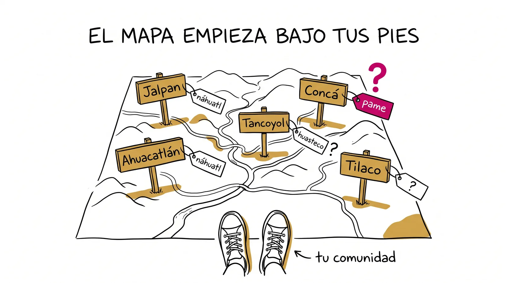
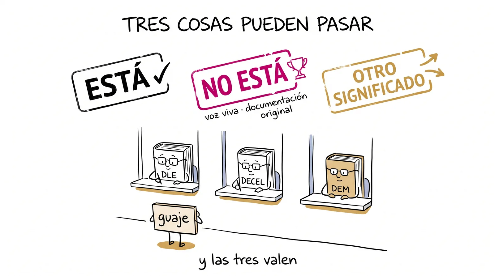
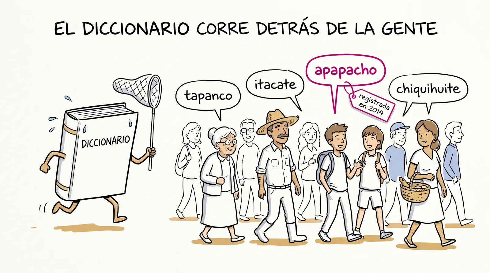

# Semana 10 · El diccionario lo hacemos nosotros

> **La pregunta de la semana:** ¿y si el diccionario lo hiciéramos nosotros?

**Esta semana podrás:**

- escribir una definición con oficio: género próximo, diferencia específica y sin la palabra adentro
- hacer la ficha de una palabra de tu región con el rigor de un diccionario, y con la voz de quien te la regaló
- descubrir si tu palabra está, no está, o está con otro significado, en tres fuentes distintas
- sumar tu ficha al mapa léxico del grupo y escribir la biografía de la palabra que salvaste

Hay palabras vivas en la Sierra, en el barrio, en la cocina de tu abuela, que ningún diccionario registra. Si nadie las anota, se pierden. Esta semana las anotamos nosotros, y descubrimos que el diccionario no es el dueño de las palabras: corre detrás de la gente.

---

| Día | Sesión | Trae |
|---|---|---|
| [Martes 29](#martes) · 1 h | La cosecha del mapa | tu entrevista hecha, con el ejemplo dicho tal cual |
| [Miércoles 30](#miercoles) · 1 h | Taller de fichas | dos o tres palabras de campo, con quién y dónde |
| [Jueves 1](#jueves) · 1 h, centro de cómputo | ¿Está o no está? | tus fichas con el origen pendiente |
| [Viernes 2](#viernes) · 2 h | La palabra que salvé | tu mejor ficha y tu libro |

Cada día es un mazo de láminas. En clase se proyectan una por una con el botón <strong>Presentar</strong>; aquí se quedan apiladas, en orden, para volver a ellas cuando quieras. Debajo de los mazos: la ficha modelo para tocar, las reglas de la definición, el formulario que sube tu ficha al mapa y los topónimos de la Sierra.

<!-- ============================ MARTES ============================ -->
<section class="mazo" id="martes">

Martes 29 de septiembre · 1 hora

<h3>La cosecha del mapa</h3>

Las palabras que trajeron de sus casas salen a la luz, y ninguna está en el diccionario.

<button class="btn-presentar" type="button">Presentar ▸</button>

<section class="lam">
<h4>1 El minuto del lector 3 min</h4>
Al aire

Una persona, un minuto: qué estoy leyendo y por dónde voy.

Sin resumen y sin recomendación forzada. Solo el título, por dónde vas y si te está gustando o no.

Antes, tu minuto con el ticket de la semana 9 en voz alta: dos o tres cosas turbias y qué vas a hacer con ellas hoy. Luego la lista del minuto del lector. Y un aviso de un renglón: ya llegaron los primeros booktubers; los autorizados van subiendo a Leemos esta semana.

</section>
<section class="lam lam--bitacora">
<h4>La bitácora del lector 1 min</h4>

Que quede el rastro. El segundo círculo es en dos semanas.

<a href="../recursos/plantillas/bitacora-lector.html" target="_blank" rel="noopener">Bitácora del lector</a>Una línea por sesión, en dos toques. Y si tu libro te regala una palabra de las que solo se dicen en un lugar, cosecha ahí: hoy sirve.

Lámina fija de todos los martes: pasa el QR, manda el enlace al grupo en este momento y sigue. Recuérdales cada tanto que la bitácora vive solo en su teléfono: desde el menú se copia un código de respaldo (empieza con ETIMB·) que se mandan a sí mismos por WhatsApp. Quien no haya entregado booktuber todavía tiene la semana: dilo sin nombres.

</section>
<section class="lam lam--actividad">
<h4>2 La cosecha 20 min</h4>
Todo el grupo

Tu palabra de casa, quién te la dio y el ejemplo tal como lo dijo.

Una vuelta completa, treinta segundos cada quien: la palabra, la persona y la frase entre comillas. Todas suben al pizarrón, repartidas en cinco columnas: <strong>cocina · campo · oficios · dichos · lugares</strong>. Ese pizarrón es el primer borrador del mapa léxico del grupo.

Esta es la sesión de la unidad: lo que trajeron es documentación original y hay que tratarlo como tal. Anota tú en el pizarrón mientras hablan (o un escribano rápido), y saca foto antes de borrar: es el "muro de palabras vivas" que el ejercicio de hoy da por sentado. Quien no hizo entrevista aporta una palabra de memoria y la anota con asterisco: la entrevista se hace esta semana. Si el grupo es grande, dos columnas por lado del pizarrón y nadie se queda sin subir.

</section>
<section class="lam lam--oscura">
<h4>Miren el pizarrón</h4>

Casi ninguna de estas palabras está en el diccionario. Y todas están vivas.

Hace dos semanas verificamos en el DLE el origen de casi todo. Hoy el DLE se queda callado con la mitad del pizarrón. Eso no dice que las palabras no existan: dice que nadie las ha anotado con método. Esta semana lo hacemos nosotros.

</section>
<section class="lam">
<h4>3 ¿Quién hace el diccionario? 8 min</h4>

Gente, con un método. Y siempre va detrás de los hablantes.

<table>
<tr><th>Diccionario</th><th>Quién lo hace</th><th>Qué registra</th></tr>
<tr><td><strong>DLE</strong> (Real Academia Española, desde 1780)</td><td>las academias de la lengua, la mexicana incluida</td><td>el español general; el origen entre paréntesis</td></tr>
<tr><td><strong>DEM</strong>, Diccionario del español de México (El Colegio de México, 2010)</td><td>lingüistas, a partir de millones de palabras de textos y habla de aquí</td><td>cómo se usa cada palabra en México, con ejemplos reales</td></tr>
<tr><td><strong>Diccionario de mexicanismos</strong> (Academia Mexicana de la Lengua, 2010)</td><td>la academia de aquí</td><td>lo que solo se dice en México</td></tr>
<tr><td><strong>El mapa léxico del grupo</strong> (nosotros, 2026)</td><td>ustedes, con entrevistas y fuente</td><td>lo que se dice en la Sierra y en sus casas</td></tr>
</table>

Los tres primeros trabajan igual que nosotros esta semana: alguien oye una palabra en uso, la documenta con ejemplo y fuente, y la define con oficio. La diferencia es de tamaño, no de método. <em>Apapachar</em> se dijo durante siglos antes de que el DLE la registrara en 2014.

El DEM está gratis en línea (dem.colmex.mx) y es la fuente nueva del jueves: registra usos mexicanos que el DLE no trae, con ejemplos sacados de un corpus. Ábrelo proyectado con <em>tapanco</em> o <em>itacate</em> para que vean cómo se ve una entrada. La fila del mapa del grupo no es broma: la voz "diccionario" la merecen desde que hay método.

</section>
<section class="lam">
<h4>4 Definir es un oficio 8 min</h4>

Una definición tiene dos partes: la familia grande y lo que la distingue de sus parientes.

disco plano<small>género próximo</small>
que se pone al fuego para cocer tortillas<small>diferencia específica</small>
= comal

Género próximo: la familia (utensilio, prenda, porción de comida, piso). Diferencia específica: lo que separa al comal de la olla y de la cazuela. Y la regla de oro del oficio, la que rompe todo el mundo la primera vez: <strong>la definición nunca usa la palabra que está definiendo</strong>. "Molote: un molote de cobija" no define nada.

Tres cosas distintas que una ficha necesita, cada una en su renglón: la <em>definición</em> (qué es), el <em>ejemplo de uso</em> (cómo la dijo alguien, entre comillas) y la <em>nota de origen</em> (de qué lengua viene). Se confunden todo el tiempo. El ejercicio de hoy es para dejar de confundirlas.

</section>
<section class="lam lam--actividad">
<h4>5 Gimnasio: definir es un oficio 17 min</h4>
Actividad · individual

Tres rondas: distinguir, operar, escribir.

<a href="../ejercicios/semana-10/ejercicio-10A-definir-es-un-oficio.html">Definir es un oficio</a>: primero etiquetas tres líneas sobre <em>molote</em> (¿definición, ejemplo u origen?), luego operas tres definiciones enfermas (circular, disfrazada de ejemplo, demasiado vaga) y al final escribes la tuya para <em>itacate</em>. El ejercicio te avisa si la palabra se te coló adentro de su propia definición.

<a href="../ejercicios/semana-10/ejercicio-10A-definir-es-un-oficio.html" target="_blank" rel="noopener">Definir es un oficio</a>El muro está lleno de palabras vivas. Ahora hay que definirlas como se debe.

La ronda 2 es la que rinde: los tres pacientes son los tres errores que van a cometer mañana en sus fichas. Si el tiempo aprieta, la ronda 3 se termina en casa. Al cerrar, pregunta en voz alta cuál palabra del pizarrón salvarían: es la última casilla del ejercicio y el gancho del viernes.

</section>
<section class="lam">
<h4>6 Antes del miércoles 3 min</h4>
Para llevar a casa

Trae dos o tres palabras de campo con todo: quién la dice, dónde, y el ejemplo entre comillas.

Si hoy solo trajiste una, consigue otra esta tarde: en tu casa, con un vecino, en la tienda. Mañana se les hace ficha. Y saca foto del pizarrón antes de irte: ahí están las palabras del grupo.

</section>
</section>

<!-- ============================ MIÉRCOLES ============================ -->
<section class="mazo" id="miercoles">

Miércoles 30 de septiembre · 1 hora

<h3>Taller de fichas</h3>

Tu palabra de campo merece una ficha con rigor de diccionario. Hoy se la haces.

<button class="btn-presentar" type="button">Presentar ▸</button>

<section class="lam">
<h4>1 Ritual: la que salvarías 5 min</h4>
Al aire

De todo el pizarrón de ayer, ¿cuál palabra te gustaría que no se perdiera, y por qué?

Una línea por persona. No tiene que ser la tuya: puede ser la que trajo alguien más y te dio un vuelco.

Escucha con atención: las palabras que nombren aquí son las que van a elegir el viernes para "La palabra que salvé". Anota dos o tres que se repitan.

</section>
<section class="lam">
<h4>2 La ficha, con sus seis renglones 8 min</h4>

Entrada · categoría · definición · ejemplo textual · quién y dónde · origen.

<table>
<tr><th>Renglón</th><th>tapanco</th></tr>
<tr><td><strong>Entrada</strong> (categoría)</td><td>tapanco (sustantivo)</td></tr>
<tr><td><strong>Definición</strong></td><td>Piso alto de madera, construido bajo el techo, que sirve para almacenar cosas.</td></tr>
<tr><td><strong>Ejemplo de uso</strong>, tal como se dijo</td><td>"El maíz está en el tapanco."</td></tr>
<tr><td><strong>Quién y dónde</strong></td><td>Mi tío, en el rancho; se oye en toda la comunidad.</td></tr>
<tr><td><strong>Origen</strong> (hipótesis, se verifica el jueves)</td><td>Suena a náhuatl. Por investigar.</td></tr>
</table>

El ejemplo va entre comillas y con las palabras exactas de la persona: es su voz, no la tuya. Y el nombre de quien te la regaló se pone con su permiso, y solo el de pila: en el mapa aparece "mi tío" o "don Chuy", nunca apellidos.

Insiste en el ejemplo textual: es la parte que convierte una lista de palabras en documentación. Si alguien lo inventa se nota, porque suena a definición. El renglón de origen lleva asterisco hasta el jueves: hoy no se busca nada.

</section>
<section class="lam lam--actividad">
<h4>3 Gimnasio: taller de fichas 28 min</h4>
Actividad · individual, luego en parejas

Una ficha por palabra de campo. Y una prueba de fuego: ¿tu pareja la entendería sin conocerla?

<a href="../ejercicios/semana-10/ejercicio-10B-taller-de-fichas.html">Taller de fichas</a>: llenas dos fichas con los seis renglones (el ejercicio te frena si la palabra se cuela en su definición), generas la captura de cada una y la pegas donde indique el profesor. Luego intercambias con tu pareja: lee su ficha como si no conociera la palabra y le devuelve un veredicto de lector con lo que ajustaría.

<a href="../ejercicios/semana-10/ejercicio-10B-taller-de-fichas.html" target="_blank" rel="noopener">Taller de fichas</a>Dos fichas con seis renglones, y el veredicto de un lector que no conoce tu palabra.

Dieciocho minutos de fichas, diez de intercambio. La prueba de fuego es lo que separa una ficha buena de una que solo tú entiendes: obliga a que la haga alguien que no es de la misma casa. Las capturas son el corpus del mapa: recógelas todas en la plantilla del tablero, aunque solo la mejor suba a la web.

</section>
<section class="lam">
<h4>4 El mapa empieza bajo tus pies 12 min</h4>

Los nombres de los lugares también son palabras con biografía. Se llaman topónimos.

<table>
<tr><th>Lugar</th><th>Lo que dicen las fuentes, o lo que se cuenta</th></tr>
<tr><td><strong>Jalpan</strong></td><td>náhuatl, de <em>Xalpan</em>: "sobre la arena" (<em>xalli</em>, arena)</td></tr>
<tr><td><strong>Ahuacatlán</strong></td><td>náhuatl puro: "lugar de aguacates" (<em>ahuacatl</em> + <em>-tlan</em>, lugar)</td></tr>
<tr><td><strong>Tancoyol</strong></td><td>se cuenta que es huasteco: "lugar de coyoles", la palma; falta verificarlo</td></tr>
<tr><td><strong>Concá</strong></td><td>no es náhuatl: es un topónimo pame, de la lengua de los xi'úi que vivían aquí antes que nadie. Su significado casi no está documentado</td></tr>
<tr><td><strong>Tilaco, Saldiveña, tu comunidad</strong></td><td>pregunta a los mayores. Lo que te digan vale como testimonio, y se compara con lo que diga la fuente</td></tr>
</table>

Fíjate en las capas: hay nombres náhuatl (los que pusieron los aliados de los españoles y los frailes), nombres pames y huastecos (los de antes) y nombres en español (los de después). Un mapa de la Sierra es también un mapa de quién nombró qué. Y los nombres pames casi no están en ningún libro: tu ficha puede ser de las primeras.

Aquí la honestidad de fuente es más importante que nunca: las etimologías de topónimos circulan sin respaldo y con mucha seguridad. Distingue en voz alta "lo dice el DLE" (Jalpan no está ahí, pero <em>xalli</em> sí) de "se cuenta" y de "nadie lo sabe todavía". Que la ficha del topónimo diga cuál de las tres es. Es también la siembra de la semana 11: la seguridad no es prueba.

</section>
<section class="lam lam--actividad">
<h4>5 Cierre 7 min</h4>
Para llevar a casa

Mañana, centro de cómputo: tus fichas enfrentan a tres diccionarios.

Trae tus capturas (o tus fichas de cuaderno) y marca cuáles tienen el origen pendiente: esas van primero. Y una ficha extra, si quieres: la de un topónimo. Entrada, qué lugar nombra, qué dicen los mayores que significa y de qué lengua parece venir. Vale para el mapa, en la columna de lugares.

</section>
</section>

<!-- ============================ JUEVES ============================ -->
<section class="mazo" id="jueves">

Jueves 1 de octubre · 1 hora · centro de cómputo

<h3>¿Está o no está?</h3>

Hoy tus palabras de campo enfrentan a los diccionarios. A veces ganan ellas.

<button class="btn-presentar" type="button">Presentar ▸</button>

<section class="lam">
<h4>1 Tres fuentes y tres veredictos 8 min</h4>

DLE, DECEL y, hoy, el DEM. Y solo tres cosas pueden pasar.

<table>
<tr><th>Veredicto</th><th>Qué significa</th><th>Qué haces</th></tr>
<tr><td><strong>Está, con su origen</strong></td><td>tu hipótesis del martes ya tiene juez</td><td>anota el origen y la fuente; compara con tu apuesta</td></tr>
<tr><td><strong>No está</strong> en ninguno de los tres</td><td>voz viva no registrada</td><td>anota en cuáles diccionarios no apareció: tu ficha es documentación original</td></tr>
<tr><td><strong>Está, con otro significado</strong></td><td>el uso de tu región se desvió del registrado</td><td>anota las dos acepciones: es el hallazgo más fino del mapa</td></tr>
</table>

El giro de hoy: si tu palabra no aparece en ningún diccionario, no fallaste. Descubriste algo que nadie ha anotado, y tú eres la primera persona que la documenta con método. Eso se marca con orgullo.

Orden de búsqueda: DLE (paréntesis), DECEL (historia), DEM (dem.colmex.mx, el que más mexicanismos registra). Modela un caso completo con una palabra del pizarrón del martes, incluido un "no está" honesto: que vean que anotar en cuáles diccionarios no apareció es un dato, no una derrota.

</section>
<section class="lam lam--oscura">
<h4>Cómo se lee una entrada del DEM</h4>

Trae el ejemplo real de cómo se usa la palabra en México. No el origen: el uso.

El DEM se hizo a partir de un corpus, millones de palabras de textos y conversaciones de aquí. Por eso su ejemplo no lo inventó nadie: es una frase que alguien dijo o escribió de verdad, igual que tu ejemplo textual. Si tu palabra está ahí y en el DLE no, ya sabes cuál diccionario se parece más al mapa que estás haciendo.

</section>
<section class="lam lam--actividad">
<h4>2 Gimnasio: ¿está o no está? 32 min</h4>
Actividad · individual, con las tres fuentes abiertas

Cada palabra de campo pasa por el protocolo. Luego, tu mejor ficha se arma completa.

<a href="../ejercicios/semana-10/ejercicio-10C-esta-o-no-esta.html">¿Está o no está?</a>: en la estación 1 registras el veredicto de cada palabra con su nota de fuente; en la estación 2 armas la ficha definitiva de tu mejor palabra (idealmente una que no estaba o que significaba otra cosa), con su ámbito en el mapa y tu nombre de pila si das permiso. Esa captura es la que sube al mapa léxico del grupo.

<a href="../ejercicios/semana-10/ejercicio-10C-esta-o-no-esta.html" target="_blank" rel="noopener">¿Está o no está?</a>Tres veredictos posibles, tres fuentes, y la ficha que salva una palabra.

El error frecuente es dar por "no está" una palabra que sí está con otra grafía (guaje / huaje, chiquihuite / chiquigüite): pídeles probar dos escrituras antes de sentenciar. Veinte minutos para la estación 1, doce para la ficha definitiva.

</section>
<section class="lam lam--actividad">
<h4>3 Al mapa 10 min</h4>
Actividad · individual

Tu mejor ficha se manda desde esta misma página, y el profesor la cuelga en la vitrina.

Abajo, en <a href="#sube-tu-ficha-al-mapa">Sube tu ficha al mapa</a>, está el formulario: los mismos renglones de tu captura. Llénalo con tu ficha definitiva; el profesor revisa y la publica en el <a href="../vitrina/mapa-lexico.html">mapa léxico del grupo</a> con tu nombre de pila, si lo diste. Quien prefiera papel, entrega la ficha en cuaderno y se sube igual.

El formulario cae en la pestaña <em>mapa-lexico</em> del recolector. Palomea las que suben, genera el bloque con el menú Cosecha y pégalo en <code>vitrina/mapa-lexico.md</code>, entre las marcas. La primera vez que el mapa se proyecte con fichas es el viernes, en la lámina 4: que llegue con al menos diez.

</section>
<section class="lam">
<h4>4 El marcador 7 min</h4>
Al aire

¿Cuántas no estaban? ¿Cuántas estaban con otro significado?

Tres números al pizarrón, uno por veredicto. El del medio es el trofeo del grupo: palabras que nadie había documentado. Y mañana: quiz relámpago, la biografía de la palabra que salvaste y el mapa proyectado por primera vez.

</section>
</section>

<!-- ============================ VIERNES ============================ -->
<section class="mazo" id="viernes" data-ticket>

Viernes 2 de octubre · 2 horas

<h3>La palabra que salvé</h3>

Tercera pieza del Museo de la unidad. Esta no habla de una palabra: habla de ustedes dos.

<button class="btn-presentar" type="button">Presentar ▸</button>

<section class="lam lam--actividad">
<h4>1 Ritual: quiz relámpago 15 min</h4>
A solas · sin mazo y sin celular

Tres reactivos. Tu apuesta primero, del 0 al 3.

Etiquetar tres líneas sobre una palabra, diagnosticar una definición enferma y dictar el veredicto de una palabra que no aparece en ningún diccionario. En el cuadernillo, se califica en el momento, y los dos números van al renglón del <strong>quiz #8</strong> de tu expediente.

<a href="../ejercicios/semana-10/quiz-relampago-semana-10.html" target="_blank" rel="noopener">El quiz, lámina por lámina</a>El mismo que se proyecta, con cronómetro de tres minutos y las respuestas al final.

Proyecta desde el enlace. Reparte: 2 min de apuesta, 3 de resolución, 8 de calificación comentada, 2 para el expediente. El reactivo 2 se califica por el diagnóstico, no por la reparación (la reparación se comenta, no se cuenta). En el 3, cualquier respuesta que diga "voz viva no registrada" o "documentación original" es bien; "la palabra no existe" es aún no, y es el error que la semana existe para corregir.

</section>
<section class="lam">
<h4>2 La entrevista, revisada 10 min</h4>
Al aire

¿Qué pasó cuando le preguntaste a alguien por una palabra suya?

Una ronda corta. Interesa menos la palabra que la escena: quién se rio, quién se puso serio, quién dijo "eso ya nadie lo dice". Ahí está el material de la biografía de hoy.

Casi siempre sale una historia de alguien que se emocionó al ser preguntado. Deja que se cuente completa: es la lámina que le da sentido al mapa, y no la puedes proyectar.

</section>
<section class="lam lam--oscura">
<h4>3 ¿Quién decide qué es una palabra? 10 min</h4>

Una palabra no espera al diccionario para existir. El diccionario corre detrás de la gente.

Todas las palabras del DLE fueron, alguna vez, una palabra que alguien decía y nadie había anotado. <em>Apapachar</em> llegó al DLE en 2014, después de siglos de uso. Lo que hiciste esta semana es exactamente lo que hacen los lexicógrafos: oír, documentar con ejemplo y fuente, definir con oficio. La pregunta de quién decide sigue abierta: tiene su propia semana, la 16.

No resuelvas la pregunta. Si alguien dice "la RAE decide", pregúntale de dónde saca la RAE las palabras. Es la misma conversación de la semana 6 (el dinosaurio se inventó), ahora con palabras que ellos mismos documentaron.

</section>
<section class="lam lam--actividad">
<h4>4 Gimnasio: la palabra que salvé 35 min</h4>
Actividad · individual

Una biografía que no se centra en qué significa la palabra, sino en cómo llegó a ti.

<a href="../ejercicios/semana-10/ejercicio-10D-la-palabra-que-salve.html">La palabra que salvé</a>: eliges una palabra de tu trabajo de campo, idealmente una que no estaba en el diccionario. Los apuntes (quién te la regaló, la escena, qué significa para esa persona, por qué merece no perderse) y luego la biografía en texto corrido, de seis a diez líneas. Es la <strong>tercera pieza de tu portafolio de la unidad 2</strong>: la captura se pasa en limpio a la ficha del Museo.

<a href="../ejercicios/semana-10/ejercicio-10D-la-palabra-que-salve.html" target="_blank" rel="noopener">La palabra que salvé</a>Quién te la regaló, en qué escena, y por qué merece no perderse.

Algunas palabras cargan historias íntimas (una abuela que ya no está, un pueblo que se dejó). El ejercicio lo dice y tú lo repites: cada quien decide cuánto contar, y lo que entra al Museo se documenta con cariño, no como curiosidad. Circula poco y en silencio.

</section>
<section class="lam">
<h4>5 El mapa, proyectado 15 min</h4>
Al aire

Nuestro diccionario, hecho desde aquí. Se lee en voz alta, ficha por ficha.

El <a href="../vitrina/mapa-lexico.html">mapa léxico del grupo</a> abre hoy con las fichas que subieron el jueves. Cada quien lee la suya: entrada, definición y el ejemplo con la voz de quien se la dio. Es la primera vez que estas palabras se leen en un diccionario, y el diccionario lo hicieron ustedes.

Proyecta la vitrina con las fichas ya pegadas. Si no alcanzó el tiempo de curaduría, proyecta la plantilla del tablero con las capturas: lo importante es que se lean en voz alta hoy. Anota cuál ficha provoca más reacción: es la destacada de la semana en "Lo que produjimos".

</section>
<section class="lam">
<h4>6 Lectura compartida 15 min</h4>

Diez minutos de algo hermoso, sin análisis y sin tarea.

El cierre de siempre. Hoy, si se puede, algo escrito por alguien que anotó las palabras de su gente antes de que se perdieran.

Funciona un fragmento de Rulfo otra vez, o de Elena Garro, o de un cronista de la Sierra si tienes uno a la mano. Al terminar: ¿oyeron alguna palabra que estaría en nuestro mapa?

</section>
<section class="lam">
<h4>7 Cierre y encomienda 5 min</h4>
Para llevar a casa

La semana que entra cazamos mentiras. Trae una etimología que te hayan contado.

De tu casa, de internet, de un video, de lo que sea: una historia sobre el origen de una palabra que alguien cuenta con seguridad. No la verifiques todavía. Y una tarea de treinta segundos: pregúntale a una IA de dónde viene una palabra que tú elijas y copia la respuesta tal cual. La vamos a sentar en el banquillo.

</section>
</section>

## La lectura, esta semana

El **minuto del lector** abre el martes y la voz alta cierra el viernes. Tu [bitácora](../recursos/plantillas/bitacora-lector.html) sigue sumando líneas con el segundo libro, y el segundo círculo de lectura llega en la semana 12: ve marcando tu frase. Los booktubers autorizados de la semana pasada se publican en [Leemos](../leemos.html) conforme llegan; si no has entregado el tuyo, esta semana todavía cuenta.

---

## Herramientas de la semana

### Cómo se hace una ficha (plantilla)

Cada palabra de campo lleva estos seis datos. Toca los ejemplos para ver una ficha completa.

  

  
Toca una palabra de ejemplo.

{: .ojo }
Regla de la definición: no puedes usar la palabra dentro de su propia definición. "Molote: un molote de cobija" no vale. Género próximo (la familia) más diferencia específica (lo que la distingue), y ya.

### Las tres fuentes del jueves

| Fuente | Para qué sirve | Dónde |
|---|---|---|
| **DLE** | el origen, entre paréntesis al inicio de la entrada | [dle.rae.es](https://dle.rae.es) |
| **DECEL** | la historia completa, con sus escalas | [etimologias.dechile.net](http://etimologias.dechile.net) |
| **DEM**, Diccionario del español de México | cómo se usa la palabra en México, con ejemplos reales; registra voces que el DLE no trae | [dem.colmex.mx](https://dem.colmex.mx) |

Tres resultados posibles: **está** (con su origen), **no está** (voz viva no registrada: documentación original tuya) o **está con otro significado** (el regional se desvió). Prueba dos escrituras antes de sentenciar un "no está": *guaje* y *huaje*, *chiquihuite* y *chiquigüite*.

### Sube tu ficha al mapa

La captura del jueves, renglón por renglón. El profesor revisa y la publica en el [mapa léxico del grupo](../vitrina/mapa-lexico.html). Nombre de pila solamente, y solo si das permiso.

### El mapa empieza bajo tus pies

Los nombres de los lugares también son palabras con biografía. Se llaman topónimos, y la Sierra Gorda está sembrada de ellos.

**Jalpan** viene del náhuatl *Xalpan*, sobre la arena. **Ahuacatlán** es náhuatl puro: lugar de aguacates. Pero **Concá** no es náhuatl: es un topónimo pame, de la lengua de los xi'úi que vivían aquí mucho antes que nadie.

Misión de campo: ¿qué significa Concá? ¿Y Tancoyol, Tilaco, Saldiveña? No lo respondas con el celular: pregunta a los mayores de tu comunidad, anota lo que te digan y compara versiones. Los nombres pames y huastecos de la Sierra casi no están documentados. Tu ficha puede ser de las primeras.

{: .reto }
Ficha extra para el mapa léxico: haz la ficha de un topónimo. Entrada, qué lugar nombra, qué dicen los mayores que significa, y de qué lengua parece venir. Súbela con el formulario de arriba, en el ámbito "lugares".

---

## El gimnasio completo

Los ejercicios de la semana, para tu celular o el centro de cómputo. Sin nota y sin registro: puro entrenamiento.

- [Definir es un oficio](../ejercicios/semana-10/ejercicio-10A-definir-es-un-oficio.html) · martes
- [Taller de fichas](../ejercicios/semana-10/ejercicio-10B-taller-de-fichas.html) · miércoles
- [¿Está o no está?](../ejercicios/semana-10/ejercicio-10C-esta-o-no-esta.html) · jueves, centro de cómputo
- [La palabra que salvé](../ejercicios/semana-10/ejercicio-10D-la-palabra-que-salve.html) · viernes
- [Quiz de gimnasio](../ejercicios/semana-10/quiz-gimnasio-semana-10.html) · para ensayar cuando quieras
- [El quiz relámpago, tal como se proyecta](../ejercicios/semana-10/quiz-relampago-semana-10.html) · viernes, con cronómetro y respuestas

---

## Las tarjetas de la semana

Esta semana el trabajo es hacer fichas, no tarjetas. Al mazo entran solo los conceptos del oficio y ocho palabras de la cocina y el campo que ya tienen fuente.

📥 **[Baja el mazo de la semana 10](../recursos/anki/etimologias-semana-10.apkg)** · Seis conceptos del oficio y ocho palabras con historia.

| Frente | Reverso (significado · ejemplo ancla) |
|---|---|
| género próximo | la familia grande a la que pertenece lo definido · "disco plano" en comal |
| diferencia específica | lo que separa la cosa de sus parientes · "que se pone al fuego para cocer tortillas" |
| definición circular | usa la palabra que está definiendo: no vale · "molote: un molote de cobija" |
| ejemplo textual | la frase tal como la dijo alguien, entre comillas · "El maíz está en el tapanco" |
| topónimo | nombre propio de un lugar · Jalpan, de Xalpan |
| voz viva no registrada | palabra en uso que no aparece en ningún diccionario · documentación original |
| tapanco | náhuatl · tlapantli, azotea: el piso alto donde duerme la cosecha |
| itacate | náhuatl · itacatl, provisión para el camino |
| comal | náhuatl · comalli |
| metate | náhuatl · metlatl, la piedra de moler |
| nixtamal | náhuatl · nextli (ceniza) + tamalli: maíz cocido con cal |
| huacal | náhuatl · huacalli, la caja de varas |
| milpa | náhuatl · milli (sembradío) + -pan (lugar) |
| chiquihuite | náhuatl · chiquihuitl, el cesto |

## Lo que produjimos

*El mapa léxico de nuestra región: las palabras que salvamos del olvido, con el ejemplo dicho por quien las regaló. Se llena al cerrar la semana.* Míralo en [Mapa léxico del grupo](../vitrina/mapa-lexico.html). Aquí se anota la ficha destacada de la semana y el marcador del jueves: cuántas no estaban en ningún diccionario, cuántas estaban con otro significado.

## El postre 🍨

La RAE tardó siglos en aceptar *apapachar*: la registró en 2014. Millones de personas la decían mucho antes de que un diccionario les diera permiso. Una palabra no espera al diccionario para existir: el diccionario corre detrás de la gente.

---

## Antes de irte

<a class="ticket" href="{{ site.ticket_url }}" target="_blank" rel="noopener">
  <b>Ticket de salida de esta semana</b>
  Noventa segundos, al cierre de la sesión larga: qué te llevas, qué quedó turbio y cómo estuvo el ritmo. Con nombre o sin él.
  <em>Lo que escribas aquí decide por dónde empezamos el martes.</em>
</a>
<a class="ticket-qr" href="{{ site.ticket_url }}" target="_blank" rel="noopener">
  
  escanéalo
</a>

