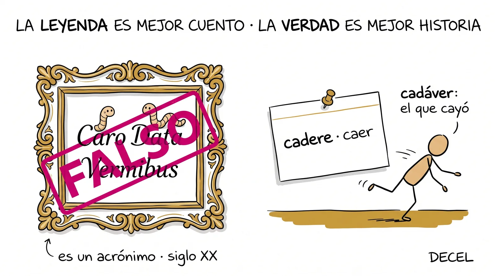
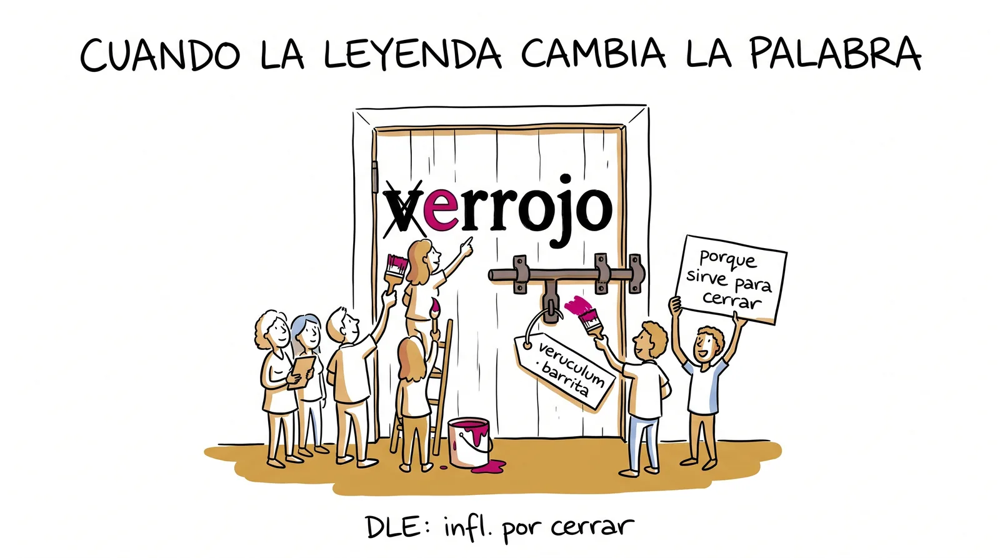

# Semana 11 · Cazadores de mitos

> **La pregunta de la semana:** ¿cómo sé si una etimología es verdadera?

**Esta semana podrás:**

- reconocer las señales de alarma de una etimología inventada antes de abrir ninguna fuente
- sentar a la IA en el banquillo: pedirle un origen, ficharlo tal cual y llevarlo a juicio
- dictar veredicto con la fuente en la mano, y confirmar también las verdades que parecían mentira
- escribir la biografía de una palabra con leyenda, contando las dos versiones

Hay historias preciosas sobre el origen de las palabras que son mentira, y circulan más que las verdaderas porque son bonitas. En la semana 3 inventaste una de esas historias a propósito, para engañar al grupo. Esta semana ese músculo cambia de bando: ya no fabricas mentiras, cazas las que andan sueltas con cara de verdad.

---

| Día | Sesión | Trae |
|---|---|---|
| [Martes 6](#martes) · 1 h | Las señales de alarma | la etimología que te contaron en casa y la que te dio la IA |
| [Miércoles 7](#miercoles) · 1 h | El expediente de mitos | a tu equipo con sus cuatro historias |
| [Jueves 8](#jueves) · 1 h, centro de cómputo | El gran tribunal | tus apuestas del martes y el expediente |
| [Viernes 9](#viernes) · 2 h | La palabra con leyenda | tu palabra elegida y tu libro |

Cada día es un mazo de láminas. En clase se proyectan una por una con el botón <strong>Presentar</strong>; aquí se quedan apiladas, en orden, para volver a ellas cuando quieras. Debajo de los mazos: el cazador de mitos para jugar, las señales de alarma, las tarjetas y el muro de mitos cazados por el grupo.

<!-- ============================ MARTES ============================ -->
<section class="mazo" id="martes">

Martes 6 de octubre · 1 hora

<h3>Las señales de alarma</h3>

Mientras más bonita la historia, más vale la pena verificarla.

<button class="btn-presentar" type="button">Presentar ▸</button>

<section class="lam">
<h4>1 El minuto del lector 3 min</h4>
Al aire

Una persona, un minuto: qué estoy leyendo y por dónde voy.

Sin resumen y sin recomendación forzada. El segundo círculo es la semana que entra: si vas a la mitad, hoy es buen día para decirlo.

Antes, tu minuto con el ticket de la semana 10: lo turbio y qué haces hoy con eso. Luego el minuto del lector con la lista. Aviso corto: el círculo 2 cae el viernes 16, y quien no haya terminado su segunda obra va igual.

</section>
<section class="lam lam--bitacora">
<h4>La bitácora del lector 1 min</h4>

Falta una semana para el círculo. Abre la tarjeta <em>Antes del círculo</em> y ve marcando tu frase.

<a href="../recursos/plantillas/bitacora-lector.html" target="_blank" rel="noopener">Bitácora del lector</a>La tarjeta del círculo 2 se abre sola cuando toca. Nadie la lee por dentro: cuenta lo que salga de ella.

Lámina fija de todos los martes: pasa el QR, manda el enlace al grupo en este momento y sigue. Recuérdales cada tanto que la bitácora vive solo en su teléfono: desde el menú se copia un código de respaldo (empieza con ETIMB·) que se mandan a sí mismos por WhatsApp.

</section>
<section class="lam lam--actividad">
<h4>2 Ritual: ¿te acuerdas del impostor? 5 min</h4>
Al aire

En la semana 3 alguien de este salón inventó un origen falso y se lo creyeron. ¿Quién fue, y cómo lo logró?

Dos o tres recuerdos rápidos. Fíjense en el truco: los que engañaron contaron una historia redonda, con un detalle concreto, dicha con seguridad. Exactamente lo que vamos a aprender a cazar.

Se paga la deuda de la semana 3: el impostor etimológico fue el ensayo de esta semana. Si nadie se acuerda, cuenta tú el que mejor haya salido. La lección es una: engañar con una etimología es fácil, y por eso se verifica.

</section>
<section class="lam lam--oscura">
<h4>3 La historia perfecta 8 min</h4>

cadáver

"Viene de las iniciales de Caro Data Vermibus: carne dada a los gusanos."

Macabra, redonda, memorable. Suena a latín de verdad. Apuesten: ¿verdadera o falsa?

Deja que voten a mano alzada antes de revelar. Suele ganar "verdadera", y ese es el punto: la historia convence porque es buena, no porque sea cierta.

</section>
<section class="lam">
<h4>Falsa. Y la señal que la delata estaba a la vista</h4>

cadere<small>caer (latín)</small>
= cadáver, "el que cayó"

Los acrónimos (palabras hechas de iniciales, como <em>ovni</em> o <em>láser</em>) son un invento del siglo XX. Ninguna palabra latina nació de iniciales, así que cualquier historia que explique una palabra vieja con siglas es falsa antes de abrir el diccionario. El DECEL dicta la versión sobria: <em>cadaver</em>, emparentado con <em>cadere</em>, caer. La leyenda es mejor cuento; la verdad es mejor historia.

</section>
<section class="lam">
<h4>4 Las señales, al pizarrón 10 min</h4>

Cuatro señales que encienden la alarma. La quinta la ponen ustedes.

<table>
<tr><th>Señal</th><th>Por qué sospechar</th><th>Ejemplo</th></tr>
<tr><td><strong>Es un acrónimo</strong></td><td>las siglas son del siglo XX; ninguna palabra antigua nació de iniciales</td><td>cadáver, "Caro Data Vermibus"</td></tr>
<tr><td><strong>Demasiado buena</strong></td><td>redonda, macabra, con moraleja: las etimologías reales suelen ser aburridas</td><td>sincero, "sin cera"</td></tr>
<tr><td><strong>Otra lengua sin razón</strong></td><td>¿por qué una palabra española vendría del inglés, si no entró por una puerta conocida?</td><td>gringo, "green go home"</td></tr>
<tr><td><strong>Nadie cita una fuente</strong></td><td>"dicen que", "leí que", "la IA me dijo"</td><td>casi todas las de WhatsApp</td></tr>
</table>

A eso se le llama <strong>paretimología</strong> o etimología popular: una historia de origen que la gente inventa porque suena lógica, y que circula sin fuente. Las señales no dictan el veredicto: solo dicen dónde mirar primero. El veredicto lo dicta la fuente, el jueves.

Constrúyelas con ellos en el pizarrón, no las dictes: pregunta qué tenía la historia de cadáver que la hacía sospechosa y de ahí salen las cuatro. La quinta que suele aparecer: "la cuenta una persona famosa" (una reina, un rey, un soldado). Que la anoten como propia. El ejercicio de hoy usa las cinco etiquetas.

</section>
<section class="lam lam--actividad">
<h4>5 Gimnasio: cacería guiada 25 min</h4>
Actividad · en parejas

Seis historias. Señales, apuesta y argumento. Hoy no se verifica nada.

<a href="../ejercicios/semana-11/ejercicio-11A-caceria-guiada.html">Cacería guiada</a>: gringo, sincero, OK, siesta, adiós y bárbaro. Por cada caso marcan las señales que enciende, apuestan (verdadero, falso o dudoso) y argumentan en una línea. Las fuentes hablan el jueves: la captura de hoy es su boleto para el tribunal.

<a href="../ejercicios/semana-11/ejercicio-11A-caceria-guiada.html" target="_blank" rel="noopener">Cacería guiada</a>Seis casos, cinco señales, y ninguna respuesta hasta el jueves.

Resiste la tentación de revelar: si alguien pregunta "¿y siesta sí es verdad?", la respuesta es "el jueves, con la fuente". La mitad de los casos son verdaderos a propósito, para que el escepticismo automático también se caiga. Recoge las capturas en la plantilla del tablero.

</section>
<section class="lam lam--actividad">
<h4>6 Antes del miércoles 5 min</h4>
Para llevar a casa

Trae la etimología que te contaron en casa, y la que te dio la IA, copiada tal cual.

Si no hiciste la tarea del viernes, hoy en la noche: pregúntale a cualquier IA "¿de dónde viene la palabra X?" con una palabra que tú elijas, y copia la respuesta completa, con todo y su seguridad. Mañana el equipo ficha cuatro historias y al menos una tiene que venir de una IA.

</section>
</section>

<!-- ============================ MIÉRCOLES ============================ -->
<section class="mazo" id="miercoles">

Miércoles 7 de octubre · 1 hora

<h3>El expediente de mitos</h3>

Cuatro historias que se cuentan por ahí. Hoy se fichan; el jueves van a juicio.

<button class="btn-presentar" type="button">Presentar ▸</button>

<section class="lam">
<h4>1 Ritual: los mitos de casa 6 min</h4>
Al aire

¿Qué historia de origen te contaron, y quién te la contó?

Ronda rápida: palabra, historia en una línea y de dónde salió (casa, internet, un video, una IA). Sin veredicto. Al pizarrón las que se repitan: las historias que más circulan son las que más vale la pena juzgar.

</section>
<section class="lam lam--actividad">
<h4>2 La IA en el banquillo 12 min</h4>
Al aire · demostración

Vamos a preguntarle a una IA el origen de una palabra que no existe.

Proyectada, en vivo. Inventamos una palabra entre todos (con piezas griegas para que suene real, como en la fábrica de monstruos de la semana 6) y le pedimos su etimología. Miren la respuesta: párrafos, siglos, lenguas, todo con seguridad. Ahora piensen qué pasa cuando le preguntan por una palabra que sí existe: responde con exactamente la misma cara.

Funciona con cualquier chatbot. Pide al grupo la palabra (algo como "cronofagia" o "necroteca" que no esté registrada, o un invento puro); si la IA responde "no existe", celebra el caso honesto y prueba con otra: casi siempre acaba fabricando. Guarda captura de pantalla de la respuesta inventada para el jueves. El punto no es que la IA "mienta": es que no distingue cuándo sabe y cuándo rellena, y lo dice igual de seguro.

</section>
<section class="lam lam--oscura">
<h4>La IA no sabe cuándo no sabe</h4>

Responde con la misma seguridad cuando acierta y cuando inventa. Tú, si verificas, sí sabes.

Por eso la respuesta de una IA es un punto de partida, nunca una fuente. Lo firmaste en el pacto de IA de la semana 0: se usa para explorar, y lo que se afirma se verifica en el DLE o el DECEL. Fíjense en el detalle de la semana 9: el DLE, cuando duda, escribe "quizá". La IA nunca escribe "quizá" por su cuenta.

</section>
<section class="lam lam--actividad">
<h4>3 Gimnasio: el expediente de mitos 30 min</h4>
Actividad · por equipos

Cuatro etimologías que se cuentan, fichadas tal como circulan. Al menos una, de una IA.

<a href="../ejercicios/semana-11/ejercicio-11B-expediente-de-mitos.html">El expediente de mitos</a>: por cada historia, la palabra, la historia copiada sin corregirla (los detalles bonitos suelen ser la pista), de dónde salió, las señales que enciende y la apuesta razonada del equipo. El ejercicio no deja generar el expediente si no hay un mito de IA. Nada se verifica hoy: el expediente completo es la agenda del tribunal.

<a href="../ejercicios/semana-11/ejercicio-11B-expediente-de-mitos.html" target="_blank" rel="noopener">El expediente de mitos</a>Cuatro mitos, un equipo, y la agenda del jueves.

Equipos de tres o cuatro. Las historias de casa que salieron en el ritual entran directo; las de IA se copian del celular. Si un equipo ficha una historia que es verdadera (pasa con siesta o con adiós), no lo corrijas: el tribunal también confirma verdades, y descubrirlo ellos vale más.

</section>
<section class="lam">
<h4>4 Cierre 7 min</h4>
Para llevar a casa

Mañana hablan las fuentes. Y ojo: no todo lo raro es mentira.

<em>Morfina</em> viene de Morfeo, el dios griego del sueño: se la puso un farmacéutico a principios del siglo XIX porque produce sopor. Suena a leyenda y está documentada. <em>Sarcófago</em>, la caja que come carne, ya la vieron en la semana 6. Mañana el tribunal derriba mitos y también deja de pie verdades increíbles. Trae tu captura del martes y el expediente del equipo.

</section>
</section>

<!-- ============================ JUEVES ============================ -->
<section class="mazo" id="jueves">

Jueves 8 de octubre · 1 hora · centro de cómputo

<h3>El gran tribunal de los mitos</h3>

El martes apostaste. Hoy hablan las fuentes y el mundo se divide en cuentos y hechos.

<button class="btn-presentar" type="button">Presentar ▸</button>

<section class="lam lam--oscura">
<h4>1 La regla mayor del cazador 5 min</h4>

El veredicto lo dicta la fuente. Nunca el primer resultado del buscador, nunca la IA, nunca la corazonada.

Y la segunda regla, que casi nadie espera: <strong>el tribunal también confirma verdades</strong>. Si tu escepticismo derriba todo lo que suena raro, no estás cazando mitos: estás adivinando al revés. <em>Siesta</em> viene de la hora sexta. <em>Bárbaro</em> viene de "bar-bar". Las dos parecen cuento y las dos están en la fuente.

</section>
<section class="lam">
<h4>2 Cómo se lee una fuente que desmiente 7 min</h4>
<table>
<tr><th>La leyenda</th><th>Lo que dice la fuente</th><th>Cómo se lee</th></tr>
<tr><td>sincero, "sin cera"</td><td>DLE: "Del lat. <em>sincērus</em>"</td><td>si el paréntesis da un étimo latino de una sola pieza, la historia de las dos palabras se cae sola</td></tr>
<tr><td>gringo, "green go home"</td><td>DLE: "quizá del esp. <em>griego</em>"</td><td>la fuente honesta también duda; "quizá" es un dato, y aun así descarta el inglés</td></tr>
<tr><td>OK, "0 killed"</td><td>DECEL: broma de 1839, "oll korrect"</td><td>cuando el DLE trae poco, el DECEL cuenta el caso completo</td></tr>
<tr><td>siesta, "hora sexta"</td><td>DLE: "Del lat. <em>sexta</em> [hora]"</td><td>la leyenda y la fuente coinciden: confirmada</td></tr>
</table>

Si el DLE y el DECEL no coinciden, documenta las dos versiones: eso vale doble. Y si la fuente dice "quizá" o "de origen incierto", tu veredicto es "sigue dudosa", que es un veredicto honesto y no una derrota.

Proyecta la entrada de <em>sincero</em> en el DLE y luego la del DECEL, que además explica por qué la leyenda de "sin cera" es falsa. Es el modelo de lectura que van a repetir con sus casos: primero el paréntesis, luego la historia.

</section>
<section class="lam lam--actividad">
<h4>3 Gimnasio: el gran tribunal 33 min</h4>
Actividad · individual, con las fuentes abiertas

Tus tres mejores casos, con veredicto, etimología documentada y fuente.

<a href="../ejercicios/semana-11/ejercicio-11C-gran-tribunal.html">El gran tribunal de los mitos</a>: de los seis del martes y los cuatro del expediente eliges tres. Por cada uno: la historia que se cuenta, el veredicto (confirmada, derribada o sigue dudosa), la etimología documentada y la nota de fuente. El ejercicio no deja derribar un mito sin decir cuál es la etimología verdadera: no basta decir que la historia es falsa. Los mejores casos se proponen para el muro de esta página.

<a href="../ejercicios/semana-11/ejercicio-11C-gran-tribunal.html" target="_blank" rel="noopener">El gran tribunal de los mitos</a>Tres casos, tres veredictos, y la fuente en la mano.

El caso obligatorio de cada quien es el de la IA de su equipo: que lo lleven a la fuente y comparen párrafo por párrafo. Cuando la IA acertó, también se anota: la conclusión no es "la IA siempre miente", es "no se sabe hasta que se verifica". Circula buscando quién usa el buscador en lugar del DLE: es el error del día.

</section>
<section class="lam lam--actividad">
<h4>4 Al muro 8 min</h4>
Actividad · individual

El mito más difundido que cayó, y la verdad más increíble que quedó de pie.

Abajo, en <a href="#sube-tu-caso-al-muro">Sube tu caso al muro</a>, está el formulario: palabra, la historia que se cuenta, el veredicto, la etimología documentada y la fuente. El profesor revisa y los publica en "Lo que produjimos", con nombre de pila si lo das. Sube uno: el que más te sorprendió.

El formulario cae en la pestaña <em>general</em> del recolector (no hay tipo propio para mitos): palomea los que suben, genera el bloque con el menú Cosecha y pégalo entre las marcas de "Lo que produjimos" de esta página, en la variable MITOS. Revisa antes de publicar que la etimología documentada sea la de la fuente, no otra leyenda.

</section>
<section class="lam">
<h4>5 El marcador 7 min</h4>
Al aire

¿Cuántos mitos cayeron? ¿Cuántas verdades increíbles quedaron de pie? ¿Cuántas veces acertó la IA?

Tres números al pizarrón. El tercero es el que más sorprende: la IA acierta seguido, y aun así no sirve como fuente, porque no hay manera de saber cuándo acertó sin verificar. Mañana: quiz relámpago y la biografía de una palabra con leyenda. Ve eligiendo la tuya.

</section>
</section>

<!-- ============================ VIERNES ============================ -->
<section class="mazo" id="viernes" data-ticket>

Viernes 9 de octubre · 2 horas

<h3>La palabra con leyenda</h3>

Una biografía con dos versiones: la que se cuenta y la que documentan las fuentes.

<button class="btn-presentar" type="button">Presentar ▸</button>

<section class="lam lam--actividad">
<h4>1 Ritual: quiz relámpago 15 min</h4>
A solas · sin mazo y sin celular

Tres reactivos. Tu apuesta primero, del 0 al 3.

Dictaminar una historia de origen, reconocer una verdad que parece mito, y decir qué se hace con una etimología que da la IA. En el cuadernillo, se califica en el momento, y los dos números van al renglón del <strong>quiz #9</strong> de tu expediente: el último antes del integrador de la unidad.

<a href="../ejercicios/semana-11/quiz-relampago-semana-11.html" target="_blank" rel="noopener">El quiz, lámina por lámina</a>El mismo que se proyecta, con cronómetro de tres minutos y las respuestas al final.

Proyecta desde el enlace. Reparte: 2 min de apuesta, 3 de resolución, 8 de calificación comentada, 2 para el expediente. En el reactivo 1 el "bien" es sospechar sin sentenciar; "falsa de seguro" es aún no aunque la historia sea falsa, porque dictó veredicto sin fuente. El reactivo 2 (murciélago) está puesto para que se caiga el escepticismo automático.

</section>
<section class="lam">
<h4>2 Cuando la leyenda cambia la palabra 10 min</h4>

A veces la etimología popular no solo cuenta un cuento: le cambia la forma a la palabra de verdad.

<table>
<tr><th>Palabra de hoy</th><th>De dónde venía</th><th>Qué le hizo la gente</th></tr>
<tr><td><strong>nigromancia</strong></td><td>del griego <em>nekromanteía</em>, adivinar con los muertos (la <em>necro-</em> de la semana 6)</td><td>como sonaba a magia negra, la gente la cruzó con <em>nigro</em>, negro, y la palabra cambió de letra</td></tr>
<tr><td><strong>cerrojo</strong></td><td>del latín <em>veruculum</em>, la barrita (nada que ver con cerrar)</td><td>como sirve para cerrar, la gente lo acomodó a <em>cerrar</em>, y <em>verrojo</em> se volvió <em>cerrojo</em></td></tr>
<tr><td><strong>vagamundo</strong></td><td>de <em>vagabundo</em>, del latín <em>vagabundus</em></td><td>"el que vaga por el mundo" sonaba más lógico, y así lo dice mucha gente; el DLE registra las dos</td></tr>
</table>

El DLE lo anota con dos palabras: "influido por" (<em>cerrojo</em>: "del lat. <em>verucŭlum</em>, infl. por <em>cerrar</em>"). Es la paretimología en su versión seria: una historia falsa tan convincente que termina escribiéndose en la palabra. Por eso las leyendas no se ridiculizan: se explican, porque explican cosas.

Es la lámina que le da dignidad a la pieza del Museo de hoy: la leyenda también es historia. Si el grupo va rápido, <em>nigromancia</em> conecta con las diez piezas tenebrosas de la semana 6 y vale la pena decirlo.

</section>
<section class="lam lam--actividad">
<h4>3 Gimnasio: la palabra con leyenda 35 min</h4>
Actividad · individual

Elige una palabra con etimología popular famosa. Cuenta las dos versiones, cada una con su encanto.

<a href="../ejercicios/semana-11/ejercicio-11D-la-palabra-con-leyenda.html">La palabra con leyenda</a>: la versión que se cuenta, la versión documentada con su fuente, el veredicto de la leyenda, y una biografía de cinco a ocho líneas que hile las dos. Puede ser verdadera o falsa: el Museo acepta las dos. Es la <strong>cuarta pieza de tu portafolio de la unidad 2</strong>, y la última antes de la defensa.

<a href="../ejercicios/semana-11/ejercicio-11D-la-palabra-con-leyenda.html" target="_blank" rel="noopener">La palabra con leyenda</a>La versión que se cuenta, la versión documentada, y por qué convence la primera.

Regla de la pieza, dicha en voz alta: la leyenda no se ridiculiza, se explica por qué convence; y el veredicto no lo da el autor, lo da la fuente. Quien eligió un caso "sigue dudosa" tiene la pieza más honesta del día.

</section>
<section class="lam">
<h4>4 El muro, proyectado 10 min</h4>
Al aire

Los mitos que cazamos y las verdades que dejamos de pie, con nombre de quien las juzgó.

Se lee en voz alta el muro de <a href="#lo-que-produjimos">Lo que produjimos</a>: por cada caso, la historia que se cuenta y lo que dijo la fuente. Y una pregunta al grupo: ¿cuál de estas historias falsas les gustaría que fuera verdad? Esa es la que van a seguir oyendo toda la vida, y ahora ya saben qué contestar.

Si la curaduría no alcanzó, proyecta la plantilla del tablero con las capturas del jueves. Lo importante es que el veredicto se diga con la fuente en voz alta.

</section>
<section class="lam">
<h4>5 Puente a la semana 12: ¿quién es dueño del español? 12 min</h4>

La unidad cierra la semana que entra. Esto es lo que debe existir.

<table>
<tr><th>Qué</th><th>Cuándo</th><th>Qué traes</th></tr>
<tr><td>La disputa de los extranjerismos, cambiando de bando</td><td>martes 13</td><td>tu postura, y la contraria</td></tr>
<tr><td>Tu defensa individual, peldaño 2, con banco de preguntas publicado</td><td>miércoles 14 y jueves 15</td><td>la pieza de la unidad que mejor te representa y su fuente</td></tr>
<tr><td>El quiz integrador de la unidad 2</td><td>viernes 16</td><td>tu serie de calibración al día: los renglones #7 a #9</td></tr>
<tr><td>El segundo círculo de lectura</td><td>viernes 16</td><td>tu libro en la mano y una frase marcada</td></tr>
<tr><td>Tu segundo parcial</td><td>el fin de semana</td><td>tu expediente y tu portafolio enfrente</td></tr>
</table>

Cuatro piezas hiciste en esta unidad: la palabra que viajó mil años, la viajera, la que salvaste y la que trae leyenda. La semana que entra defiendes una. Elígela hoy, no el miércoles.

Las fechas están en la <a href="semana-12.html">semana 12</a>; ajusta aquí si el calendario cambia. Recuérdales el suelo de la unidad 2 tal como está en <a href="../evaluacion.html">Tu calificación</a>, y que el booktuber 1 es tabla: quien no lo haya entregado tiene hasta el viernes 16.

</section>
<section class="lam">
<h4>6 Lectura compartida 15 min</h4>

Diez minutos de algo hermoso, sin análisis y sin tarea.

El cierre de siempre. Hoy, si se puede, una historia que parezca mentira y sea verdad.

Funciona una crónica: un fragmento de Monsiváis, o una de las historias verdaderas de Kapuściński. Al terminar, la pregunta del día: ¿cómo sabrías si esto pasó? Y la respuesta ya la traen: fuente.

</section>
<section class="lam">
<h4>7 Cierre 5 min</h4>
Para llevar a casa

Elige la pieza que vas a defender y ten su fuente a la mano. El banco de preguntas ya está publicado.

Está en la <a href="semana-12.html">semana 12</a>, en Herramientas: cinco preguntas, ninguna sorpresa. Y una última cacería para el camino: la próxima vez que alguien te cuente de dónde viene una palabra, ya no vas a poder no preguntar "¿y eso dónde lo leíste?".

</section>
</section>

## La lectura, esta semana

El **minuto del lector** abre el martes y la voz alta cierra el viernes. Tu [bitácora](../recursos/plantillas/bitacora-lector.html) ya tiene abierta la tarjeta del segundo círculo: llega el viernes 16 con el libro en la mano y una frase marcada. Y si tu primer booktuber sigue pendiente, esta es la última semana para entregarlo antes del cierre de la unidad. Los autorizados están en [Leemos](../leemos.html).

---

## Herramientas de la semana

### Las señales de un mito

1. **Es un acrónimo.** Los acrónimos son del siglo XX. Ninguna palabra antigua nació de iniciales.
2. **La historia es demasiado buena.** Demasiado redonda, demasiado macabra, demasiado perfecta.
3. **Explica una palabra con otra lengua sin razón.** ¿Por qué una palabra española vendría del inglés, si no entró por una puerta conocida?
4. **No la respalda ninguna fuente.** Verifica en el [DLE](https://dle.rae.es) o el [DECEL](http://etimologias.dechile.net), nunca en el primer resultado ni en la IA.
5. **La quinta la puso el grupo el martes.** Casi siempre: la cuenta una persona famosa, un rey, una reina, un soldado.

Las señales dicen dónde mirar primero. El veredicto lo dicta la fuente. Y la fuente también confirma verdades: *siesta*, *bárbaro*, *morfina* y *murciélago* parecen cuento y están documentadas.

### Sube tu caso al muro

El mito más difundido que cayó, o la verdad más increíble que quedó de pie. El profesor revisa contra la fuente y lo publica abajo, en *Lo que produjimos*, con tu nombre de pila si lo das.

---

## El gimnasio completo

Los ejercicios de la semana, para tu celular o el centro de cómputo. Sin nota y sin registro: puro entrenamiento.

- [Cacería guiada](../ejercicios/semana-11/ejercicio-11A-caceria-guiada.html) · martes
- [El expediente de mitos](../ejercicios/semana-11/ejercicio-11B-expediente-de-mitos.html) · miércoles
- [El gran tribunal de los mitos](../ejercicios/semana-11/ejercicio-11C-gran-tribunal.html) · jueves, centro de cómputo
- [La palabra con leyenda](../ejercicios/semana-11/ejercicio-11D-la-palabra-con-leyenda.html) · viernes
- [Quiz de gimnasio](../ejercicios/semana-11/quiz-gimnasio-semana-11.html) · para ensayar cuando quieras
- [El quiz relámpago, tal como se proyecta](../ejercicios/semana-11/quiz-relampago-semana-11.html) · viernes, con cronómetro y respuestas

---

## Hoja de consulta

Adivina primero, revela después. ¿Cuál de estas historias es verdad?

  
<strong>Cazador de mitos</strong>0 / 0

  

### Cuando la leyenda cambia la palabra

| Palabra | De dónde venía | Qué le hizo la gente |
|---|---|---|
| nigromancia | griego *nekromanteía*, adivinar con los muertos | sonaba a magia negra: la cruzaron con *nigro* y cambió de letra |
| cerrojo | latín *veruculum*, la barrita | como sirve para cerrar, lo acomodaron a *cerrar* |
| vagamundo | *vagabundo*, latín *vagabundus* | "el que vaga por el mundo" sonaba más lógico; el DLE registra las dos |

Cuando el DLE escribe "influido por", está registrando una paretimología que ganó: una historia falsa tan convincente que terminó escrita en la palabra.

---

## Las tarjetas de la semana

Cinco conceptos del oficio de cazador y diez palabras con leyenda, cada una con su veredicto y su fuente.

📥 **[Baja el mazo de la semana 11](../recursos/anki/etimologias-semana-11.apkg)** · Los conceptos, las señales y las diez palabras con leyenda.

| Frente | Reverso (significado · ejemplo ancla) |
|---|---|
| paretimología | etimología popular: historia de origen inventada porque suena lógica · "sin cera" |
| acrónimo | palabra hecha de iniciales; invento del siglo XX, señal de mito en palabras antiguas · ovni, láser |
| fuente de autoridad | la que dicta el veredicto: DLE, DECEL · nunca el buscador ni la IA |
| las cuatro señales | acrónimo · demasiado buena · otra lengua sin razón · sin fuente |
| "la IA no sabe cuándo no sabe" | responde igual de segura cuando acierta y cuando inventa · punto de partida, nunca fuente |
| cadáver | latín, de cadere, caer · leyenda: Caro Data Vermibus (falsa) |
| sincero | latín sincerus, puro · leyenda: sin cera (falsa) |
| gringo | quizá de griego, hablar raro · leyenda: green go home (falsa) |
| mermelada | portugués marmelada, de marmelo, membrillo · leyenda: Marie malade (falsa) |
| OK | broma de 1839: oll korrect · leyenda: 0 killed (falsa) |
| siesta | latín sexta hora · confirmada |
| bárbaro | griego bárbaros, del sonido bar-bar · confirmada |
| morfina | de Morfeo, dios del sueño · confirmada |
| murciélago | murciégalo: mur (ratón) + ciego · confirmada |
| nigromancia | griego nekromanteía, alterada por nigro (negro) · paretimología que cambió la palabra |

## Lo que produjimos

Los mejores mitos que cazamos y las verdades increíbles que confirmamos. Se publican con la fuente que dictó el veredicto y con el nombre de pila de quien lo juzgó.

<!-- COSECHA:general (mitos) · el bloque de abajo lo genera la hoja de cálculo del curso
     (pestaña general → menú Cosecha → Bloque para la web). Pega aquí lo que te dé,
     con el nombre de variable MITOS. Cada caso: palabra, historia, veredicto, nota
     (la etimología documentada), fuente y nombre. Comentarios solo entre barra-asterisco. -->

<!-- /COSECHA -->

## El postre 🍨

Le preguntas a una IA el origen de una palabra que acabas de inventar y te lo responde con seguridad total, historia incluida. La IA no sabe cuándo no sabe. Tú, si verificas, sí. Esa es toda la diferencia, y no es poca.

---

## Antes de irte

<a class="ticket" href="{{ site.ticket_url }}" target="_blank" rel="noopener">
  <b>Ticket de salida de esta semana</b>
  Noventa segundos, al cierre de la sesión larga: qué te llevas, qué quedó turbio y cómo estuvo el ritmo. Con nombre o sin él.
  <em>Lo que escribas aquí decide por dónde empezamos el cierre de la unidad.</em>
</a>
<a class="ticket-qr" href="{{ site.ticket_url }}" target="_blank" rel="noopener">
  
  escanéalo
</a>

